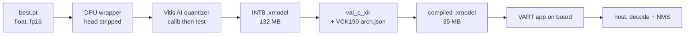

# Project Overview

## The task

Deploy a **YOLOv3 object detector onto AMD Versal hardware** — specifically a **VCK190**
evaluation board — using the Vitis AI DPU toolchain.

## What the repository actually is

An **Ultralytics YOLOv5-lineage codebase carrying a YOLOv3 model**. The familiar YOLOv5 layout is
all here — `train.py`, `val.py`, `export.py`, `models/`, `utils/`, `data/*.yaml`, `runs/` — but the
model configs and weights are YOLOv3. On top of that stock base sit a handful of
hand-written deployment scripts (the `*_AB*.py` files) that implement the Vitis AI path.

| Layer | What it is |
| --- | --- |
| Stock YOLOv5 framework | `train.py`, `val.py`, `export.py`, `models/`, `utils/` — see [[Code Map]] |
| YOLOv3 model definitions | `models/yolov3*.yaml`, plus custom `Bottleneck_merged` in `models/common.py` |
| Trained weights | `runs/train/exp2/weights/best.pt` — see [[Training Run exp2]] |
| **Deployment scripts** | `inspect_model_AB1.py`, `inspect_common_AB2.py`, `export_dpu_wrapper_AB3.py`, `quantize_vitis_AB4.py` |
| Session additions | `vitis_run.sh`, `dpu_silu_experiment.py`, `vitis_compat/`, `tools/graphify_codebase.py` |

## Two custom ideas worth understanding

### 1. The merged bottleneck

`models/common.py` defines `Bottleneck_merged` alongside the standard `Bottleneck`. The standard
block is two convolutions (a 1×1 channel reduction then a 3×3); the merged block **drops the 1×1
reduction entirely**, leaving a single conv. Fewer parameters and fewer FLOPs, at some accuracy
cost — a hardware-efficiency play. **That cost is now measured**: −3.4 points mAP@0.5 and
−5.2 points mAP@0.5:0.95 in float, but *better* accuracy once quantized to INT8 on the board —
[[yolov3_original on Hardware]].

The deployed checkpoint uses **both**: merged blocks in backbone stages 6 and 8, standard blocks
in the neck (19, 20, 26, 27). Hence the `yolov3_merged23_e75.pt` naming. Detail in
[[Subsystem - Models]].

### 2. The DPU wrapper

The DPU cannot run YOLO's detection head — anchor decoding and NMS are not fixed-function conv
operations. `export_dpu_wrapper_AB3.py` therefore wraps the model and **replaces the Detect head's
forward pass with the three raw output convolutions**, so the DPU produces raw feature maps and
the host CPU does the decoding. See [[Vitis AI DPU Concepts]].

## The pipeline

Each artefact explained in [[Vitis AI DPU Concepts]]; what actually ran in
[[Quantization and Compile Results]]; the plan and status in [[Implementation Plan]].

## Current state, honestly

The pipeline **works end to end** — a compiled xmodel exists. But compiling revealed a blocking
problem: the model's **SiLU** activation cannot map to the DPU, shattering the graph into 52
subgraphs. Swapping to `LeakyReLU(0.1015625)` collapses it to **1**, which has been measured, not
guessed.

So the deliverable is now well-defined: **finetune with LeakyReLU, then re-run this same
pipeline.** Read [[DPU Subgraph Fragmentation]] and [[SiLU to LeakyReLU Experiment]] before
planning any further work.

## Working constraints

This work happens on **someone else's machine**, which shapes several decisions:

- Everything is confined to a clone — [[Clone Provenance]].
- The disk is **99% full**, so nothing gets installed globally and no large files get written —
  [[Disk and System Constraints]].
- All Python runs inside the Vitis AI Docker container rather than a host venv —
  [[Vitis AI Container]].

---

Back to [[Code Map]] | [[Home]]
