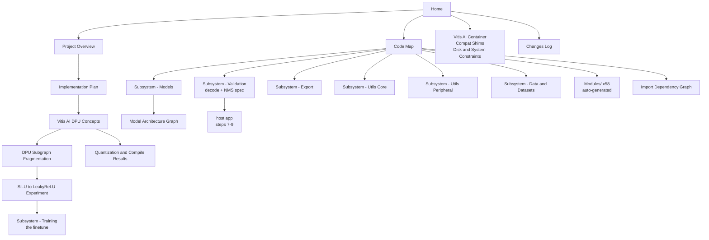

# Code Map

The way into this codebase. Every module note links back here; this is the hub.

---

## Orientation

An **Ultralytics YOLOv5-lineage framework carrying a YOLOv3 model**, plus a hand-written Vitis AI
deployment path bolted on. The stock framework is large (58 Python modules, ~1500-line files) but
**most of it is irrelevant to the Versal task**. If you are here to ship to hardware, the code that
matters is about six files.

> [!tip] If you read only one thing
> [[DPU Subgraph Fragmentation]] — the model's SiLU activation prevents it mapping to the DPU.
> Everything else is secondary to that.

## Start here

1. [[Project Overview]] — what this is and what the task is
2. [[DPU Subgraph Fragmentation]] — the blocker, and why it dominates planning
3. [[SiLU to LeakyReLU Experiment]] — the measured fix
4. [[Vitis AI DPU Concepts]] — how the toolchain works
5. [[Subsystem - Models]] — the network itself, including `Bottleneck_merged`
6. [[Subsystem - Validation]] — the decode + NMS spec the host app must reimplement
7. [[Implementation Plan]] — the nine steps and their status

## Hot files — what actually matters for deployment

| File | Why it matters |
| --- | --- |
| [[export_dpu_wrapper_AB3]] | Strips the Detect head to 3 raw convs. **The** enabling piece of the DPU path. |
| [[quantize_vitis_AB4]] | Drives `torch_quantizer` calib → test → `.xmodel`. |
| `dpu_silu_decompose_AB5.py` | Same pipeline, but rewrites SiLU as `x*sigmoid(x)` so the graph uses ops the board can actually execute. The reason best.pt runs at all — [[SiLU Decomposition]]. |
| [[models.common]] | `Conv` (SiLU default — the problem), `Bottleneck`, `Bottleneck_merged`. |
| [[models.yolo]] | `Detect` decode maths, `parse_model`, and the `activation:` yaml override that enables the fix. |
| [[utils.general]] | `non_max_suppression` — must be ported to the host. |
| [[utils.dataloaders]] | `letterbox` — the preprocessing the host must match. |
| `runs/train/exp2/weights/best.pt` | The deployed checkpoint — [[Training Run exp2]]. |
| `yolov3_test/yolov3_original.pt` | Stock, unmerged YOLOv3. Also deployed — but trained without `person`, indices shifted by one — [[yolov3_original on Hardware]]. |
| `yolov3_test/compiled_orig/` | Its compiled xmodel: 61 MB, 73 DPU subgraphs. |
| `Yolo_v8_Versal_Implementation/` | Stock `yolov8n/s/m/l` awaiting deployment — [[Implementation Plan - YOLOv8]]. |
| *(outside the repo)* `~/Desktop/Versal_AI/` | The existing YOLOv8 deployment: compiled xmodels, board runs, saved predictions — [[YOLOv8 Prior Work in Versal_AI]]. |

## Repository layout

| Path | Purpose | Relevance |
| --- | --- | --- |
| `train.py` | Training entry point — **59% dead commented code** | [[Subsystem - Training]] — critical path (the finetune) |
| `val.py` | Evaluation, mAP | [[Subsystem - Validation]] — source of the decode/NMS spec |
| `export.py` | 11 export formats, **none of them xmodel** | [[Subsystem - Export]] — bypassed entirely |
| `models/` | Layer definitions + architecture yamls | [[Subsystem - Models]] |
| `utils/` | Data, loss, metrics, plotting, loggers | [[Subsystem - Utils Core]] · [[Subsystem - Utils Peripheral]] |
| `data/` | Dataset + hyperparameter yamls | [[Subsystem - Data and Datasets]] |
| `runs/train/exp2/` | The real training run | [[Training Run exp2]] |
| `runs/train/exp/` | A dead run — empty `weights/` | see [[Training Run exp2]] |
| `*_AB*.py` | The hand-written Vitis AI deployment scripts | [[Vitis AI DPU Concepts]] |
| `dpu_silu_experiment.py` | The activation-swap experiment | [[SiLU to LeakyReLU Experiment]] |
| `dpu_silu_decompose_AB5.py` | The activation-**rewrite** that made best.pt runnable | [[SiLU Decomposition]] |
| `tools/inspect_xmodel.py` | Subgraph counts + CPU op types a compiled xmodel needs at runtime | [[SiLU Decomposition]] |
| `tools/board_curves.py` | PR/P/R/F1 curves + confusion matrix from board predictions | [[Board mAP - best.pt on Hardware]] |
| `tools/recover_class_mapping.py` | Reads a checkpoint's true class ordering off its own predictions | [[yolov3_original on Hardware]] |
| `tools/coco_to_yolo_labels.py` | COCO annotations → YOLO .txt labels, for float baselines | [[yolov3_original on Hardware]] |
| `host_vck190/rescore_shifted.py` | Remaps board predictions by a class offset and rescores | [[yolov3_original on Hardware]] |
| `host_vck190/` | Board-side VART app: preprocess, infer, decode, NMS | [[Host Application]] |
| `vitis_compat/` | Offline `ultralytics` shim + NumPy bridge + seaborn | [[Compat Shims]] |
| `vitis_run.sh` | Container runner — **how you run anything** | [[Vitis AI Container]] |
| `vitis_out/` | All run logs | [[Quantization and Compile Results]] |
| `quantize_result*/`, `compiled*/` | Quantizer and compiler output | [[Quantization and Compile Results]] |
| `host_vck190/` | Board-side decode + NMS + VART eval | [[Host Application]] |
| `tools/graphify_codebase.py` | Generates the module notes below | — |

## Module notes

All 58 first-party modules have auto-generated notes under `02 Codebase/Modules/`, each listing
its imports, its importers, its classes and a local dependency diagram. Regenerate with:

```bash
python3 tools/graphify_codebase.py
```

### Entry-point scripts
[[train]] · [[val]] · [[export]]

### Deployment scripts
[[inspect_model_AB1]] · [[inspect_common_AB2]] · [[export_dpu_wrapper_AB3]] · [[quantize_vitis_AB4]] · [[quantize_result.YOLOv3DPUWrapper]]

### Model definitions
[[models]] · [[models.common]] · [[models.common_orig]] · [[models.yolo]] · [[models.experimental]] · [[models.tf]]

### Core utilities
[[utils]] · [[utils.general]] · [[utils.dataloaders]] · [[utils.augmentations]] · [[utils.torch_utils]] · [[utils.loss]] · [[utils.metrics]] · [[utils.autoanchor]] · [[utils.autobatch]] · [[utils.activations]] · [[utils.callbacks]] · [[utils.downloads]] · [[utils.plots]]

### Experiment loggers
[[utils.loggers]] · [[utils.loggers.wandb]] · [[utils.loggers.wandb.wandb_utils]] · [[utils.loggers.clearml]] · [[utils.loggers.clearml.clearml_utils]] · [[utils.loggers.clearml.hpo]] · [[utils.loggers.comet]] · [[utils.loggers.comet.comet_utils]] · [[utils.loggers.comet.hpo]]

### Segmentation (unused)
[[utils.segment]] · [[utils.segment.general]] · [[utils.segment.dataloaders]] · [[utils.segment.augmentations]] · [[utils.segment.loss]] · [[utils.segment.metrics]] · [[utils.segment.plots]]

### Serving / cloud (unused)
[[utils.triton]] · [[utils.aws]] · [[utils.aws.resume]] · [[utils.flask_rest_api.restapi]] · [[utils.flask_rest_api.example_request]]

### Compatibility shims (added this session)
[[vitis_compat.np2_pickle_compat]] · [[vitis_compat.ultralytics]] · [[vitis_compat.ultralytics.utils]] · [[vitis_compat.ultralytics.utils.plotting]] · [[vitis_compat.ultralytics.utils.checks]] · [[vitis_compat.ultralytics.utils.patches]] · [[vitis_compat.ultralytics.utils.torch_utils]]

### Scratch
[[vitis_out.probe_init]] — the segfault bisection probe, see [[The numpy _core Segfault]]

## Graphs

- [[Import Dependency Graph]] — the 58 modules and their import edges, generated from AST
- [[Model Architecture Graph]] — the network layer by layer

## How this vault maps together



---

Back to [[Code Map]] | [[Home]]
