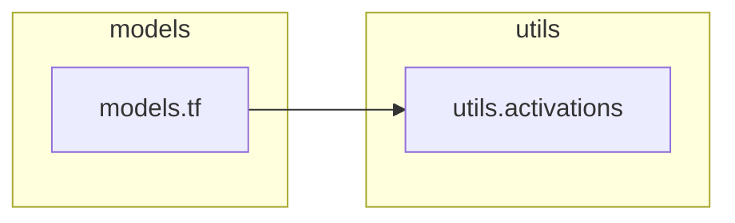

# `utils.activations`

> [!info] Source
> `yolov3_test/utils/activations.py` - 139 lines

**Purpose:** Activation functions.

## Imports (internal)

_None - leaf module._

## Imported by

- [[models.tf]]

## Third-party / stdlib

`torch`

## Classes

- `SiLU(nn.Module)`
- `Hardswish(nn.Module)`
- `Mish(nn.Module)`
- `MemoryEfficientMish(nn.Module)`
- `FReLU(nn.Module)`
- `AconC(nn.Module)`
- `MetaAconC(nn.Module)`

## Local neighbourhood

---

Back to [[Code Map]] | [[Home]]
