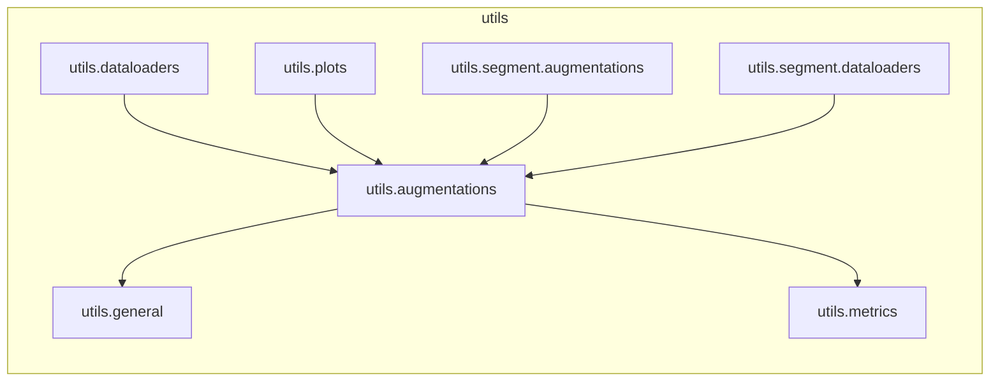

# `utils.augmentations`

> [!info] Source
> `yolov3_test/utils/augmentations.py` - 419 lines

**Purpose:** Image augmentation functions.

## Imports (internal)

- [[utils.general]]
- [[utils.metrics]]

## Imported by

- [[utils.dataloaders]]
- [[utils.plots]]
- [[utils.segment.augmentations]]
- [[utils.segment.dataloaders]]

## Third-party / stdlib

`albumentations`, `cv2`, `math`, `numpy`, `random`, `torch`, `torchvision`

## Classes

- `Albumentations`
- `LetterBox`
- `CenterCrop`
- `ToTensor`

## Top-level functions

`normalize()`, `denormalize()`, `augment_hsv()`, `hist_equalize()`, `replicate()`, `letterbox()`, `random_perspective()`, `copy_paste()`, `cutout()`, `mixup()`, `box_candidates()`, `classify_albumentations()`, `classify_transforms()`

## Local neighbourhood

---

Back to [[Code Map]] | [[Home]]
