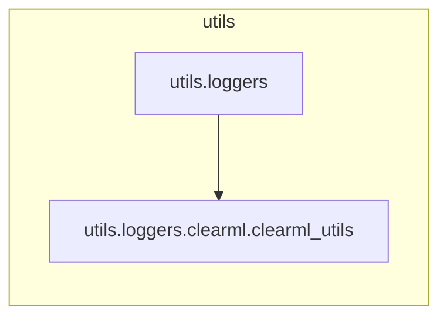

# `utils.loggers.clearml.clearml_utils`

> [!info] Source
> `yolov3_test/utils/loggers/clearml/clearml_utils.py` - 175 lines

**Purpose:** Main Logger class for ClearML experiment tracking.

## Imports (internal)

_None - leaf module._

## Imported by

- [[utils.loggers]]

## Third-party / stdlib

`clearml`, `glob`, `numpy`, `pathlib`, `re`, `ultralytics`, `yaml`

## Classes

- `ClearmlLogger`

## Top-level functions

`construct_dataset()`

## Local neighbourhood

---

Back to [[Code Map]] | [[Home]]
