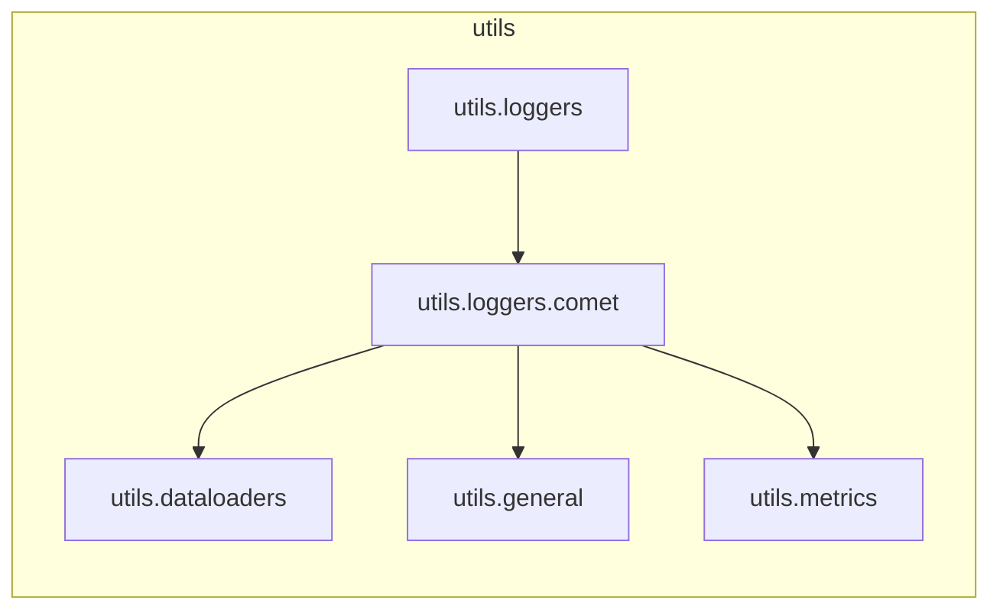

# `utils.loggers.comet`

> [!info] Source
> `yolov3_test/utils/loggers/comet/__init__.py` - 556 lines

## Imports (internal)

- [[utils.dataloaders]]
- [[utils.general]]
- [[utils.metrics]]

## Imported by

- [[utils.loggers]]

## Third-party / stdlib

`PIL`, `comet_ml`, `glob`, `json`, `logging`, `os`, `pathlib`, `sys`, `torch`, `torchvision`, `yaml`

## Classes

- `CometLogger`

## Local neighbourhood

---

Back to [[Code Map]] | [[Home]]
