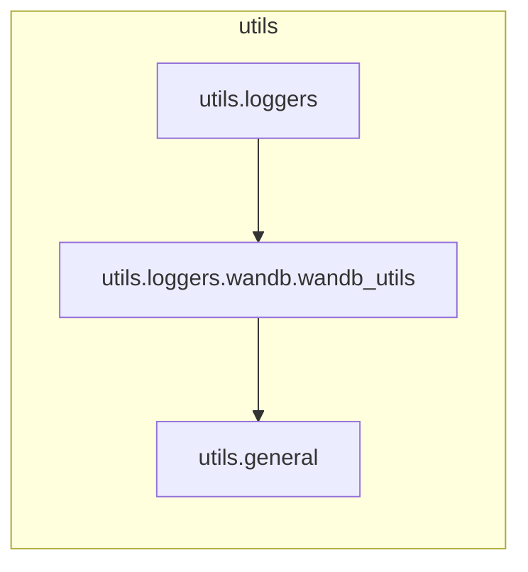

# `utils.loggers.wandb.wandb_utils`

> [!info] Source
> `yolov3_test/utils/loggers/wandb/wandb_utils.py` - 211 lines

## Imports (internal)

- [[utils.general]]

## Imported by

- [[utils.loggers]]

## Third-party / stdlib

`contextlib`, `logging`, `os`, `pathlib`, `sys`, `wandb`

## Classes

- `WandbLogger`

## Top-level functions

`all_logging_disabled()`

## Local neighbourhood

---

Back to [[Code Map]] | [[Home]]
