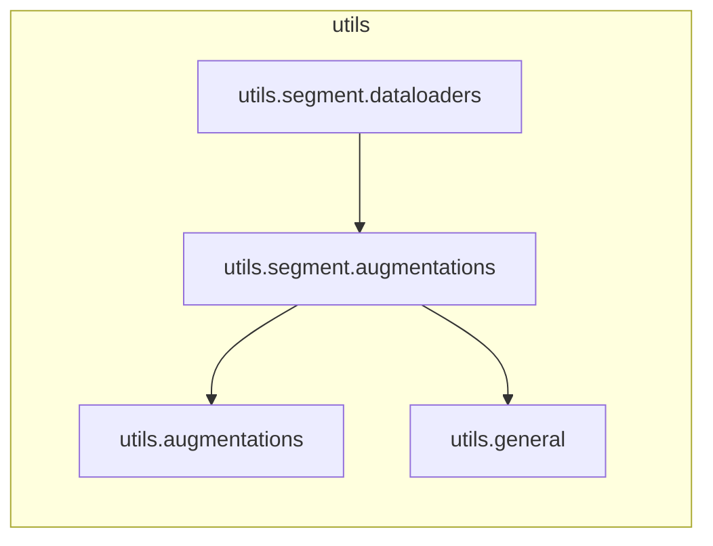

# `utils.segment.augmentations`

> [!info] Source
> `yolov3_test/utils/segment/augmentations.py` - 91 lines

**Purpose:** Image augmentation functions.

## Imports (internal)

- [[utils.augmentations]]
- [[utils.general]]

## Imported by

- [[utils.segment.dataloaders]]

## Third-party / stdlib

`cv2`, `math`, `numpy`, `random`

## Top-level functions

`mixup()`, `random_perspective()`

## Local neighbourhood

---

Back to [[Code Map]] | [[Home]]
