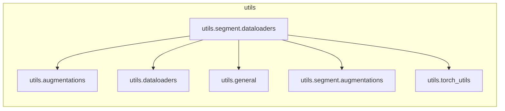

# `utils.segment.dataloaders`

> [!info] Source
> `yolov3_test/utils/segment/dataloaders.py` - 363 lines

**Purpose:** Dataloaders.

## Imports (internal)

- [[utils.augmentations]]
- [[utils.dataloaders]]
- [[utils.general]]
- [[utils.segment.augmentations]]
- [[utils.torch_utils]]

## Imported by

_Nothing imports this (entry point or unused)._

## Third-party / stdlib

`cv2`, `numpy`, `os`, `random`, `torch`

## Classes

- `LoadImagesAndLabelsAndMasks(LoadImagesAndLabels)`

## Top-level functions

`create_dataloader()`, `polygon2mask()`, `polygons2masks()`, `polygons2masks_overlap()`

## Local neighbourhood

---

Back to [[Code Map]] | [[Home]]
