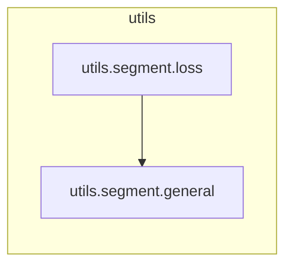

# `utils.segment.general`

> [!info] Source
> `yolov3_test/utils/segment/general.py` - 161 lines

## Imports (internal)

_None - leaf module._

## Imported by

- [[utils.segment.loss]]

## Third-party / stdlib

`cv2`, `numpy`, `torch`

## Top-level functions

`crop_mask()`, `process_mask_upsample()`, `process_mask()`, `process_mask_native()`, `scale_image()`, `mask_iou()`, `masks_iou()`, `masks2segments()`

## Local neighbourhood

---

Back to [[Code Map]] | [[Home]]
