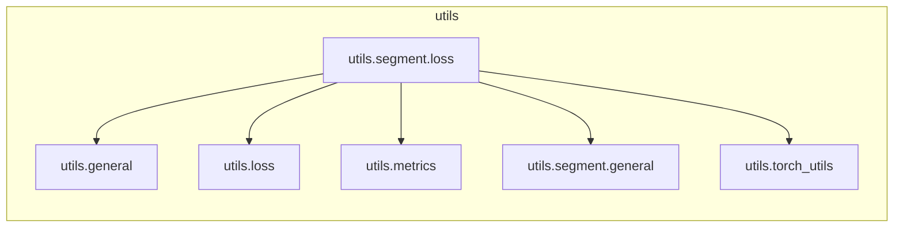

# `utils.segment.loss`

> [!info] Source
> `yolov3_test/utils/segment/loss.py` - 202 lines

## Imports (internal)

- [[utils.general]]
- [[utils.loss]]
- [[utils.metrics]]
- [[utils.segment.general]]
- [[utils.torch_utils]]

## Imported by

_Nothing imports this (entry point or unused)._

## Third-party / stdlib

`torch`

## Classes

- `ComputeLoss`

## Local neighbourhood

---

Back to [[Code Map]] | [[Home]]
