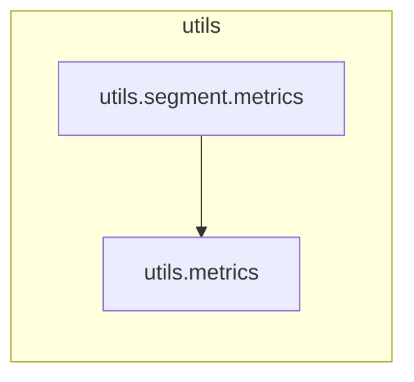

# `utils.segment.metrics`

> [!info] Source
> `yolov3_test/utils/segment/metrics.py` - 222 lines

**Purpose:** Model validation metrics.

## Imports (internal)

- [[utils.metrics]]

## Imported by

_Nothing imports this (entry point or unused)._

## Third-party / stdlib

`numpy`

## Classes

- `Metric`
- `Metrics`

## Top-level functions

`fitness()`, `ap_per_class_box_and_mask()`

## Local neighbourhood

---

Back to [[Code Map]] | [[Home]]
