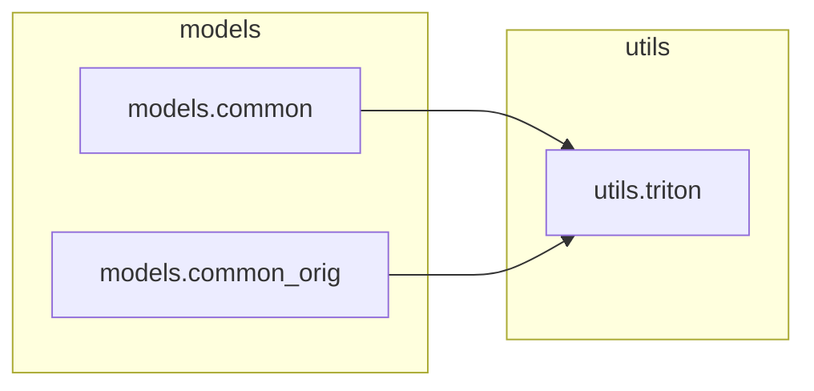

# `utils.triton`

> [!info] Source
> `yolov3_test/utils/triton.py` - 93 lines

**Purpose:** Utils to interact with the Triton Inference Server.

## Imports (internal)

_None - leaf module._

## Imported by

- [[models.common]]
- [[models.common_orig]]

## Third-party / stdlib

`torch`, `tritonclient`, `typing`, `urllib`

## Classes

- `TritonRemoteModel`

## Local neighbourhood

---

Back to [[Code Map]] | [[Home]]
