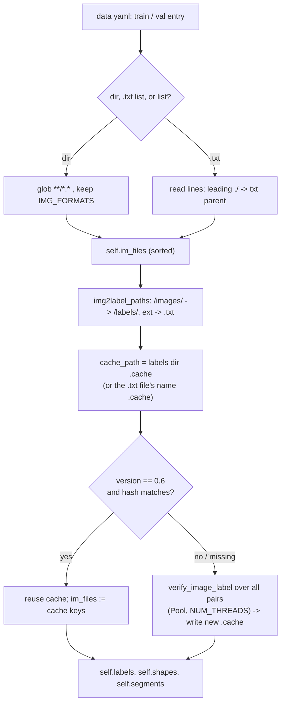

# Subsystem - Data and Datasets

Everything that turns files on disk into `(image_tensor, labels)` batches: the dataset yamls in
`data/`, the label `.txt` contract, the `*.cache` label index, the hyperparameter yamls in
`data/hyps/`, and the preprocessing chain that the **host side of the Versal deployment must
reproduce bit-for-bit**. Code lives in [[utils.dataloaders]] (ingestion, cache, letterbox call
site), [[utils.general]] (`check_dataset`, path resolution, COCO id maps) and
[[utils.augmentations]] (`letterbox`, photometric/geometric augs).

> [!warning] Bottom line for deployment
> - exp2 trained against **`data/train2017_yolo.yaml`** (`runs/train/exp2/opt.yaml:3`), whose
>   `path:` is `/home/aesicdab/Documents/Yolo_v3_AB/yolov3_test/datasets/coco` - a directory that
>   **does not exist anywhere in this clone** (`yolov3_test/datasets/` is absent entirely).
>   You cannot re-validate the checkpoint on full COCO here.
> - The **only** dataset physically present is `datasets/coco128/` (128 images, 941 label rows) at
>   the clone root, reachable through `data/coco128.yaml`.
> - `data/coco128.yaml:19` has been **edited**: class 0 is `dummy_class`, not `person`. Never take
>   the deployment class list from that file - see [[#The 80 COCO class names (authoritative order)]].
> - The Vitis calibration loader resizes with a **plain stretch**, while training/val use
>   **letterbox**. That is a real quantization-accuracy bug - see [[#Preprocessing: three chains, two of them agree]].

---

## 1. The dataset-yaml schema, as the code actually enforces it

`check_dataset()` in `utils/general.py:519-562` is the single gate every yaml passes through
(called from `val.py:305` and from `train.py` via `check_det_dataset`-equivalent logic in the
train path).

| Key | Required? | Semantics as implemented |
|---|---|---|
| `train` | **yes** (`utils/general.py:533`) | dir, `.txt` list file, or list of either |
| `val` | **yes** | same three forms |
| `test` | no | same; only used with `--task test` |
| `names` | **yes** | list *or* `{int: str}` dict; a list is converted with `dict(enumerate(...))` at `utils/general.py:535-536` |
| `nc` | **ignored / overwritten** | `data["nc"] = len(data["names"])` at `utils/general.py:538` |
| `path` | optional | dataset root; prepended to `train`/`val`/`test` |
| `download` | optional | URL, `bash ...`, or inline Python `exec`-ed when `val` is missing (`utils/general.py:556-579`) |

Path resolution rules worth memorising (`utils/general.py:541-553`):

- `path` missing or empty -> `Path("")`, then resolved against `ROOT` (= `yolov3_test/`, from
  `FILE.parents[1]`).
- Relative `path` -> `(ROOT / path).resolve()`. So `../datasets/coco128` becomes
  `<clone>/datasets/coco128`, matching `DATASETS_DIR = ROOT.parent / "datasets"`
  (`utils/general.py:49`, overridable via `$YOLOv5_DATASETS_DIR`).
- Absolute `path` is used verbatim and **is not rewritten** - this is why `train2017_yolo.yaml`
  still points at the pre-clone `Yolo_v3_AB` tree.
- `train`/`val`/`test` entries that are themselves absolute survive `path / value` unchanged
  (`Path.__truediv__` semantics), so `val2017_yolo.yaml`'s `/SN02DATA/...` paths are used as-is.
- Special case at `utils/general.py:549-550`: if `path/<value>` does not exist and the value starts
  with `../`, the `../` is stripped and retried once.
- Only `val` existence is checked. A broken `train` path fails later, inside the dataset
  constructor (`utils/dataloaders.py:544`, `FileNotFoundError: ... does not exist`).

`nc` being recomputed from `names` means a yaml with `nc: 80` but 79 names silently trains an
79-class head - and `val.py:317-321` will then hard-assert against `model.model.nc` (80 here).

## 2. Inventory of `data/*.yaml` and whether their roots exist in this clone

| yaml | `path:` | train / val | root exists in clone? |
|---|---|---|---|
| `coco128.yaml:11-13` | `../datasets/coco128` | `images/train2017` for both | **YES** -> `<clone>/datasets/coco128` |
| `train2017_yolo.yaml:4-7` | `/home/aesicdab/Documents/Yolo_v3_AB/yolov3_test/datasets/coco` | `train2017.txt` / `val2017.txt` / `test2017.txt` | **NO** (absolute, outside clone; note `Yolo_v3_AB`, not `..._AB_New`) |
| `val2017_yolo.yaml:1-2` | *(no `path:` key)* | both `/SN02DATA/groupA/pratibha1/.../converted/images/train` | **NO** (foreign cluster mount; train == val) |
| `custom_coco.yaml:1-3` | `/SN02DATA/groupA/pratibha1/yolov3/yolov3/coco/` | `train2017` / `val2017` | **NO** (foreign cluster mount) |
| `coco.yaml:11-14` | `../datasets/coco` | `train2017.txt` / `val2017.txt` / `test-dev2017.txt` | **NO** (`<clone>/datasets/coco` absent; has a `download:` block that would pull ~20 GB) |
| `coco128-seg.yaml`, `Argoverse.yaml`, `voc.yaml`, `VisDrone.yaml`, `GlobalWheat2020.yaml`, `SKU-110K.yaml`, `xView.yaml`, `objects365.yaml`, `ImageNet.yaml` | `../datasets/<name>` | - | **NO** - none of these exist under `<clone>/datasets/` |

> [!danger] Do not let a yaml's `download:` block run on this machine
> `coco.yaml:100-115` and `coco128.yaml:101` will fetch 20.1 GB / 7 MB respectively the moment
> `check_dataset` finds `val` missing and `autodownload=True` (the default). `data/scripts/get_coco.sh`
> and `get_coco128.sh` do the same from the shell (`d='../datasets'`, resolved from the **CWD**, not
> from `ROOT`). On a 99%-full disk, always pass a yaml whose `val` path already exists, or
> `autodownload=False`.

Semantic notes:

- `coco128.yaml` uses **`val: images/train2017`** - val and train are the same 128 images. Any mAP
  measured through it is train-set mAP; useful only as a plumbing/regression check for the
  quantized model, never as an accuracy number.
- `val2017_yolo.yaml` also sets `train == val`, and has **no `path:`** and **no `nc`-consistent
  `test`** - it is a leftover from the previous cluster.
- `coco.yaml` is the only one using the modern `names: {0: person, ...}` dict form; the four
  COCO-derived local yamls use the legacy list form (all 80 entries each, verified by count).
- Vim swap files `data/.custom_coco.yaml.swp` and `data/.train2017_yolo.yaml.swp` are present -
  evidence these two were hand-edited, and possibly mid-edit when copied. (Their content was not
  decoded.)

## 3. What exp2 actually consumed

From `runs/train/exp2/opt.yaml` (authoritative, written at `train.py:1014`):

```yaml
weights: yolov3_merged23_e75.pt   # not a stock yolov3.pt - the merged-bottleneck variant
data: data/train2017_yolo.yaml    # full COCO 2017 via train2017.txt / val2017.txt
imgsz: 416
batch_size: 8
epochs: 75
rect: false                       # square 416x416 letterbox during training
cache: null                       # no RAM/disk image cache; label .cache still used
noautoanchor: false               # AutoAnchor DID run (train.py:1154-1155)
single_cls: false
optimizer: SGD
label_smoothing: 0.0
freeze: [0]
```

Consequences:

- `train`/`val` were **`.txt` list files**, not directories. `utils/dataloaders.py:537-542` reads
  the file line-by-line and expands a leading `./` to the txt file's parent directory; every other
  line is taken verbatim. So COCO paths in `train2017.txt` were resolved relative to
  `.../datasets/coco/`.
- Because `val` resolved to `.../datasets/coco/val2017.txt`, `val.py:309`'s
  `is_coco = data["val"].endswith("coco/val2017.txt")` evaluates **True** for this yaml. That
  switches on the 80->91 class remap and makes `--save-json` look for
  `../datasets/coco/annotations/instances_val2017.json` (`val.py:454`). See section 7.
- `noautoanchor: false` means [[utils.autoanchor]]`.check_anchors(thr=4.0)` ran against the COCO
  label distribution at 416 px before training. The anchors in `best.pt` are nevertheless the
  standard YOLOv3 set (established fact), i.e. AutoAnchor's recall test passed and it left them
  alone - so the host decode can use the canonical anchor table.
- With `cache: null`, images were re-decoded every epoch; only the **label** cache was used.

## 4. Label `.txt` format (the darknet/YOLO contract)

One `.txt` per image, discovered purely by string surgery on the image path -
`img2label_paths()`, `utils/dataloaders.py:488-493`:

```
.../images/train2017/000000000009.jpg  ->  .../labels/train2017/000000000009.txt
```

It replaces the **last** `/images/` with `/labels/` and swaps the extension. There is no fallback:
a dataset laid out without an `images/` path component gets label paths equal to the image paths
with a `.txt` suffix, and every label reads as "missing".

Row format - one object per line, whitespace separated:

```
<class_index> <x_center> <y_center> <width> <height>
45 0.479492 0.688771 0.955609 0.5955
```

- `class_index` is a **0-based** integer into `names` (0..79 for this model).
- The four geometry values are **normalised to [0,1]** against the *original* image width/height,
  centre-based (`xywhn`), not corner-based.
- Validation rules, all in `verify_image_label()` (`utils/dataloaders.py:1100-1122`):
  exactly 5 columns (`:1111`), all values `>= 0` (`:1112`), all coordinates `<= 1` (`:1113`),
  exact-duplicate rows are silently de-duplicated with a warning (`:1114-1119`).
- **Segment escape hatch** (`:1105-1108`): if *any* row has more than 6 fields, the whole file is
  parsed as polygons `cls x1 y1 x2 y2 ...` and converted to boxes via `segments2boxes`. A stray
  6+-field row therefore reinterprets the entire file.
- A missing `.txt` is not an error - it counts as a *background* image (`nm`, `:1124-1125`); an
  empty `.txt` counts as `ne`. Training only aborts if **no** labels at all were found
  (`utils/dataloaders.py:568,574`).
- Images are verified too: PIL `verify()`, EXIF-aware size, `>= 10 px` per side, extension in
  `IMG_FORMATS` (`utils/dataloaders.py:62`), and truncated JPEGs are **rewritten in place** at
  quality 100 (`:1093-1098`) - a silent write into your dataset directory.

## 5. `datasets/coco128/` as it exists on this disk

```
<clone>/datasets/coco128/
├── images/train2017/   128 × *.jpg   (000000000009.jpg ... )
├── labels/train2017/   128 × *.txt
├── labels/train2017.cache   41 202 B
├── LICENSE
└── README.txt          (Ultralytics COCO2YOLO conversion notes)
```

Verified by inspection: 128 images, 128 label files, **941 total label rows, every row exactly 5
columns, zero empty label files**. Class ids present span `0..79` but only **71 distinct** classes
appear - absent are ids `10, 12, 18, 19, 37, 47, 66, 70, 78`. Do not use per-class mAP from
coco128 for those ids.

`data/images/bus.jpg` and `data/images/zidane.jpg` are also in-tree - the natural single-image
smoke tests for the board's host pipeline (bus.jpg is a good letterbox test: it is portrait).

## 6. `labels/train2017.cache` - what it is and why this copy is stale

It is a **NumPy `.npy` pickle of a Python dict** (`np.save` at `utils/dataloaders.py:708`, then the
`.npy` suffix is renamed away at `:709`; `file` reports `NumPy array, version 1.0`). Built by
`LoadImagesAndLabels.cache_labels()`, `utils/dataloaders.py:675-713`. Structure:

| key | value |
|---|---|
| `<absolute image path>` (one per verified image) | `[labels_ndarray(n,5), (w,h) shape, segments]` |
| `"hash"` | `get_hash(label_files + im_files)` |
| `"results"` | `(nf, nm, ne, nc, n)` = found / missing / empty / corrupt / total |
| `"msgs"` | list of warning strings replayed on load |
| `"version"` | `0.6` (`cache_version`, `utils/dataloaders.py:499`) |

Its whole purpose is to skip the parallel image+label scan on every run. The validity test is two
asserts (`utils/dataloaders.py:556-557`): matching `version`, and matching `hash`. And `get_hash`
(`utils/dataloaders.py:74-79`) hashes **the summed file sizes *and* the concatenated path
strings**:

```python
size = sum(os.path.getsize(p) for p in paths if os.path.exists(p))
h = hashlib.sha256(str(size).encode()); h.update("".join(paths).encode())
```

> [!info] This clone's cache was written from the original tree
> All 128 image keys inside `datasets/coco128/labels/train2017.cache` are absolute paths under
> `/home/aesicdab/Documents/Yolo_v3_AB_New/datasets/coco128/images/train2017/` (verified with
> `strings`: 128/128 hits, no other root). Run from the clone, the path strings differ, the hash
> assert fails, and the cache is transparently **rebuilt** in place - a few seconds for 128 images,
> and the only write is the new `.cache` file. Nothing breaks; expect a one-off
> `New cache created: ...` line.
>
> The reason this matters at all is `utils/dataloaders.py:577-578`: after a *successful* cache load
> the dataset **replaces** `self.im_files` with the cache's keys. A cache that validated while
> containing foreign paths would send every `cv2.imread` to a non-existent file. The path component
> of the hash is what makes that unreachable - so never "fix" a hash mismatch by deleting the
> asserts.



Note the cache *location* rule (`utils/dataloaders.py:553`): for a directory-based dataset the
cache is `<labels dir>.cache` (hence `labels/train2017.cache`); for a `.txt`-list dataset it is
`<listfile>.cache`, i.e. exp2 wrote `.../datasets/coco/train2017.cache` next to the list file, on
the machine that is now unreachable.

## 7. The 80 COCO class names (authoritative order)

Index == position in the list. Taken from `data/train2017_yolo.yaml:10-89` (the yaml exp2 actually
used) and cross-checked identical, name-for-name and index-for-index, against the explicitly
numbered `data/coco.yaml:18-97`. **Use this, not `coco128.yaml`.**

```python
# COCO-80 class names for YOLOv3 head outputs (index == channel order in the 85-vector's class block)
COCO80_NAMES = [
    "person", "bicycle", "car", "motorcycle", "airplane", "bus", "train", "truck",
    "boat", "traffic light", "fire hydrant", "stop sign", "parking meter", "bench",
    "bird", "cat", "dog", "horse", "sheep", "cow", "elephant", "bear", "zebra",
    "giraffe", "backpack", "umbrella", "handbag", "tie", "suitcase", "frisbee",
    "skis", "snowboard", "sports ball", "kite", "baseball bat", "baseball glove",
    "skateboard", "surfboard", "tennis racket", "bottle", "wine glass", "cup",
    "fork", "knife", "spoon", "bowl", "banana", "apple", "sandwich", "orange",
    "broccoli", "carrot", "hot dog", "pizza", "donut", "cake", "chair", "couch",
    "potted plant", "bed", "dining table", "toilet", "tv", "laptop", "mouse",
    "remote", "keyboard", "cell phone", "microwave", "oven", "toaster", "sink",
    "refrigerator", "book", "clock", "vase", "scissors", "teddy bear",
    "hair drier", "toothbrush",
]
assert len(COCO80_NAMES) == 80
```

Index anchors for quick sanity checks while debugging DPU output: `0 person`, `2 car`,
`15 cat`, `16 dog`, `39 bottle`, `41 cup`, `45 bowl`, `56 chair`, `62 tv`, `79 toothbrush`.

> [!tip] Where this ordering lives in the tensor
> Each of the 3 anchors per cell contributes 85 channels: `[tx, ty, tw, th, obj, cls_0 ... cls_79]`.
> In the raw DPU outputs `[1,255,52,52] / [1,255,26,26] / [1,255,13,13]` the 255 = 3x85, so class
> `c` of anchor `a` sits at channel `a*85 + 5 + c`. The list above defines `c`. See
> [[Subsystem - Export]] and [[export_dpu_wrapper_AB3]] for the head-stripping, and
> [[Model Architecture Graph]] for the strides/anchor assignment.

### The 80 -> 91 remap is *not* your deployment mapping

`coco80_to_coco91_class()` (`utils/general.py:773-783`) returns

```
[1,2,3,4,5,6,7,8,9,10,11,13,14,15,16,17,18,19,20,21,22,23,24,25,27,28,31,32,33,34,35,36,37,38,
 39,40,41,42,43,44,46,47,48,49,50,51,52,53,54,55,56,57,58,59,60,61,62,63,64,65,67,70,72,73,74,
 75,76,77,78,79,80,81,82,84,85,86,87,88,89,90]
```

It exists **only** to write `category_id`s into a `predictions.json` for `pycocotools`, and it is
applied only when `is_coco` is True (`val.py:342`) - which, as noted, `train2017_yolo.yaml`
triggers. Host post-processing on the board should stay in 0..79 index space and use
`COCO80_NAMES`; converting to 91-space would mislabel everything from index 11 onward.

## 8. Preprocessing: three chains, two of them agree

| stage | code | resize | pad | colour | scale |
|---|---|---|---|---|---|
| train (non-mosaic) | `utils/dataloaders.py:745-747` + `:803-822` | `load_image` scales longest side to 416 (`INTER_LINEAR` when augmenting), then `letterbox(auto=False, scaleup=True)` | 114 grey, centred | `cv2.imread` BGR -> RGB at `:798` | `/255` at `train.py:1213` |
| val / mAP | same call, `augment=False` -> `scaleup=False`; `rect=pt`, `pad=0.5` (`val.py:323`) | `INTER_AREA` when downscaling | 114 grey, centred | BGR -> RGB | `/255` at `val.py:357` |
| **Vitis calibration** | `quantize_vitis_AB4.py:284-315` | `transforms.Resize((416, 416))` - **aspect-ratio-destroying stretch** | **none** | `PIL.Image.convert("RGB")` | `ToTensor()` -> `/255` |

`letterbox()` itself (`utils/augmentations.py:122-152`): scale by `r = min(416/h, 416/w)`, pad the
remainder to 416x416 with `color=(114,114,114)`, split evenly on both sides, `BORDER_CONSTANT`.
With `auto=True` (the *default*, used by the inference `LoadImages` paths) it pads only to the next
stride multiple instead of the full square - not what a fixed-shape DPU input wants.

> [!danger] Calibration/inference preprocessing mismatch
> The quantizer's calibration set (`quantize_vitis_AB4.py:340-346`, 100 images by default,
> `max_samples=100`, fed one at a time as `1x3x416x416`) is stretched, unpadded and PIL-decoded,
> whereas the trained model has only ever seen letterboxed, 114-padded, OpenCV-decoded input.
> Activation ranges collected from geometrically distorted images are the wrong ranges, on top of
> the [[Vitis AI DPU Concepts|SiLU]] float-op problem. Fix by letterboxing the calibration images
> exactly as `utils/augmentations.py:122` does before `ToTensor()`, and draw them from a real val
> split rather than the first 100 files `os.walk` happens to yield. Note also that PIL gives RGB
> and cv2 gives BGR - the two chains agree on final channel order only because the dataloader
> reverses cv2's BGR at `utils/dataloaders.py:798`; do not "fix" one without the other.

**Host recipe to mirror on the VCK190** (must match the val chain):
`cv2.imread` -> letterbox to 416x416 with `color=114`, `auto=False`, `scaleup=False` -> `[:, :, ::-1]`
BGR->RGB -> `HWC->CHW` -> `float32 / 255` -> DPU input fixed-point scale. Keep `ratio` and
`(dw, dh)` from `letterbox`; you need them to undo the padding on the decoded boxes, the same way
`scale_boxes` does in [[utils.general]] (`shapes` is carried for exactly this purpose,
`utils/dataloaders.py:748`).

## 9. `data/hyps/*.yaml`

Six files - and note that **no `hyp.finetune*.yaml` exists in this repo** (upstream YOLOv5 has
one; here the "tuned" variants are the two evolved dataset-specific files).

| file | role | deltas vs `scratch-low` |
|---|---|---|
| `hyp.scratch-low.yaml` | default for `train.py` (`train.py:1367`) and the baseline | - |
| `hyp.scratch-med.yaml` | medium aug | `lrf 0.01 -> 0.1`, `cls 0.5 -> 0.3`, `obj 1.0 -> 0.7`, `scale 0.5 -> 0.9`, `mixup 0.0 -> 0.1` |
| `hyp.scratch-high.yaml` | high aug | as med, plus `copy_paste 0.0 -> 0.1` (segment-only; a no-op for box labels) |
| `hyp.no-augmentation.yaml` | hand augmentation off, use Albumentations instead | all of `hsv_*`, `translate`, `scale`, `shear`, `fliplr`, `mosaic`, `mixup` = 0; loss gains as med |
| `hyp.VOC.yaml` | evolved for VOC (gen 467 of 996, header at `:7-11`) | fully re-tuned, e.g. `lr0 0.00334`, `momentum 0.74832`, `box 0.02`, `anchor_t 3.3744`, and an `anchors: 3.412` key |
| `hyp.Objects365.yaml` | evolved for Objects365 | `lr0 0.00258`, `lrf 0.17`, `warmup_epochs 1.33`, `anchors: 3.2` |

The `anchors:` key is the interesting one for this project: when present it makes the model rebuild
its head with that many anchors per layer (commented out in the scratch files - see
`data/hyps/hyp.scratch-low.yaml:21`). Both scratch and exp2 hyps omit it, so the 3-anchors-per-layer
YOLOv3 head is preserved. Do not introduce it.

### Which hyp exp2 used

`runs/train/exp2/hyp.yaml` is **numerically identical to `data/hyps/hyp.scratch-low.yaml`** -
`diff` of the two, comments stripped, shows a single cosmetic line (`iou_t: 0.20` re-emitted as
`0.2`). The same dict is echoed inside `runs/train/exp2/opt.yaml:4-32`. So: exp2 = stock
low-augmentation recipe, SGD, lr0 0.01 -> lrf 0.01 (linear one-cycle), 3 warmup epochs,
mosaic 1.0, fliplr 0.5, no mixup, no rotation/shear/perspective, no flipud.

> [!info] The saved hyp.yaml is pre-scaling
> `train.py:1013` dumps `hyp` **before** the layer/class/size scaling at `train.py:1166-1168`:
> `box *= 3/nl`, `cls *= nc/80 * 3/nl`, `obj *= (imgsz/640)**2 * 3/nl`. With `nl=3`, `nc=80`,
> `imgsz=416` the effective gains during exp2 were `box 0.05`, `cls 0.5`, and
> **`obj 1.0 * (416/640)^2 = 0.4225`** - not the 1.0 the file shows. Relevant if you ever fine-tune
> at a different `imgsz` and expect comparable objectness behaviour. Loss construction is in
> [[utils.loss]].

## 10. Landmines checklist

1. `data/coco128.yaml:19` names class 0 `dummy_class`. `check_dataset` still yields `nc=80`, so
   nothing errors - you just get wrong labels and a nonsense `person` row in every report. Prefer
   a corrected copy (do **not** edit the shipped file) or `data/train2017_yolo.yaml`'s name list.
2. Every yaml except `coco128.yaml` points at data absent from this clone (section 2). Passing one
   to `val.py` ends in `Dataset not found` - or, for `coco.yaml`, an attempted 20 GB download.
3. `train2017_yolo.yaml`'s `val` ends in `coco/val2017.txt`, so `val.py` flips into `is_coco` mode
   and expects `../datasets/coco/annotations/instances_val2017.json` for `--save-json`
   (`val.py:454`). Absent here; use `--save-json` only with the real COCO tree.
4. `train2017_yolo.yaml:7` has a **trailing space** after `test2017.txt`. YAML keeps it out of the
   scalar, and `path / "test2017.txt "` is never constructed because only `val` is existence-checked
   at load - but it is the kind of thing that bites when `--task test` is used. (Unverified whether
   PyYAML's plain-scalar strip fully removes it in every version present here.)
5. The stale `train2017.cache` (section 6) is harmless but will be rewritten - make sure
   `datasets/coco128/labels/` is writeable, else you get the
   "Cache directory ... is not writeable" warning at `utils/dataloaders.py:712` and pay the scan
   cost every run.
6. Calibration preprocessing mismatch (section 8) - the highest-impact data-side issue for
   quantized accuracy on the board.
7. `--cache ram` (`train.py:1379`) is gated by `check_cache_ram` but `--cache disk` writes a `.npy`
   **next to every image** (`utils/dataloaders.py:640,824`). On this 99%-full disk, never use it.

## Related

Modules: [[utils.dataloaders]] · [[utils.general]] · [[utils.augmentations]] · [[utils.autoanchor]] ·
[[utils.plots]] (the `labels.jpg` / `labels_correlogram.jpg` in `runs/train/exp2/`) ·
[[utils.segment.dataloaders]] (segment variant, unused here) · [[train]] · [[val]] ·
[[quantize_vitis_AB4]] · [[export_dpu_wrapper_AB3]]

Siblings: [[Subsystem - Training]] · [[Subsystem - Validation]] · [[Subsystem - Export]] ·
[[Subsystem - Utils Core]] · [[Training Run exp2]] · [[Vitis AI DPU Concepts]] ·
[[Model Architecture Graph]]

Back to [[Code Map]] | [[Home]]
