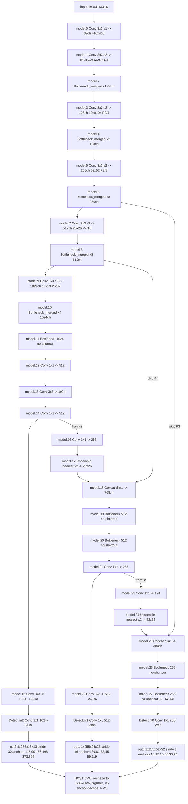

# Subsystem - Models

> [!info] Scope
> Everything that defines *what the network is*: the layer library (`models/common.py`, 1122 lines), the graph
> assembler and detection head (`models/yolo.py`, 460 lines), the ensemble/loader helpers
> (`models/experimental.py`), and the YAML architecture configs (`models/*.yaml`).
> Module-level notes: [[models.common]] · [[models.yolo]] · [[models.experimental]] · [[models.common_orig]] · [[models.tf]] · [[models]]

> [!tip] The one-paragraph version
> The deployed network is **`yolov3_merged_23.yaml`**: a darknet53 skeleton whose five backbone residual
> stages have had their standard two-conv `Bottleneck` replaced by a single **1x1** conv
> (`Bottleneck_merged`), 23 of them, while the YOLOv3 head keeps six ordinary `Bottleneck`s. The result is
> **52 convolutions total - 37 of them pointwise 1x1** - all with **SiLU**, and a `Detect` head at index 28
> that the DPU wrapper amputates down to its three 1x1 output convs. Everything after those convs (reshape,
> sigmoid, anchor decode, NMS) is host CPU work, and the decode is **YOLOv5-style, not classic YOLOv3**.

---

## 1. File map

| Path | Role | Ships to board? |
|---|---|---|
| `models/common.py` | Layer library: `Conv`, `Bottleneck`, `Bottleneck_merged`, `C3`, `SPP/SPPF`, `Concat`, `DetectMultiBackend`, `AutoShape`, … | Class *definitions* must exist to unpickle the `.pt` |
| `models/yolo.py` | `Detect`, `Segment`, `BaseModel`, `DetectionModel`, `parse_model` | Same - unpickling needs `models.yolo.DetectionModel` |
| `models/experimental.py` | `attempt_load`, `Ensemble`, `MixConv2d`, `Sum` | Only on the host loading path |
| `models/common_orig.py` | Pristine backup of `common.py`. Imported by **nothing** (`grep -rn common_orig *.py` → no hits) | No |
| `models/yolov3_merged_23.yaml` | **The deployed architecture** | Architecture of record |
| `models/yolov3_merged.yaml`, `yolov3_orig.yaml`, `yolov3.yaml` | Ablation siblings (see §6) | No |
| `models/tf.py` | Keras mirror of `common.py` for the TFLite/SavedModel export path | Irrelevant to the DPU path ([[models.tf]]) |
| `models/hub/*.yaml`, `models/segment/*.yaml`, `yolov5*.yaml` | Upstream Ultralytics baggage, unused here | No |

> [!warning] Stale editor swap file
> `models/.yolo.py.swp` (16 KB) exists next to `yolo.py`. Somebody left `yolo.py` open in vim. If that session
> is still alive anywhere, its buffer can overwrite the file. Worth resolving before any edit to `yolo.py`.

---

## 2. The layer library in `models/common.py`

`Conv` is the atom everything else is built from (`models/common.py:57-81`):

```python
class Conv(nn.Module):
    default_act = nn.SiLU()                      # models/common.py:60
    def __init__(self, c1, c2, k=1, s=1, p=None, g=1, d=1, act=True):
        self.conv = nn.Conv2d(c1, c2, k, s, autopad(k, p, d), groups=g, dilation=d, bias=False)
        self.bn   = nn.BatchNorm2d(c2)
        self.act  = self.default_act if act is True else act if isinstance(act, nn.Module) else nn.Identity()
```

- `bias=False` + BN: the bias you see in the quantized graph appears only because Vitis AI folds BN into the
  conv. `BaseModel.fuse()` (`models/yolo.py:169-178`) does the same fold in PyTorch via `fuse_conv_and_bn`
  ([[utils.torch_utils]]) and swaps `forward` for `forward_fuse` (`models/common.py:77`).
- `autopad` (`models/common.py:48-54`) gives 'same' padding: k=3 → p=1, k=1 → p=0. Matches the traced graph
  (`padding=[1,1]` for 3x3, `[0,0]` for 1x1).

| Class | Lines | What it emits | Used by the YOLOv3 YAMLs? |
|---|---|---|---|
| `Conv` | 57-81 | Conv2d → BN → SiLU | **Yes - 80 occurrences across `yolov3*.yaml`** |
| `Bottleneck` | 150-190 | `cv1` 1x1 c→c/2, `cv2` 3x3 c/2→c, optional residual add | **Yes - 23 occurrences** (all 6 in the deployed head) |
| `Bottleneck_merged` | 192-212 | **single `cv2` 1x1 c1→c2**, optional residual add | **Yes - the deployed backbone** (see §3) |
| `Concat` | 468-480 | `torch.cat(x, dim)`; `dim=1` here | **Yes - 11 occurrences** (2 in the deployed graph) |
| `SPP` | 318-342 | 1x1 reduce, 3x MaxPool k=5/9/13 s=1, cat, 1x1 | Only in `yolov3-spp.yaml` - **not deployed** |
| `SPPF` | 345-365 | 1x1 reduce, 3x sequential MaxPool k=5, cat, 1x1 | No (YOLOv5 configs only) |
| `DWConv` | 84-91 | `Conv` with `groups=gcd(c1,c2)` | No |
| `DWConvTranspose2d` | 94-101 | grouped `ConvTranspose2d` | No |
| `BottleneckCSP` | 215-238 | 4 convs + BN + SiLU around an `n`-deep `Bottleneck` stack | No |
| `C3` / `C3x` / `C3TR` / `C3SPP` / `C3Ghost` | 259-315 | CSP block with 3 convs; variants swap the inner `m` | No (these are the YOLOv5 blocks) |
| `Focus` | 368-382 | space-to-depth slice + `Conv` | No |
| `GhostConv` / `GhostBottleneck` | 385-423 | GhostNet cheap-conv blocks | No |
| `Contract` / `Expand` | 426-465 | reshape/permute space↔channel | No |
| `TransformerLayer` / `TransformerBlock` | 104-147 | MHA + FFN, no LayerNorm | No |
| `CrossConv` | 241-256 | 1xk then kx1 convs | No |
| `Proto` | 1083-1096 | segmentation mask prototypes | No (detection only) |
| `Classify` | 1099-1121 | conv → GAP → dropout → linear | No |
| `DetectMultiBackend` | 483-816 | Runtime wrapper: dispatches to pt / TorchScript / ONNX / OpenVINO / TensorRT / CoreML / TF* / Paddle / Triton | Host only - used by [[val]] and [[export]] |
| `AutoShape` | 819-925 | letterbox + forward + NMS + `Detections` for arbitrary input types | Host only |
| `Detections` | 928-1080 | results container: `.xyxy/.xywh/.pandas()/.crop()/.render()` | Host only |

> [!info] Deployed op inventory (counted from the traced graph)
> `quantize_result/YOLOv3DPUWrapper.py`: **52** `Conv2d`, **49** `aten::silu_`, **23** `Add`,
> **2** `Interpolate` (nearest 2x), **2** `Cat`, 179 traced ops total.
> Kernel breakdown: **37x 1x1/s1, 10x 3x3/s1, 5x 3x3/s2**. 49 = 52 - 3, i.e. *every* conv carries SiLU
> except the three `Detect` output convs. The 23 `Add`s are exactly the 23 merged residual shortcuts.

### `DetectMultiBackend` notes that bite

- `fuse=True` is the default (`models/common.py:486`) - the commented-out `fuse=False` variant on line 487 is
  the debug alternative. Any fp32 reference numbers you generate through `DetectMultiBackend` come from a
  **BN-fused** model; the DPU wrapper does *not* fuse (see §8), so tiny numeric differences between "host
  reference" and "pre-quant wrapper" are expected and are not a bug.
- Suffix sniffing (`_model_type`, `models/common.py:790-808`) imports `export_formats` from [[export]]; there is
  **no `.xmodel` entry**, so a compiled xmodel can never be driven through `DetectMultiBackend`. The board
  runner is separate code that does not exist in this repo yet.

---

## 3. `Bottleneck` vs `Bottleneck_merged` - the project's core idea

**Standard** (`models/common.py:150-190`), the classic darknet residual unit:

```python
c_ = int(c2 * e)              # e=0.5 → c_ = c/2
self.cv1 = Conv(c1, c_, 1, 1) # 1x1 reduce
self.cv2 = Conv(c_, c2, 3, 1, g=g)  # 3x3 expand
self.add = shortcut and c1 == c2
# forward: x + cv2(cv1(x)) if add else cv2(cv1(x))
```

**Merged** (`models/common.py:192-212`):

```python
def __init__(self, c1, c2, shortcut=True):   # note: no g, no e
    self.cv2 = Conv(c1, c2, 1, 1)            # ONE 1x1 conv, full width in → full width out
    self.add = shortcut and c1 == c2
# forward: x + cv2(x) if add else cv2(x)
```

Two things changed, and the second is the one people miss:

1. the **1x1 reduction `cv1` is gone**, and
2. the surviving conv is **not** the original 3x3 - `cv2` is instantiated as `Conv(c1, c2, 1, 1)`, i.e.
   **kernel 1**. Confirmed in the traced graph: every `Bottleneck_merged/Conv[cv2]/Conv2d` is
   `kernel_size=[1,1], padding=[0,0]` (`quantize_result/YOLOv3DPUWrapper.py:15`, `:20`, `:44`, …).
   The signature also drops `g` and `e`, so a YAML entry may pass only `[c2]` or `[c2, shortcut]`.

### Cost consequence (exact, weights only)

For a residual stage with `c1 = c2 = c`: standard = `0.5c²` (cv1) + `4.5c²` (cv2 3x3) = **5c²**;
merged = **1c²**. A flat **5x** reduction in both parameters and MACs, per bottleneck, everywhere.

| Backbone stage | c | n | grid @416 | std conv weights | merged | std MACs | merged MACs |
|---|---|---|---|---|---|---|---|
| `model.2` | 64 | 1 | 208² | 20,480 | 4,096 | 0.89 G | 0.18 G |
| `model.4` | 128 | 2 | 104² | 163,840 | 32,768 | 1.77 G | 0.35 G |
| `model.6` | 256 | 8 | 52² | 2,621,440 | 524,288 | 7.09 G | 1.42 G |
| `model.8` | 512 | 8 | 26² | 10,485,760 | 2,097,152 | 7.09 G | 1.42 G |
| `model.10` | 1024 | 4 | 13² | 20,971,520 | 4,194,304 | 3.54 G | 0.71 G |
| **total** | | **23** | | **34.26 M** | **6.85 M** | **20.4 G** | **4.08 G** |

(Computed from channel and spatial dims; conv weights only, BN/bias excluded; MAC = one multiply-accumulate,
double for FLOPs. ~27.4 M weights and ~16.3 GMAC/frame removed from the backbone.)

### What it means for DPU inference

> [!tip] Good for the DPU
> - 1x1 convs are the DPUCVDX8G's happiest shape: no line buffering, maximum PE utilisation, and the whole
>   `Bottleneck_merged` is `conv → act → add`, three ops.
> - The 5x weight cut is a 5x cut in on-chip weight traffic for the deepest stages, which is where a
>   C32B6 configuration is DDR-bandwidth-bound.
> - The residual `Add` (int8 elementwise add) is a native DPU op, so the shortcut is free.

> [!danger] Bad for accuracy - and this is an architectural fact, not a quantization artefact
> A 1x1 conv performs **zero spatial mixing**. In `yolov3_merged_23` the entire backbone residual stack is
> pointwise, so the only spatially-mixing layers in the whole deployed net are **15 convs**: `model.0` (3x3/1),
> the five stride-2 downsamples (`model.1/3/5/7/9`), and nine 3x3s in the head. Darknet53's receptive field is
> built almost entirely by the 3x3s inside its bottlenecks - those are gone. Expect the fp32 `merged_23`
> baseline to localise worse than stock YOLOv3, **especially small objects on the P3/8 branch**.
> Measure fp32 `merged_23` mAP *before* quantizing, or you will spend days blaming int8 for a design decision.

> [!warning] Unpickling depends on this class name
> `runs/train/exp2/weights/best.pt` is a pickled `models.yolo.DetectionModel` whose submodules are
> `models.common.Bottleneck_merged` instances. **If `common.py` is ever replaced by `common_orig.py`, the
> checkpoint stops loading** (`AttributeError: Can't get attribute 'Bottleneck_merged'`). Keep `common.py`
> as-is on any machine that has to touch the checkpoint - including inside the Vitis AI container.

### Archaeology: the abandoned first attempt

`models/common.py:164-175` and `:183-190` hold a commented-out earlier version of the same idea inside
`Bottleneck` itself - `cv1 = None if c_ == c1`, with a debug `print` - plus the dead one-liner
`#return x + self.cv2(x) if self.add else self.cv2(x)` on `:182`. That approach would have made
`Bottleneck`'s behaviour depend on channel arithmetic; the final design instead added a separate class, which
is why the checkpoint can mix both cleanly. Nothing else in the repo references that dead code.

---

## 4. `common.py` vs `common_orig.py` - exactly what the project changed

`diff models/common_orig.py models/common.py` is **47 lines, one hunk region**. That is the complete extent of
the modification to the layer library:

1. `Bottleneck.__init__` gained a blank line and the commented-out alternative implementation
   (`common.py:158`, `:164-175`).
2. `Bottleneck.forward` gained two commented-out alternative bodies (`common.py:182`, `:183-190`).
3. **`class Bottleneck_merged` was added** (`common.py:192-212`).

Live behaviour of `Bottleneck` is byte-identical to upstream. **Nothing else in `common.py` differs** - not
`Conv`, not `SPP`, not `DetectMultiBackend`. So the entire architectural intervention of this project is one
new 21-line class plus one line added to a set literal in `parse_model` (`models/yolo.py:369`). Everything
else in the repo's diff surface is deployment scaffolding, not modelling.

`common_orig.py` is 1077 lines vs `common.py`'s 1121 and is imported nowhere; treat it as a reference copy
only. It is graphified as [[models.common_orig]] purely because it is a `.py` file under `models/`.

For `models/yolo.py` there is no pristine copy in-repo, so the diff cannot be isolated the same way. Visible
project edits are the `Bottleneck_merged` entry in the `parse_model` module set (`:369`) and commented-out
debug prints (`:358`, `:364`, `:387-388`). *(No upstream copy present to diff against - unverified whether
anything else was touched.)*

---

## 5. `parse_model`: YAML → `nn.Sequential`

`models/yolo.py:345-424`. Single pass over `d["backbone"] + d["head"]`, each entry `[from, number, module, args]`:

1. **`module` is `eval`'d from its string** (`:357`), resolving against `models.yolo`'s namespace, which did
   `from models.common import *` (`:23`). This is why `Bottleneck_merged` works as a YAML token, and why
   `nn.Upsample` / `nn.MaxPool2d` work too. `args` entries are also `eval`'d under
   `contextlib.suppress(NameError)` (`:359-361`), which is how the bare words `nc` and `anchors` in the
   `Detect` line become real values.
2. **Depth scaling**: `n = max(round(n * gd), 1) if n > 1 else n` (`:363`). `depth_multiple: 1.0` here → no-op.
3. **Channel bookkeeping** (`:386-392`): for conv-like modules `c1 = ch[f]`, `c2 = args[0]`, then
   `c2 = make_divisible(c2 * gw, 8)` unless `c2 == no`. `width_multiple: 1.0` → no-op. Final args are
   `[c1, c2, *args[1:]]`. `Bottleneck_merged` is in that set (`:369`), so it receives `(c1, c2, …)` like the
   others - and since its `__init__` takes only `(c1, c2, shortcut)`, a YAML entry with `g`/`e` extras would
   `TypeError`. The deployed YAML passes only `[c2]`.
4. **`Concat`** (`:398-399`): `c2 = sum(ch[x] for x in f)` - no module args beyond the dim.
5. **`Detect`** (`:401-404`): `args.append([ch[x] for x in f])` - the head is handed the channel widths of its
   source layers **in `f` order**, which fixes the order of `Detect.m` (see §7).
6. **Repeats** (`:414`): `nn.Sequential(*(m(*args) for _ in range(n))) if n > 1 else m(*args)`. So `model.2`
   (n=1) is a bare `Bottleneck_merged` while `model.4/6/8/10` are `Sequential`s - visible verbatim in the
   traced names (`Bottleneck_merged[layers]/ModuleList[2]` vs `Sequential[layers]/ModuleList[6]/Bottleneck_merged[0]`).
7. **Save list** (`:419`): `save.extend(x % i for x in ([f] if isinstance(f,int) else f) if x != -1)`. For the
   deployed YAML this yields **`save = [6, 8, 14, 15, 21, 22, 27]`** (the probe script prints exactly this;
   `vitis_out/probe_init.py:23`). Note `%` - a `from: -2` at index 16 saves layer **14**, not 15.
8. **Activation override** (`:348-351`): `d.get("activation")` → `Conv.default_act = eval(act)`. **None of the
   `yolov3*.yaml` files set it**, so SiLU stands. `models/hub/yolov5s-LeakyReLU.yaml:5` shows the syntax
   (`activation: nn.LeakyReLU(0.1)`) - this is the hook to use if SiLU is swapped out (§9).

Each built module is tagged `m_.i, m_.f, m_.type, m_.np` (`:417`) - those four attributes are what both
`BaseModel._forward_once` and the DPU wrapper rely on to re-route tensors.

---

## 6. YAML diff: `yolov3_orig` vs `yolov3_merged` vs `yolov3_merged_23`

All three files are 52 lines, identical except for the backbone module token on five lines. Head, anchors,
`nc: 80`, `depth_multiple`/`width_multiple: 1.0` are byte-identical everywhere.

| YAML line | Layer | `yolov3_orig.yaml` / `yolov3.yaml` | `yolov3_merged.yaml` | `yolov3_merged_23.yaml` **(deployed)** |
|---|---|---|---|---|
| 18 | `model.2` (n=1, 64) | `Bottleneck` | `Bottleneck_merged` | `Bottleneck_merged` |
| 20 | `model.4` (n=2, 128) | `Bottleneck` | `Bottleneck_merged` | `Bottleneck_merged` |
| 22 | `model.6` (n=8, 256) | `Bottleneck` | `Bottleneck_merged` | `Bottleneck_merged` |
| 24 | `model.8` (n=8, 512) | `Bottleneck` | `Bottleneck_merged` | `Bottleneck_merged` |
| 26 | `model.10` (n=4, 1024) | `Bottleneck` | **`Bottleneck`** | **`Bottleneck_merged`** |
| 31-49 | head `model.11/19/20/26/27` | `Bottleneck` | `Bottleneck` | `Bottleneck` |

So: `yolov3_orig.yaml` and `yolov3.yaml` are identical (0 merged); `yolov3_merged.yaml` merges 1+2+8+8 = **19**;
`yolov3_merged_23.yaml` also merges the deepest stage, 19+4 = **23**. That number is the naming: **"merged23" =
23 merged bottlenecks**, and it is corroborated by the 23 `Add` ops in the traced graph. *(The name-to-count
correspondence is inference from the counts, not from a comment in the repo.)*

`yolov3-spp.yaml` (SPP block, standard bottlenecks) and `yolov3-tiny.yaml` (`nn.MaxPool2d` + `nn.ZeroPad2d`,
no bottlenecks at all) are unrelated baselines.

> [!info] The checkpoint really is `merged_23` - verified
> `vitis_out/inspect_best.log` dumps `model.yaml` embedded in `runs/train/exp2/weights/best.pt`: the backbone
> lists `Bottleneck_merged` for all five stages **including `model.10`**, the head lists `Bottleneck`, plus
> `ch: 3`. Independently, the traced graph gives 1+2+8+8+4 merged units and 6 standard ones in the head
> (`ModuleList[11]`, `[19]`, `[20]`, `[26]`, `[27]x2` all show `Conv[cv1]` 1x1 + `Conv[cv2]` 3x3).
> Note `runs/train/exp2/opt.yaml` has **`cfg: ''`** and `weights: yolov3_merged23_e75.pt` - exp2 inherited its
> architecture from that checkpoint, not from a YAML, so the YAML file is documentation of record rather than
> the literal input. See [[Training Run exp2]].

---

## 7. `Detect`, `BaseModel`, `DetectionModel`

### Forward mechanics

`BaseModel._forward_once` (`models/yolo.py:141-153`) is the whole runtime:

```python
for m in self.model:
    if m.f != -1:
        x = y[m.f] if isinstance(m.f, int) else [x if j == -1 else y[j] for j in m.f]
    x = m(x)
    y.append(x if m.i in self.save else None)
```

`y` is a dense list with `None` holes; only `self.save` indices are retained. `DetectionModel.forward`
(`:244-248`) just adds the TTA path `_forward_augment` (`:250-263`, scales 1/0.83/0.67 + lr flip) - unused for
deployment.

### Build-time stride and anchor normalisation

`DetectionModel.__init__` (`:199-241`):

- `m.stride = torch.tensor([s / x.shape[-2] for x in forward(torch.zeros(1, ch, 256, 256))])` (`:233`) - strides
  are **measured**, not declared, from a 256x256 dummy pass in the `f` order `[27, 22, 15]` → `[8, 16, 32]`.
- `check_anchor_order(m)` ([[utils.autoanchor]]) then `m.anchors /= m.stride.view(-1,1,1)` (`:235`) - this is
  why the checkpoint's `anchors` buffer is in **grid units**.
- `_initialize_biases` (`:293-303`) seeds the output-conv biases (objectness `log(8/(640/s)²)`, class
  `log(0.6/(nc-0.99999))`). It runs **only when building from a YAML**; loading a checkpoint skips it.

Verified in `vitis_out/inspect_best.log`: `model.28 (Detect)`, `anchors.shape = [3,3,2]` fp16,
`stride = [8., 16., 32.]` fp16, `no = 85`. The stored grid-unit anchors multiply back to the canonical pixel
set exactly (all values are exactly representable in fp16):

| Branch | stride | grid-unit anchors (checkpoint) | pixel anchors |
|---|---|---|---|
| P3 (`model.27`, 52x52) | 8 | (1.25,1.625) (2.0,3.75) (4.125,2.875) | 10,13 · 16,30 · 33,23 |
| P4 (`model.22`, 26x26) | 16 | (1.875,3.8125) (3.875,2.8125) (3.6875,7.4375) | 30,61 · 62,45 · 59,119 |
| P5 (`model.15`, 13x13) | 32 | (3.625,2.8125) (4.875,6.1875) (11.65625,10.1875) | 116,90 · 156,198 · 373,326 |

### The head itself

`Detect.__init__` (`models/yolo.py:51-62`): `nc=80`, `no=85`, `nl=3`, `na=3`,
`self.m = nn.ModuleList(nn.Conv2d(x, self.no*self.na, 1) for x in ch)` → three **1x1, 255-channel, bias=True**
convs with **no BN and no activation**. `ch` arrives in `f` order, so:

| `Detect.m[i]` | source layer | in_ch | output @416 | stride | anchor row |
|---|---|---|---|---|---|
| `m[0]` | `model.27` | 256 | `[1,255,52,52]` | 8 | 0 |
| `m[1]` | `model.22` | 512 | `[1,255,26,26]` | 16 | 1 |
| `m[2]` | `model.15` | 1024 | `[1,255,13,13]` | 32 | 2 |

(in_channels confirmed at `quantize_result/YOLOv3DPUWrapper.py:136-138`.)

`Detect.forward` (`:64-92`) then does the part the DPU cannot:

```python
x[i] = self.m[i](x[i])                                              # the only DPU-able step
x[i] = x[i].view(bs, self.na, self.no, ny, nx).permute(0,1,3,4,2).contiguous()   # → (bs,3,H,W,85)
if not self.training:
    self.grid[i], self.anchor_grid[i] = self._make_grid(nx, ny, i)  # arange/meshgrid at runtime
    xy, wh, conf = x[i].sigmoid().split((2, 2, self.nc + 1), 4)
    xy = (xy * 2 + self.grid[i]) * self.stride[i]
    wh = (wh * 2) ** 2 * self.anchor_grid[i]
    z.append(torch.cat((xy, wh, conf), 4).view(bs, self.na*nx*ny, self.no))
```

with `_make_grid` (`:94-105`) producing `grid = stack(xv,yv) - 0.5` and
`anchor_grid = anchors[i] * stride[i]` (i.e. pixel anchors).

> [!danger] This is the YOLOv5 decode, not the YOLOv3 decode
> `xy = (2σ(t) - 0.5 + cell) · stride` and `wh = (2σ(t))² · anchor_px`. Classic YOLOv3 uses
> `xy = (σ(t) + cell) · stride` and `wh = exp(t) · anchor_px`. Dropping this checkpoint's raw outputs into a
> stock Vitis AI YOLOv3 post-processor (or any darknet-style decoder) yields **plausible-looking but wrong
> boxes** - shifted by half a cell and with systematically wrong sizes, capped at 4x the anchor. Also: `wh` is
> bounded by construction, and class scores are **independent sigmoids** (no softmax), scored as
> `obj * cls` downstream in `non_max_suppression` ([[utils.general]]).

### Why the decode cannot be on the DPU

| Step in `Detect.forward` | Why the DPU/XIR can't take it |
|---|---|
| `view(bs,3,85,H,W).permute(...)` | XIR/DPU tensors are 4-D NHWC. 5-D reshape+permute has no DPU op. The compile log already shows plain 4-D `transpose`s being pushed to CPU. |
| `sigmoid()` on 255 channels | No general sigmoid in the DPU op set (hard-sigmoid only). |
| `_make_grid`'s `arange`/`meshgrid` | Constants generated **at runtime from tensor shape**; not compile-time foldable in a traced graph. |
| `* stride`, `* anchor_grid` | Broadcast elementwise multiply by rank-5 constants. |
| `torch.cat(..., 4)` + final `view` | Shape ops on a 5-D tensor. |
| NMS | Not a DPU op in any form. |

Hence `export_dpu_wrapper_AB3.py:139-171` keeps `model.model[:-1]`, replays the `_forward_once` routing
manually from the pre-computed `self.routes`/`self.save`, then calls `self.m0/m1/m2` directly and returns the
three raw tensors. Everything from `.view()` onward is host work - see [[Subsystem - Export]] and
[[export_dpu_wrapper_AB3]].

> [!warning] The stripped head takes its metadata with it
> The wrapper discards `anchors`, `stride`, `nc`, `names`, `inplace` - they live only inside the `.pt`. The
> board-side post-processor must carry them independently. `inspect_model_AB1.py` prints all of them
> ([[inspect_model_AB1]]); the values are tabulated above.

---

## 8. Deployed dataflow



> [!warning] The two `from: -2` routes are the classic trap
> `model.16` branches from **`model.14`** (the 512-ch 1x1), not from `model.15`; `model.23` branches from
> **`model.21`**, not `model.22`. A hand-rolled re-implementation that reads "previous layer" will silently
> take the 3x3-expanded tensor instead, still run, and quietly lose accuracy. Channel arithmetic is the
> cross-check: the concats must produce **768** (256+512) and **384** (128+256), matching the traced
> `in_channels` at `quantize_result/YOLOv3DPUWrapper.py:108` and `:124`.

---

## 9. SiLU: the headline DPU problem

Everything in this net activates with `nn.SiLU` because `Conv.default_act = nn.SiLU()`
(`models/common.py:60`) and no `yolov3*.yaml` sets the `activation:` key.

Evidence chain, all from this repo:

- Quantizer: `[VAIQ_WARN][QUANTIZER_TORCH_FLOAT_OP]: The quantizer recognize new op 'aten::silu_' as a float
  operator by default.` (`vitis_out/quant_test.log`)
- Generated graph: **49** `py_nndct.nn.Module('aten::silu_')` entries vs 52 `Conv2d`
  (`quantize_result/YOLOv3DPUWrapper.py`). A `py_nndct.nn.Module('...')` wrapper means *unquantized, runs in
  float*.
- Compiler: `type: aten::silu_, is not defined in XIR. XIR creates the definition of this operator
  automatically...` then a long list of `transpose ... has been assigned to CPU`, and finally
  **`Total device subgraph number 105, DPU subgraph number 52`** for `Target architecture:
  DPUCVDX8G_ISA3_C32B6`, `op num: 562` (`vitis_out/compile.log`).

> [!danger] What "52 DPU subgraphs" actually costs
> 52 DPU subgraphs = **one per convolution**. Each SiLU sits between two of them on the ARM cores, with a
> layout `transpose` on each side (DPU works NHWC, the float SiLU is fed NCHW). Every one of those boundaries
> is a full activation-tensor round trip to DDR plus a kernel launch. At 416x416 the early tensors are
> 64x208x208 and 128x104x104 - millions of elements transposed and exponentiated on the CPU, ~49 times.
> This is not a "few percent" penalty; it defeats the point of the DPU. The 5x MAC saving from
> `Bottleneck_merged` is irrelevant while this stands.

Options, in the order they should be tried:

1. **Retrain / fine-tune with a DPU-native activation.** `parse_model` already supports it: add
   `activation: nn.ReLU()` (or `nn.LeakyReLU(0.1)`) to a copy of `yolov3_merged_23.yaml` and fine-tune from
   `best.pt`. One YAML line, no code change. ReLU-family ops fuse into the conv on the DPU, so the subgraph
   count should collapse toward 1. Cost: a training run and some mAP; see [[Subsystem - Training]].
2. **Swap the module post-hoc and fine-tune briefly**: walk `model.modules()` replacing `nn.SiLU` with the
   chosen activation. Cheap to try, but the weights were trained against SiLU's negative lobe, so expect a
   real drop without at least a short fine-tune.
3. Leave SiLU and accept CPU fragmentation. Only defensible as a first end-to-end bring-up to prove the
   toolchain, never as the shipping configuration.

`utils/activations.py:9` defines an export-friendly `SiLU` as `x * torch.sigmoid(x)`; decomposing it that way
does **not** help, because neither `mul` broadcast nor a general `sigmoid` is a DPU conv-fusable op either.
*(Exact per-architecture op support - which of relu / relu6 / leaky_relu(0.1) / hard-sigmoid / hard-swish
DPUCVDX8G_ISA3_C32B6 fuses - is not documented anywhere in this repo; check the Vitis AI release's DPU op
support matrix before choosing. Unverified here.)* See [[Vitis AI DPU Concepts]].

---

## 10. Gotchas checklist for hardware bring-up

- [ ] **Decode formula** is YOLOv5-style (`2σ-0.5`, `(2σ)²·anchor`), not `exp()`. §7.
- [ ] **Output order** is P3, P4, P5 (52, 26, 13) because `Detect.f = [27, 22, 15]`. Pair `out_i` with
      `anchor row i` and `stride [8,16,32][i]`. Do not sort by tensor size and assume.
- [ ] **Channel layout inside the 255** is anchor-major: `c = a*85 + k`, `k ∈ {tx,ty,tw,th,obj,cls0..cls79}`
      (from `view(bs, na, no, ny, nx)`). The DPU runner hands back **NHWC int8** needing a `2^-fixpos` scale
      *(runner behaviour is standard Vitis AI, unverified in-repo - no board code exists yet)*.
- [ ] **`imgsz = 416`** everywhere: trained at 416 (`runs/train/exp2/opt.yaml`), quantized at 416
      (`quantize_vitis_AB4.py:327`). 416/32 = 13 exactly, so no padding surprises. Changing input size
      requires re-quantizing; the compiled xmodel is shape-static.
- [ ] **The wrapper does not `fuse()`.** It loads the pickled model and calls `.float().eval()` only
      (`export_dpu_wrapper_AB3.py:137`), so `BatchNorm2d` ops appear in the trace (`vitis_out/quant_test.log`)
      and Vitis AI folds them itself - which is why traced `Conv2d`s carry `bias=True`. Don't "fix" this by
      calling `fuse()`; nndct's own fold is the supported path.
- [ ] **fp16 provenance.** `best.pt` stores fp16 weights and fp16 `anchors`/`stride`; the wrapper casts to
      fp32 (lossless upcast of already-rounded values). Your fp32 mAP reference should be *this* checkpoint,
      not a differently-rounded one, or the "quantization loss" number is contaminated.
- [ ] **Calibration set** was 100 images from `../datasets/coco128/images/train2017`
      (`vitis_out/quant_test.log`) with a plain `Resize((416,416)) + ToTensor()` - i.e. **stretch, not
      letterbox**, unlike training/val ([[utils.dataloaders]]). Calibration statistics therefore come from a
      slightly different input distribution than inference will see. Cheap to improve; see
      [[Subsystem - Export]].
- [ ] **Keep `Bottleneck_merged` in `models/common.py`** on every machine that loads the checkpoint. §3.
- [ ] **`model.28` is the Detect index** - not 27, not `-1` by number. `model.model[:-1]` is the safe slice.

---

## Related

Layer/graph modules: [[models.common]] · [[models.yolo]] · [[models.experimental]] · [[models.common_orig]] · [[models.tf]] · [[models]]
Deployment path: [[export_dpu_wrapper_AB3]] · [[quantize_vitis_AB4]] · [[quantize_result.YOLOv3DPUWrapper]] · [[export]] · [[vitis_out.probe_init]]
Inspection: [[inspect_model_AB1]] · [[inspect_common_AB2]]
Consumers: [[train]] · [[val]] · [[utils.loss]] · [[utils.autoanchor]] · [[utils.torch_utils]] · [[utils.general]] · [[utils.activations]]
Siblings: [[Subsystem - Training]] · [[Subsystem - Validation]] · [[Subsystem - Export]] · [[Subsystem - Utils Core]] · [[Model Architecture Graph]] · [[Vitis AI DPU Concepts]] · [[Training Run exp2]]

Back to [[Code Map]] | [[Home]]
