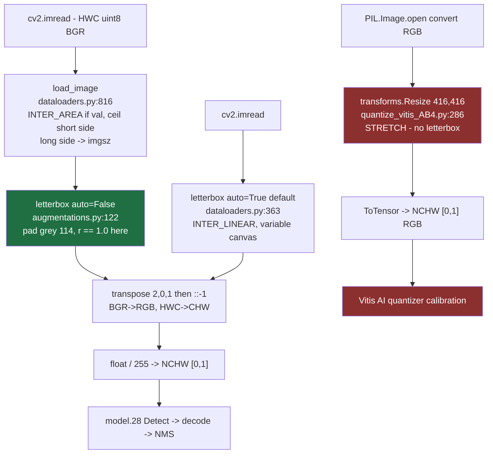

# Subsystem - Utils Core

The seven files that every other script in the repo depends on. If you are porting this
model to the VCK190, the single most important thing in this subsystem is **`letterbox()`** -
it defines the geometric contract between the trained weights and any host preprocessing you
write. Everything else here is either training-only or a small utility.

| File | Lines | Role | Module note |
|---|---|---|---|
| `utils/general.py` | 1288 | LOGGER, path/version/dataset checks, box-format conversions, NMS | [[utils.general]] |
| `utils/dataloaders.py` | 1329 | Dataset + DataLoader classes, label caching, mosaic | [[utils.dataloaders]] |
| `utils/augmentations.py` | 418 | **`letterbox()`**, random_perspective, HSV, mixup | [[utils.augmentations]] |
| `utils/torch_utils.py` | 484 | `select_device`, `fuse_conv_and_bn`, `model_info`, EMA, optimizer | [[utils.torch_utils]] |
| `utils/loss.py` | 256 | `ComputeLoss` (box/obj/cls), FocalLoss variants | [[utils.loss]] |
| `utils/autoanchor.py` | 177 | `check_anchors`, `kmean_anchors`, `check_anchor_order` | [[utils.autoanchor]] |
| `utils/__init__.py` | 105 | `TryExcept`, `threaded`, `emojis`, `notebook_init` | [[utils]] |

Related: [[Subsystem - Models]] · [[Subsystem - Training]] · [[Subsystem - Validation]] ·
[[Subsystem - Data and Datasets]] · [[Vitis AI DPU Concepts]]

---

## 1. The preprocessing contract: `letterbox()`

> [!warning] Where it actually lives
> `letterbox()` is **defined** in `utils/augmentations.py:122`, not in `dataloaders.py`.
> `utils/dataloaders.py:29-38` re-exports it, which is why `models/common.py:27` reads
> `from utils.dataloaders import exif_transpose, letterbox`. Both import paths reach the same
> function - there is only one implementation.

### 1.1 Signature and the call that produced exp2's weights

```python
def letterbox(im, new_shape=(640, 640), color=(114, 114, 114),
              auto=True, scaleFill=False, scaleup=True, stride=32):
```

The call that every training and validation tensor in [[Training Run exp2]] passed through is
`utils/dataloaders.py:747`:

```python
img, ratio, pad = letterbox(img, shape, auto=False, scaleup=self.augment)
```

So for the deployable configuration: **`auto=False`, `scaleFill=False`, `scaleup=False` (val) /
`True` (train), `color=(114,114,114)`, `stride` irrelevant when `auto=False`**.

### 1.2 Exact algorithm (portable spec)

Reading `utils/augmentations.py:124-152` literally. Input `im` is **HWC uint8 BGR** (it comes
from `cv2.imread`, `utils/dataloaders.py:814`).

```
h0, w0            = im.shape[0], im.shape[1]
new_h, new_w      = new_shape                      # int n -> (n, n)

r = min(new_h / h0, new_w / w0)
if not scaleup: r = min(r, 1.0)                     # never upscale

new_w_unpad = int(round(w0 * r))                    # NOTE: banker's rounding
new_h_unpad = int(round(h0 * r))

dw = new_w - new_w_unpad                            # total x padding
dh = new_h - new_h_unpad                            # total y padding
if   auto:      dw, dh = dw % stride, dh % stride   # shrink canvas to stride multiple
elif scaleFill: dw, dh = 0, 0; new_*_unpad = new_*  # stretch, aspect ratio destroyed

dw, dh = dw / 2.0, dh / 2.0                         # HALF paddings, kept as float

if (w0, h0) != (new_w_unpad, new_h_unpad):
    im = cv2.resize(im, (new_w_unpad, new_h_unpad), interpolation=cv2.INTER_LINEAR)

top    = int(round(dh - 0.1));  bottom = int(round(dh + 0.1))
left   = int(round(dw - 0.1));  right  = int(round(dw + 0.1))
im = cv2.copyMakeBorder(im, top, bottom, left, right, cv2.BORDER_CONSTANT, value=color)

return im, (r, r), (dw, dh)
```

Then, separately, the tensor conversion (`utils/dataloaders.py:798-799` for the dataset path,
`utils/dataloaders.py:364-365` for `LoadImages`, and the `/255` at `val.py:357`):

```
img = img.transpose(2, 0, 1)[::-1]   # HWC->CHW and BGR->RGB in one step
img = ascontiguousarray(img)         # uint8, then on GPU/CPU: float() and /= 255
```

Final tensor: **NCHW, RGB, float32 in [0,1], no mean/std normalisation.** ImageNet
mean/std (`utils/augmentations.py:16-17`) is used only by the *classification* transforms,
never by the detector.

### 1.3 Flag semantics

| Flag | Effect | Use on Versal? |
|---|---|---|
| `auto=True` (default!) | Output canvas is only padded up to the next `stride` multiple, so **output size varies per image**. | **No.** The compiled `.xmodel` has a fixed `1x3x416x416` input. Always pass `auto=False`. |
| `scaleup=False` | Small images are padded, never enlarged (`r` capped at 1.0). This is what val uses. | Match val: `scaleup=False`. |
| `scaleFill=True` | Non-uniform stretch to exactly `new_shape`; aspect ratio destroyed. Never used anywhere in this repo. | No. |
| `color=(114,114,114)` | Constant grey border. After `/255` this is `0.447058...` per channel. | Yes - must be exactly 114, not 0. |

### 1.4 Rounding traps a C++/VART host will hit

> [!danger] Three places where a naive reimplementation drifts by one pixel
> 1. **`int(round(...))` is banker's rounding in Python 3.** `round(0.5) == 0`,
>    `round(1.5) == 2`. `std::lround` / `(int)(x+0.5)` round half away from zero and will give
>    a 1-px different `new_w_unpad` whenever `w0 * r` lands exactly on `.5`.
> 2. **The `±0.1` trick puts odd padding on the bottom/right.** With `dh = k + 0.5`,
>    `top = round(k+0.4) = k` and `bottom = round(k+0.6) = k+1`. Do not compute
>    `top = bottom = dh` and then fudge; reproduce the `±0.1` expression.
> 3. **`dw`/`dh` are returned as *half*, float, pre-rounding.** `scale_boxes()` subtracts these
>    floats, not the integer `left`/`top` actually used by `copyMakeBorder`. The two differ by
>    up to 0.5 px on odd padding. Keep the float halves for the inverse transform if you want
>    bit-comparable boxes.

### 1.5 The dataset path resizes **twice**, with two different kernels

This is easy to miss and it changes pixel values. `LoadImagesAndLabels.__getitem__` calls
`load_image()` *before* `letterbox()`:

`utils/dataloaders.py:816-821`
```python
h0, w0 = im.shape[:2]
r = self.img_size / max(h0, w0)
if r != 1:
    interp = cv2.INTER_LINEAR if (self.augment or r > 1) else cv2.INTER_AREA
    im = cv2.resize(im, (math.ceil(w0 * r), math.ceil(h0 * r)), interpolation=interp)
```

Consequences at `imgsz=416`:

- The long side is already `ceil(416) == 416` when `letterbox()` is called, so `letterbox`'s
  own `r` comes out **exactly 1.0** and its `INTER_LINEAR` resize is *skipped*. `letterbox` is
  doing pure padding in the val path.
- The actual downscale kernel for validation is therefore **`cv2.INTER_AREA`** (because
  `augment=False` and `r < 1`), not `INTER_LINEAR`.
- Note `math.ceil`, not `round`, for the short side here.

> [!tip] Host-side rule
> To reproduce the val-time pixels: `INTER_AREA` downscale to long-side 416 with
> `ceil` on the short side, then grey-114 pad. Using a single `INTER_LINEAR` letterbox from
> full resolution (the `LoadImages` path, `utils/dataloaders.py:363`) gives visibly different
> pixels and slightly different scores. Pick one and be consistent between calibration,
> host validation, and the deployed app.

### 1.6 Reported val mAP was **not** measured at 416x416

`val.py:323` sets `pad, rect = (0.5, pt)` for PyTorch weights, so `rect=True` and
`LoadImagesAndLabels` builds per-batch canvases at `utils/dataloaders.py:634`:

```python
self.batch_shapes = np.ceil(np.array(shapes) * img_size / stride + pad).astype(int) * stride
```

With `img_size=416`, `stride=32`, `pad=0.5`: `416/32 = 13`, `13 + 0.5 = 13.5`, `ceil = 14`,
`14 * 32 = 448`. The long side of the val canvas is therefore **448**, and the short side is
`ceil(ar*13 + 0.5)*32` for that batch's extreme aspect ratio. `train.py:1138-1150` uses the
same `rect=True, pad=0.5` for the in-training val loader.

> [!warning] Parity expectation
> The mAP numbers in [[Training Run exp2]] come from rectangular ~448-long-side canvases with
> `multi_label=True` NMS (`val.py:372-374`). A DPU run at fixed 416x416 square will not
> reproduce them even in fp32 with zero quantisation error. Establish a **fp32, square,
> 416x416 host baseline first**, then measure quantisation loss against *that*.

### 1.7 The calibration preprocessing does not match - explicitly

`quantize_vitis_AB4.py:285-288` builds calibration tensors with:

```python
transform = transforms.Compose([
    transforms.Resize((img_size, img_size)),
    transforms.ToTensor(),
])
...
img = Image.open(path).convert('RGB')
```

> [!danger] Preprocessing mismatch (open risk)
> `transforms.Resize((416, 416))` is a **non-uniform stretch to a square** - the torchvision
> equivalent of `scaleFill=True`. It is *not* letterbox. Concretely, versus the training/val path:
>
> | | Training / val (`letterbox`) | `quantize_vitis_AB4.py` |
> |---|---|---|
> | Aspect ratio | preserved, grey-114 padded | **destroyed** (stretched) |
> | Border pixels | 114 grey bars present | none - no bars ever seen |
> | Decoder | PIL via... `cv2.imread` (BGR) | `PIL.Image.open(...).convert('RGB')` |
> | Resize kernel | `INTER_AREA` (val) / `INTER_LINEAR` | PIL bilinear **with antialiasing** |
> | Channel order into the net | BGR array reversed to RGB | RGB directly |
> | Range | `/255` -> [0,1] | `ToTensor()` -> [0,1] |
>
> Channel order and range happen to agree. **Geometry, border statistics, and the resize
> kernel do not.**
>
> Two distinct harms:
> 1. **Calibration harm.** The quantizer picks per-tensor scales from the activation ranges it
>    observes. Calibrating on stretched, border-free images samples a different input
>    distribution than the deployed one - in particular the network never sees the large flat
>    grey-114 regions that dominate letterboxed COCO inputs. Expect suboptimal scales.
> 2. **Inference harm (the fatal one).** If the *host app* also stretches, every predicted box
>    is in stretched coordinates and the anchor priors (tuned in letterbox geometry) no longer
>    match object shapes. Detections will be systematically wrong in a way that looks like
>    "the quantisation broke it".
>
> `dpu_silu_experiment.py` imports `get_calibration_dataloader` from `quantize_vitis_AB4`, so
> the same mismatch is inherited by the SiLU-swap experiment.
>
> **Fix:** replace `get_calibration_dataloader` with a letterbox-based loader
> (`cv2.imread` -> `load_image`-style `INTER_AREA` downscale -> `letterbox(..., 416, auto=False,
> scaleup=False)` -> `[::-1]` transpose -> `/255`), and use the identical function on the host.

### 1.8 Preprocessing paths in this repo



Green = the geometry the weights were trained in. Red = the geometry the quantizer currently sees.

### 1.9 The inverse transform: `scale_boxes()`

Your host post-processing needs this to map boxes from the 416x416 canvas back to the original
frame. `utils/general.py:949-962`:

```python
def scale_boxes(img1_shape, boxes, img0_shape, ratio_pad=None):
    if ratio_pad is None:
        gain = min(img1_shape[0] / img0_shape[0], img1_shape[1] / img0_shape[1])
        pad = (img1_shape[1] - img0_shape[1] * gain) / 2, (img1_shape[0] - img0_shape[0] * gain) / 2
    else:
        gain, pad = ratio_pad[0][0], ratio_pad[1]
    boxes[..., [0, 2]] -= pad[0]
    boxes[..., [1, 3]] -= pad[1]
    boxes[..., :4] /= gain
    clip_boxes(boxes, img0_shape)
```

Note it **recomputes** `gain`/`pad` from the two shapes when `ratio_pad is None` - which is
correct only for the plain single-stage letterbox, and silently wrong for the two-stage
`load_image` + `letterbox` path with `ceil` rounding. That is why `val.py:395` passes
`shapes[si][1]`, i.e. the `((h/h0, w/w0), pad)` tuple that `__getitem__` recorded at
`utils/dataloaders.py:748`. **On the host, carry the `(r, (dw, dh))` returned by your
letterbox through to the inverse transform; do not re-derive it.** Boxes are mutated
**in place**; `clip_boxes` (`utils/general.py:986`) clamps to the original frame.

---

## 2. `utils/general.py`

Imported by essentially everything, so its *import side effects* matter as much as its
functions.

### 2.1 The ultralytics imports that needed the compat shim

```python
# utils/general.py:36-37
from ultralytics.utils.checks import check_requirements
from ultralytics.utils.patches import torch_load
```

These are **module-level, unconditional**. The `vitis-ai-pytorch` image has no `ultralytics`
package, and `torch.load` on `best.pt` re-imports these modules while unpickling the custom
`DetectionModel` class - so the failure happens deep inside checkpoint load, not at an obvious
top-level import. Hence `vitis_compat/ultralytics/` ([[vitis_compat.ultralytics]]), enabled by
putting that directory on `PYTHONPATH`. Only the symbols actually imported are stubbed:

- `check_requirements(*args, **kwargs) -> True` (no-op) - [[vitis_compat.ultralytics.utils.checks]]
- `torch_load(...)` = `torch.load` with `weights_only=False` defaulted - [[vitis_compat.ultralytics.utils.patches]]
- plus `Annotator`/`colors`/`save_one_box` for `models/common.py:24` and `utils/plots.py:19` -
  [[vitis_compat.ultralytics.utils.plotting]]

Other consumers of the same shim, for reference: `utils/__init__.py:75`,
`models/experimental.py:9`, `utils/aws/resume.py:12`, `train.py:917-918`
(`TORCH_2_4`, `autocast` from `ultralytics.utils.torch_utils`).

### 2.2 `LOGGER` and `colorstr`

`set_logging(LOGGING_NAME)` runs at **import time** (`utils/general.py:154`), then
`LOGGER = logging.getLogger("yolov5")` at `:155`. Format is bare `%(message)s`; level is
`INFO` for `RANK in {-1,0}` else `ERROR` (`:129-130`). Suppress with `YOLOv5_VERBOSE=false`
(read at `:51`, though that only gates `VERBOSE`, not `set_logging`'s own call).

`colorstr(*input)` (`:714-742`) wraps a string in ANSI escapes; called with one arg it
defaults to `("blue","bold")`. **The escape codes are unconditional** - no TTY check - so
`colorstr` output in a redirected Vitis AI Docker log file contains raw `\033[34m\033[1m`.
That is why grepping the quantizer logs for prefixes like `AutoAnchor:` sometimes misses.

Other import-time side effects worth knowing before you run anything in a constrained
container: `cv2.setNumThreads(0)` (`:58`), `OMP_NUM_THREADS` set to `NUM_THREADS` (`:60`),
`CONFIG_DIR = user_config_dir()` which **creates a directory** (`:171,175`), and the
`cv2.imread/imwrite/imshow` monkey-patch at `:1285-1286` (only applied when the entry script
lives under the repo root - `inspect.stack()[-1]` check).

### 2.3 `check_img_size(imgsz, s=32, floor=0)`

`:431-442`. Rounds `imgsz` **up** to the next multiple of `s` via `make_divisible`
(`:695-699`, `math.ceil(x/divisor)*divisor`) and warns if it changed. `416 = 13 * 32` is
already aligned, so it is a no-op for this project. Called with `s = gs = max(model.stride)`
= 32. Accepts an int (returns int) or a list (returns list).

### 2.4 `check_dataset(data, autodownload=True)`

`:519-581`. Given `data/train2017_yolo.yaml` it:
1. asserts `train`, `val`, `names` keys exist (`:533-534`);
2. converts a list-form `names` to `{index: name}` and asserts integer keys (`:535-537`);
3. sets **`data["nc"] = len(data["names"])`** (`:538`) - `nc=80` is *derived here*, not read
   from the yaml;
4. resolves `train`/`val`/`test` against `path` (or `ROOT` if relative), with a `../` retry
   (`:541-553`);
5. if any `val` path is missing, runs the yaml's `download:` field - as a URL fetch, a
   `bash` command, or **`exec(s, {"yaml": data})`** (`:576`). Arbitrary code from the data
   yaml. Know what your yaml contains.
6. `check_font(...)` at `:580` - **attempts a network download** of `Arial.ttf` into
   `CONFIG_DIR`. In an offline Vitis AI container this raises inside `torch.hub.download_url_to_file`
   unless the font is already cached.

Returns the mutated dict. `check_yaml` (`:472`) -> `check_file` (`:477`) will *search*
`data/`, `models/`, `utils/` recursively for a bare filename and asserts a unique match.

### 2.5 Box format helpers (needed verbatim on the host)

All at `:867-914`, all accepting torch **or** numpy, all returning a **copy** except where noted:

- `xywh2xyxy` / `xyxy2xywh` - centre-form <-> corner-form.
- `xywhn2xyxy(x, w, h, padw, padh)` - normalised centre-form -> pixel corners **with padding
  offset added**. This is how letterbox padding gets baked into training labels
  (`utils/dataloaders.py:752`).
- `xyxy2xywhn(x, w, h, clip=False, eps=0.0)` - inverse; `clip=True` calls `clip_boxes`
  **in place on the input** (`:900`, flagged in the source comment).

### 2.6 `non_max_suppression()`

`:1008-1118`. This is the host-side reference implementation for the DPU flow, since the DPU
wrapper strips the `Detect` head. Key behaviours:

- Accepts `(bs, n, 5+nc)` in **centre-form xywh, already decoded and sigmoid-ed**. If handed a
  tuple/list it takes element 0 (`:1028-1029`).
- Objectness gate first: `xc = prediction[..., 4] > conf_thres` (`:1037`).
- `conf = obj_conf * cls_conf` (`:1070`), then either `multi_label` (one row per class over
  threshold, `:1078-1079`) or best-class-only (`:1081-1082`). **`val.py:373` passes
  `multi_label=True`**; the AutoShape path (`models/common.py:913`) does not. This alone
  shifts mAP - match whichever you are comparing against.
- Class separation is done by **offsetting boxes by `cls * max_wh` (7680)** before a single
  `torchvision.ops.nms` call (`:1099-1101`) - a standard trick, easy to reproduce with any
  NMS kernel.
- Caps: `max_nms=30000` pre-NMS, `max_det=300` post (`:1042,1102`), plus a wall-clock
  `time_limit = 0.5 + 0.05*bs` that **silently `break`s out of the batch loop** with a warning
  (`:1043,1114-1116`). On a slow ARM host this can truncate a batch; watch for that warning.
- `merge`-NMS exists but is hardcoded `False` (`:1046`).

### 2.7 Other functions you will actually touch

`increment_path` (`:1227`, the `exp`/`exp2` naming), `strip_optimizer` (`:1121`, halves a
checkpoint and sets `epoch=-1`; uses `torch_load` from the shim), `init_seeds` (`:273`),
`intersect_dicts` (`:290`, shape-matched state_dict filter used for transfer learning),
`Profile` (`:178`, the `dt[0]/dt[1]/dt[2]` timers in `val.py`), `check_version` (`:419`),
`coco80_to_coco91_class` (`:773`, only for COCO JSON export).

---

## 3. `utils/dataloaders.py`

Training-time machinery. Nothing here runs on the board, but two things affect what you
can trust.

- **`create_dataloader(...)`** (`:126-182`) - builds `LoadImagesAndLabels` + an
  `InfiniteDataLoader` (`:185`, reuses workers via `_RepeatSampler`). Worker count
  `nw = min(cpu_count // max(nd,1), batch_size, workers)` (`:167`). Forces `shuffle=False`
  when `rect=True` (`:146-148`).
- **Label cache** (`:551-578`) - a `*.cache` `.npy` next to the labels, keyed on
  `get_hash(label_files + im_files)` (file sizes + concatenated paths, `:74-79`) and
  `cache_version = 0.6`. Touching or moving the dataset invalidates it and triggers a full
  rescan via `cache_labels` -> `verify_image_label` (`:1082`).
- **`LoadImagesAndLabels.__getitem__`** (`:725-801`) - the mosaic branch (`:732`, taken when
  `augment and not rect and random() < hyp['mosaic']`, and `hyp['mosaic']=1.0` in exp2's
  `hyp.yaml`) means **essentially every training image was a 4-image mosaic**, not a
  letterboxed single image. Mosaic builds a `2*imgsz` canvas filled with 114 (`:845`) and then
  crops it back via `random_perspective(..., border=self.mosaic_border)` where
  `mosaic_border = [-imgsz//2, -imgsz//2]` (`:525`). The non-mosaic branch (`:741-763`) is the
  letterbox path documented above, and is the one val uses.
- **`load_image`** (`:803-822`) - see §1.5. Also serves the RAM/disk image cache
  (`self.ims`, `self.npy_files`).
- **`collate_fn`** (`:972-977`) - stamps the batch index into `label[:, 0]`, producing the
  `(n, 6)` `[img_idx, cls, x, y, w, h]` target layout that `ComputeLoss.build_targets`
  consumes. `collate_fn4` (`:980`) is the `--quad` variant.
- `LoadImages` / `LoadStreams` / `LoadScreenshots` (`:281`, `:392`, `:228`) are inference
  sources with **`auto=True` by default** - variable canvas size. There is no `detect.py` in
  this repo, so these are currently only reachable through `models/common.py`'s `AutoShape`
  (which passes `auto=False`, `models/common.py:902`). Do not model your Versal host loop on
  the `auto=True` default.

---

## 4. `utils/augmentations.py` (beyond letterbox)

- `random_perspective(...)` (`:155-234`) - the combined
  `T @ S @ R @ P @ C` affine/perspective warp; border fill is a **hardcoded `(114,114,114)`**
  at `:196,198` (it does not read the `color` argument pattern used by letterbox). Filters
  degenerate boxes through `box_candidates` (`:298`, `wh_thr=2`, `ar_thr=100`, `area_thr=0.1`).
- `augment_hsv(im, hgain, sgain, vgain)` (`:74-91`) - LUT-based HSV jitter, **in place** via
  `cv2.cvtColor(..., dst=im)`. exp2 used `hsv_h=0.015, hsv_s=0.7, hsv_v=0.4`.
- `mixup` (`:288`) - `np.random.beta(32,32)` blend. Disabled in exp2 (`mixup: 0.0`).
- `copy_paste` (`:237`) - segment-based; needs segment labels. Disabled in exp2 (`0.0`).
- `Albumentations` (`:20-55`) - optional; if the package is absent it silently becomes a
  no-op (`except ImportError: pass`, `:45-46`). So the *effective* training augmentation
  depends on whether `albumentations` was installed at the time - check the exp2 log for the
  `albumentations:` line if you need to know.
- `normalize` / `denormalize` (`:58-71`) with ImageNet stats - **classification only**. The
  detector never normalises beyond `/255`.

> [!warning] Do not copy the `LetterBox` class
> `class LetterBox` at `:358-381` is a separate, classification-oriented reimplementation and
> it is **broken for `auto=True`**. Line 377:
> ```python
> hs, ws = (math.ceil(x / self.stride) * self.stride for x in (h, w)) if self.auto else self.h, self.w
> ```
> Python precedence parses this as `hs, ws = (<genexpr> if self.auto else self.h), self.w`, so
> with `auto=True` `hs` is bound to a *generator object* and the next line raises. It is also
> dead code - `grep` finds no instantiation anywhere in the repo (`classify_transforms` at
> `:355` uses `CenterCrop`, not `LetterBox`). The function `letterbox()` at `:122` is the
> only correct reference.

---

## 5. `utils/torch_utils.py`

### 5.1 `select_device(device="", batch_size=0, newline=True)`

`:118-152`. Not just a lookup - it has side effects:

- Sets `os.environ["CUDA_VISIBLE_DEVICES"]` to `"-1"` for `cpu`/`mps`, or to the requested
  device string, **before** the `torch.cuda.is_available()` assert (`:125-130`). So it must be
  called before anything else touches CUDA, and calling it twice with different arguments in
  one process is unreliable.
- Asserts a valid CUDA device if you named one; falls back to CPU otherwise (`:145-147`).
- Accepts `"cuda:0"`, `"0"`, `"0,1"`, `"cpu"`, `"mps"`, `""`, `"none"` (normalised at `:121`).
- Checks `batch_size % n_devices == 0` for multi-GPU (`:135-136`).
- Logs the version banner via `git_describe() or file_date()`.

`export_dpu_wrapper_AB3.py` (current version) **bypasses this** and does
`torch.load(..., map_location='cpu')` directly - so `CUDA_VISIBLE_DEVICES` is never forced and
the quantizer script instead pins `torch.set_num_threads(1)` plus five `*_NUM_THREADS=1` env
vars (`quantize_vitis_AB4.py:251-273`) to avoid OpenMP crashes in the Docker CPU image. An
earlier commented-out revision did use `select_device` (`export_dpu_wrapper_AB3.py:13`).

### 5.2 `fuse_conv_and_bn(conv, bn)` - the one that matters for the DPU

`:267-294`. Standard closed-form BN folding:

```
W_fused = diag(gamma / sqrt(var + eps)) @ W_conv
b_fused = (gamma / sqrt(var + eps)) * (b_conv - mean) + beta       # as coded:
          W_bn @ b_conv + (beta - gamma*mean/sqrt(var+eps))
```

Produced conv always has `bias=True` and `requires_grad_(False)`.

Called only from `DetectionModel.fuse()` (`models/yolo.py:169-177`), which walks
`self.model.modules()` and folds every `Conv`/`DWConv` that still has a `.bn`, deletes the
`bn` attribute, and swaps `m.forward = m.forward_fuse`. Because it recurses through
`modules()`, it also reaches the `Conv` inside `Bottleneck` and `Bottleneck_merged`
(`models/common.py:204` - `self.cv2 = Conv(c1, c2, 1, 1)`), so the merged23 architecture folds
cleanly.

> [!info] Why this matters for Vitis AI
> The DPU has no batch-norm primitive; `conv -> bn` must be folded into a single biased
> convolution before or during quantisation. Folding *before* the quantizer also means
> calibration observes the post-fold activation ranges, which is what actually gets deployed.
>
> **The current `YOLOv3DPUWrapper` never calls `fuse()`** - `export_dpu_wrapper_AB3.py:137`
> does `model = model.float().eval()` and `:139` takes `model.model[:-1]` as-is, leaving
> `BatchNorm2d` modules in the traced graph. `pytorch_nndct` does its own BN folding, so this
> is not necessarily broken, but it is an untested difference from the fused graph that
> `models/experimental.py:110` (`attempt_load(..., fuse=True)`) and hence `val.py` produce.
> If the quantised model's outputs diverge from the fp32 reference more than expected, calling
> `.fuse()` on the `DetectionModel` before wrapping is the first thing to try. *(Whether it
> changes the compiled subgraph count is unverified - the SiLU fragmentation in
> [[Vitis AI DPU Concepts]] is a separate and larger problem.)*

### 5.3 `model_info(model, verbose=False, imgsz=640)`

`:297-325`. Prints `N layers, N parameters, N gradients[, X GFLOPs]`. Two things to know:

- The FLOPs half is wrapped in a bare `try/except Exception: fs = ""` (`:314-322`), and `thop`
  is imported under `try/except ImportError: thop = None` at `:26-29`. **With `thop` absent
  the GFLOPs figure silently disappears** - a missing number in the log is not evidence of a
  problem.
- The estimate is computed on a `stride x stride` (i.e. 32x32) dummy input and then scaled by
  `imgsz[0]/stride * imgsz[1]/stride` (`:317-320`). It is an extrapolation, not a measurement
  at 416. `DetectionModel.info()` (`models/yolo.py:181`) defaults `img_size=640`, so unless the
  caller passes 416 the printed GFLOPs is a 640 figure.
- `Path(model.yaml_file).stem.replace("yolov5", "YOLOv3")` at `:324` is why summaries print
  "YOLOv3" for a yolov5-named yaml.

`profile(input, ops, n=10, device=None)` (`:162-212`) is the per-op forward/backward/GFLOPs
bench; also `thop`-guarded (`:186-188`).

### 5.4 The rest

`ModelEMA` (`:454-484`) - the checkpoint's `ema` key comes from here, and both
`export_dpu_wrapper_AB3.py:133` (`ckpt.get('ema') or ckpt.get('model')`) and
`strip_optimizer` prefer it. `smart_optimizer` (`:351`) - three param groups (decay /
no-decay-norm / bias). `smart_resume` (`:400`), `EarlyStopping` (`:424`),
`smart_DDP` (`:57`, hard-fails on torch 1.12.0), `de_parallel`/`is_parallel` (`:215-222`),
`initialize_weights` (`:225-238`, sets BN `eps=1e-3, momentum=0.03` and makes SiLU/ReLU
**inplace** - `aten::silu_` in the quantizer log, note the trailing underscore, comes from
this), `smart_inference_mode` (`:36`), `copy_attr` (`:342`), `prune`/`sparsity` (`:245-264`).

---

## 6. `utils/loss.py` - `ComputeLoss`

Training-only, but it is the authoritative statement of the **decode geometry** the weights
were fitted to, so read it before writing a host decoder.

### 6.1 Construction (`:114-139`)

```python
BCEcls = nn.BCEWithLogitsLoss(pos_weight=tensor([hyp['cls_pw']]))
BCEobj = nn.BCEWithLogitsLoss(pos_weight=tensor([hyp['obj_pw']]))
self.cp, self.cn = smooth_BCE(eps=hyp.get('label_smoothing', 0.0))   # -> (1.0, 0.0) for eps=0
self.balance = {3: [4.0, 1.0, 0.4]}.get(m.nl, ...)
self.gr = 1.0
```

- `m = de_parallel(model).model[-1]` - the `Detect` module, i.e. `model.28` here. `na=3`,
  `nc=80`, `nl=3`, and `self.anchors = m.anchors` which are **grid-unit** anchors
  (already divided by stride).
- `fl_gamma = 0.0` in exp2's `hyp.yaml`, so **FocalLoss is not active** (`:128-129`) - plain
  `BCEWithLogitsLoss` with `pos_weight=1.0` for both cls and obj.
- `label_smoothing` is absent from exp2's `hyp.yaml`, so `.get(..., 0.0)` -> `(cp, cn) = (1.0, 0.0)`.
- `self.balance = [4.0, 1.0, 0.4]` weights the three objectness losses by output layer -
  P3 (stride 8) x4.0, P4 (stride 16) x1.0, P5 (stride 32) x0.4. `autobalance=False` in
  `train.py`, so these stay fixed.

### 6.2 The three terms (`:141-191`)

| Term | Formula | exp2 gain |
|---|---|---|
| `lbox` | `mean(1 - CIoU(pbox, tbox))` over matched anchors (`:161-162`) | `hyp['box'] = 0.05` |
| `lobj` | `sum_i balance[i] * BCE(pred[...,4], tobj_i)` where the **target is the detached, clamped CIoU** (`:165-171`), not a constant 1.0 | `hyp['obj'] = 1.0` |
| `lcls` | BCE over 80 independent logits, one-hot at `cp=1.0`, else `cn=0.0` (`:174-177`); skipped entirely if `nc == 1` | `hyp['cls'] = 0.5` |

Returned as `((lbox+lobj+lcls) * bs, cat((lbox,lobj,lcls)).detach())` (`:191`) - i.e. the
scalar is multiplied by batch size, and the 3-vector is what `val.py:366` accumulates and
what shows up as the box/obj/cls columns in `results.csv`.

Because `self.gr = 1.0`, the `if self.gr < 1` blend at `:169-170` never fires: objectness is
trained to regress IoU directly. **A cell's objectness logit is therefore an IoU estimate,
not a binary presence flag** - relevant if you are tempted to raise `conf_thres` aggressively
on the host to cut NMS cost.

### 6.3 Decode geometry (must match the host decoder exactly)

`:158-159`:
```python
pxy = pxy.sigmoid() * 2 - 0.5
pwh = (pwh.sigmoid() * 2) ** 2 * anchors[i]        # anchors in GRID units
```

And the inference-side equivalent in `models/yolo.py:87-89` (with the grid pre-offset by
`-0.5` at `models/yolo.py:105`):
```python
xy = (sigmoid(xy) * 2 + grid) * stride[i]          # grid = meshgrid(x,y) - 0.5
wh = (sigmoid(wh) * 2) ** 2 * anchor_grid[i]       # anchor_grid = anchors * stride, in PIXELS
```

> [!tip] Host decode recipe for the DPU's raw `[1,255,H,W]` outputs
> Per output tensor `i` (`H,W` in `{52, 26, 13}`, `stride` in `{8, 16, 32}`):
> 1. Reshape `255 -> (3, 85)`: `view(1, 3, 85, H, W).permute(0,1,3,4,2)`
>    (`models/yolo.py:75`). Anchor index is the **outer** dimension - getting this order wrong
>    is the classic silent failure.
> 2. `sigmoid` the whole 85-vector (`models/yolo.py:87` sigmoids before splitting).
> 3. `x = (sx * 2 + (col - 0.5)) * stride`, `y = (sy * 2 + (row - 0.5)) * stride`.
>    The `-0.5` is baked into the grid, not the formula - do not forget it.
> 4. `w = (sw * 2)^2 * anchor_w_pixels`, `h = (sh * 2)^2 * anchor_h_pixels`, where
>    `anchor_*_pixels` are the standard YOLOv3 values *as listed in* [[Model Architecture Graph]]
>    (the checkpoint stores them divided by stride; multiply back).
> 5. Concatenate to `(1, 3*H*W, 85)` per layer, then `cat` the three layers in the order
>    the head emits them, and feed `non_max_suppression` (§2.6).
>
> The DPU wrapper's `out0/out1/out2` follow `detect_layer.f = [27, 22, 15]`
> (`export_dpu_wrapper_AB3.py:151,166-169`), i.e. **`out0` is 52x52/stride 8,
> `out1` is 26x26/stride 16, `out2` is 13x13/stride 32** - matching `strides [8,16,32]` and
> `anchors[0..2]` in that same order. Verify this against a real run before trusting it.

### 6.4 Anchor matching (`build_targets`, `:193-256`)

Not the classical YOLOv3 "one best anchor per object". This is the YOLOv5-style matcher that
this codebase inherits:

1. Every target is replicated across all `na=3` anchors of the layer, with the anchor index
   appended as a 7th column (`:200-201`).
2. Targets are scaled into that layer's grid units by `gain[2:6] = (W, H, W, H)` (`:221`).
3. **Shape filter, not IoU**: `r = t_wh / anchor_wh`; keep where
   `max(r, 1/r).max() < hyp['anchor_t']` (`:227-228`). With `anchor_t = 4.0`, any anchor within
   a 4x factor on both sides matches - so **one object can match multiple anchors and
   multiple layers**. The commented-out `wh_iou` line at `:229` is the older behaviour.
4. **Neighbour expansion**: each surviving target is additionally assigned to the two nearest
   adjacent cells, using `g = 0.5` and the 5-row `off` table (`:203-217, 235-239`). So a
   single object typically produces ~3x the positive samples.
5. `gij = (gxy - offsets).long()`; grid indices are `clamp_`ed into range (`:247-251`);
   `tbox` stores `(gxy - gij, gwh)` - the *fractional* offset within the cell (`:252`).

This matters for anchors: [[utils.autoanchor]]'s `check_anchors` uses the **same** `anchor_t`
ratio metric, so "BPR" is measured under exactly this matching rule.

---

## 7. `utils/autoanchor.py`

- **`check_anchors(dataset, model, thr=4.0, imgsz=640)`** (`:28-65`) - called from
  `train.py:1154` unless `--noautoanchor`. Computes Best Possible Recall under the
  `min(r, 1/r)` ratio metric; **if `bpr > 0.98` it does nothing** (`:50-51`). Only below that
  does it run `kmean_anchors` and, if the new set is better, **overwrite `m.anchors` in place**
  (`:57-61`).
- Decorated `@TryExcept(f"{PREFIX}ERROR")` (`:27`) - which **swallows every exception and
  returns `True`** (`utils/__init__.py:29-35`). A failed autoanchor pass prints one line and
  training continues. Absence of an error is not proof it ran.
- **`check_anchor_order(m)`** (`:17-24`) - flips `m.anchors` if mean anchor area is ordered
  opposite to stride. Note the unit discipline at `:58-61`: anchors are converted to
  **pixels** (`* stride`), reordered, then divided back to **grid units**. The checkpoint
  stores grid units; the comment at `:60` ("must be in pixel-space") is the reason.
- **`kmean_anchors(...)`** (`:68-177`) - scipy `kmeans` on whitened wh, then 1000 generations
  of a mutation GA on `anchor_fitness`. Needs `scipy`; falls back to random init if kmeans
  fails (`:144-146`).

> [!info] For deployment
> The exp2 anchors are the **standard YOLOv3 set**, so either BPR exceeded 0.98 or autoanchor
> was skipped/failed. Either way, the numbers you hardcode in the host decoder are the stock
> ones - see [[Model Architecture Graph]]. Read them out of the checkpoint's
> `model.28.anchors` buffer and multiply by stride rather than typing them, so a future
> retrain with recomputed anchors cannot silently break the host.

---

## 8. `utils/__init__.py`

Tiny, but two of its exports have surprising semantics.

- **`TryExcept(msg="")`** (`:14-35`) - context manager *and* decorator. `__exit__` returns
  `True`, i.e. it **unconditionally suppresses the exception** and just `print`s it. Used on
  `check_anchors` and several plotting helpers. When a decorated function "succeeds" silently,
  check stdout for the message.
- **`threaded(func)`** (`:38-55`) - runs `func` in a `daemon=True` thread and returns the
  `Thread`, not the result. Callers that ignore the return value get fire-and-forget.
- `emojis(str)` (`:9-11`) - strips non-ASCII on Windows only; used by `LOGGER` rebinding at
  `utils/general.py:156-158`.
- `join_threads` (`:58`), `notebook_init` (`:68`, imports `ultralytics.utils.checks` at
  `:75` - another shim consumer - and will `pip uninstall wandb` if wandb is present, `:84-85`).

---

## 9. Versal host-port checklist

1. **Write one preprocessing function and share it.** Same code for calibration
   (`get_calibration_dataloader`), fp32 host baseline, and the deployed app.
2. `letterbox(im, 416, color=(114,114,114), auto=False, scaleFill=False, scaleup=False)`
   with the exact rounding of §1.4. Decide explicitly whether you match the two-stage
   `INTER_AREA` val path (§1.5) or a single `INTER_LINEAR` pass, and record the choice.
3. Feed the net **RGB, NCHW, float32/255, no mean-std**.
4. Keep `(r, (dw, dh))` from letterbox and pass it to `scale_boxes`; never re-derive (§1.9).
5. Decode with the `*2-0.5` / `(*2)^2` formulas and the `-0.5` grid offset (§6.3), anchor index
   as the outer dimension of the 255 split.
6. NMS: `conf=obj*cls`, class-offset trick, `max_det=300`. Fix `multi_label` to whatever your
   reference run used (`val.py` uses `True`).
7. Establish an **fp32 square-416 host baseline** before blaming quantisation - the published
   exp2 mAP is a ~448 rectangular-canvas number (§1.6).
8. Replace `transforms.Resize((416,416))` in `quantize_vitis_AB4.py:286` (and therefore in
   `dpu_silu_experiment.py`, which reuses that loader) before drawing any conclusion about
   quantisation accuracy.

See [[Subsystem - Export]] and [[Vitis AI DPU Concepts]] for the quantise/compile side, and
[[Import Dependency Graph]] for the module-level coupling that made the `ultralytics` shim
necessary.

Back to [[Code Map]] | [[Home]]
