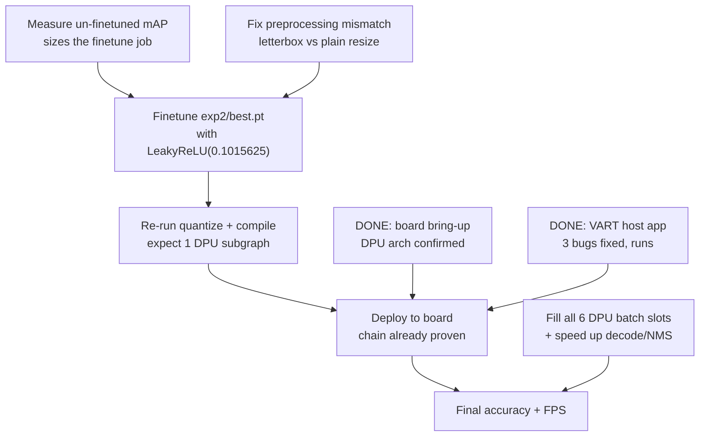

# Implementation Plan

The nine-step plan for getting YOLOv3 onto the VCK190, with live status.

> [!abstract] Where things stand
> Steps 1–5, **7 and 8** are done. Step 6 **failed on purpose** — it is the checkpoint that caught
> the SiLU problem ([[DPU Subgraph Fragmentation]]), and the fix is now proven
> ([[SiLU to LeakyReLU Experiment]]).
>
> **The board is no longer a blocker.** A VCK190 is connected, boots PetaLinux 2022.2, and its
> DPU reports `DPUCVDX8G_ISA3_C32B6` — exactly the compile target. The host app now runs on it
> (three VART bugs had to be fixed first — [[Board Bring-Up]]).
>
> **The deployment is done.** best.pt runs on the board and scores **0.4829 mAP@0.5**, 91.5% of
> the float baseline, reached without any GPU time ([[Board mAP - best.pt on Hardware]]). The
> LeakyReLU finetune is no longer on the critical path for *accuracy* — it is now purely a
> **throughput** optimisation (~1 FPS today vs 56 FPS for a single-subgraph build).

---

## Status

| # | Step | Status |
| --- | --- | --- |
| 1 | Inspect checkpoint; record nc/anchors/strides | ✅ [[Checkpoint Inspection]] |
| 2 | Verify wrapper emits 3 raw DPU-safe outputs | ✅ shapes confirmed |
| 3 | Quantize — `--quant_mode calib` | ✅ [[Quantization and Compile Results]] |
| 4 | Export `.xmodel` — `--quant_mode test` | ✅ 132 MB (needed a bug fix) |
| 5 | Compile with `vai_c_xir` for VCK190 | ✅ 35 MB xmodel |
| 6 | **Confirm a single DPU subgraph** | ❌ **52 subgraphs** — [[DPU Subgraph Fragmentation]] |
| 6b | *(added)* Prove the LeakyReLU fix | ✅ **1 subgraph** — [[SiLU to LeakyReLU Experiment]] |
| 6c | *(added)* Make **best.pt** runnable without a GPU | ✅ **decompose SiLU** — [[SiLU Decomposition]] |
| 7 | Boot VCK190, copy xmodel across | ✅ **done** — [[Board Bring-Up]] |
| 8 | VART host app: preprocess → infer → decode + NMS | ✅ **runs on hardware** — 3 bugs fixed — [[Board Bring-Up]] |
| 9 | Validate detections, benchmark FPS | ✅ **best.pt 0.4829 mAP@0.5 on hardware** — [[Board mAP - best.pt on Hardware]] |

## The revised critical path

Step 6 changed the plan's shape. The original sequence assumed compilation was a formality; it
was not. The real remaining work, in dependency order:



Only **A** still needs a GPU. Everything downstream of it has already been executed once on
real hardware with the LeakyReLU proof build, so the finetuned checkpoint should drop straight in.

That decoupling worked: the host app was written and debugged against
`compiled_lrelu/yolov3_vck190_lrelu.xmodel` as an integration dummy — right shapes, right
single-subgraph structure, meaningless accuracy — and it flushed out three VART bugs without
costing a single GPU hour.

## Step-by-step detail

### 1–2. Inspect and verify (done)

```bash
./vitis_run.sh python inspect_model_AB1.py
./vitis_run.sh python export_dpu_wrapper_AB3.py
```

Yielded nc=80, strides [8,16,32], the stock YOLOv3 anchors, and outputs
`[1,255,52,52] / [1,255,26,26] / [1,255,13,13]`. All recorded in [[Checkpoint Inspection]].

### 3–4. Quantize (done)

```bash
./vitis_run.sh python -u quantize_vitis_AB4.py --quant_mode calib \
  --weights runs/train/exp2/weights/best.pt \
  --data_dir ../datasets/coco128/images/train2017 \
  --output_dir quantize_result --img_size 416
# then the same with --quant_mode test
```

> [!note] Calibration data caveat
> Calibration used **coco128** (100 images) because that is what is in the clone. coco128 is a
> 128-image toy subset. For a production quantization, calibrate on a few hundred images drawn
> from the **actual** training distribution (`train2017_yolo.yaml`) — calibration quality directly
> sets the INT8 scaling factors and therefore the accuracy floor.

### 5–6. Compile and check (done; check failed)

```bash
./vitis_run.sh vai_c_xir -x quantize_result/YOLOv3DPUWrapper_int.xmodel \
  -a /opt/vitis_ai/compiler/arch/DPUCVDX8G/VCK190/arch.json \
  -o compiled -n yolov3_vck190
```

The check to run every time, and the one that matters most:

```bash
grep "subgraph number" vitis_out/compile.log
```

Anything other than `DPU subgraph number 1` means ops are falling back to the CPU. Investigate
before going near hardware.

### 7. Board bring-up (done)

All three prerequisites are satisfied — details and gotchas in [[Board Bring-Up]]:

1. ✅ VCK190 running **PetaLinux 2022.2** with VART 3.0.0, xir, numpy, cv2, pycocotools.
2. ✅ DPU reports **`DPUCVDX8G_ISA3_C32B6`**, byte-identical to the compile target. No
   recompilation needed. It also reports a **batch size of 6**, which the host app does not
   yet exploit.
3. ✅ `compiled_lrelu/yolov3_vck190_lrelu.xmodel` copied across and executed.

Two practical traps: pressing Enter during U-Boot's 5-second window halts autoboot (type
`boot`), and `scp` needs `-O` because the image ships no `sftp-server`.

### 8. VART host app (running on hardware)

Implemented in `host_vck190/` — see [[Host Application]]. The decode was verified against the
model's own PyTorch head to ~1e-4, and the old project's Darknet-formula decode bug was found and
avoided ([[Prior Work in Yolo_v3_AB]]). It has since been **run on the board**, which took
three further bug fixes — the graph lifetime, buffer dtype and input quantization problems in
[[Board Bring-Up]]. What it does:

1. **Preprocess** — resize to 416, `/255`, RGB, CHW. ⚠️ Must match training preprocessing.
   `quantize_vitis_AB4.py` uses a plain `Resize((416,416))`, but training used **letterbox**
   (aspect-preserving with padding). These are not the same transform; see
   [[Subsystem - Utils Core]]. Pick one and use it in *both* calibration and inference.
2. **Infer** — `vart::Runner` / `runner.execute_async` on the single DPU subgraph. ⚠️ Keep a
   reference to the `xir.Graph`, use `int8` buffers, and scale the input by `2**fix_point`.
3. **Decode** — per output tensor: sigmoid, grid offset, anchor scaling. Reference implementation
   and exact math in [[Subsystem - Validation]].
4. **NMS** — port `non_max_suppression` semantics; also in [[Subsystem - Validation]].

### 9. Validate and benchmark (in progress)

- ✅ Qualitative: 50 images through the board produced 464 detections, no crashes.
- ✅ Throughput: **26.5 FPS** DPU+preprocess. But end to end at the mAP threshold it is
  **~1 FPS** — decode and NMS on the ARM cores dominate by roughly 20x ([[Board Bring-Up]]).
- ✅ Quantitative: full COCO val2017 on the board gives **mAP@0.5 0.0591 / mAP@0.5:0.95 0.0188**
  for the un-finetuned LeakyReLU build, against a 0.5275 / 0.3228 float baseline — **11% of
  accuracy retained**. [[Board mAP - LeakyReLU Without Finetune]]. The finetune is a large job.
- ✅ **Done**: full COCO val2017 for `compiled_silu_decomp/` — best.pt's own weights on the board
  via `GraphRunner` — scores **mAP@0.5 0.4829 / mAP@0.5:0.95 0.2639**, i.e. **91.5% of the float
  baseline** ([[Board mAP - best.pt on Hardware]]). The two losses separate cleanly:
  quantization+preprocessing costs **8.5%**, the activation swap costs **88%**.
- ✅ **Done** (2026-09-12): `yolov3_original.pt` vs the merged-bottleneck variant on real
  hardware — [[yolov3_original on Hardware]]. The stock model is the better *float* model
  (0.559 vs 0.525 mAP@0.5 over the same 79 classes) and the **worse** hardware model
  (0.4681 vs 0.4829), because it gives up twice as much to INT8 — 16.6% against 8.5%. It also
  turned out to have no `person` class. `Bottleneck_merged` is vindicated for this target.
- ⬜ **Next:** the same deployment for YOLOv8 — [[Implementation Plan - YOLOv8]].

---

Back to [[Code Map]] | [[Home]]
