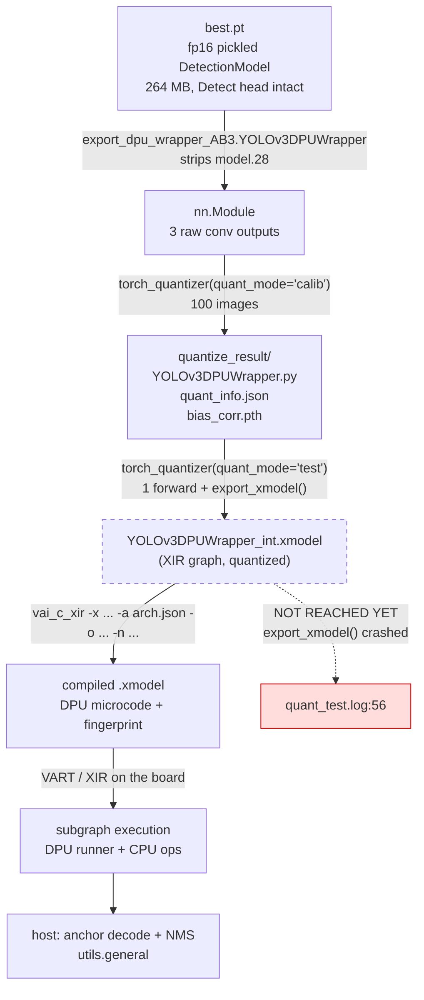
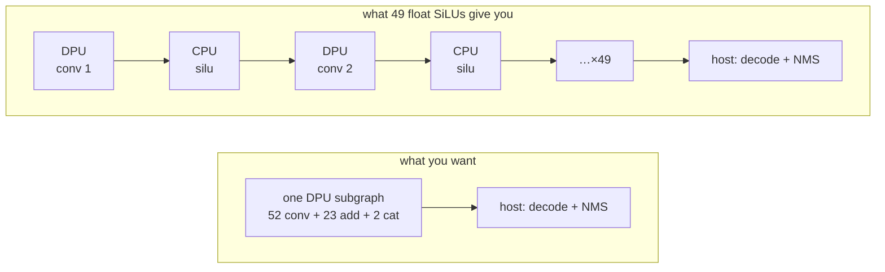
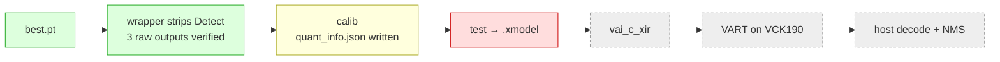

# Vitis AI DPU Concepts

Domain reference for the AMD/Xilinx side of this project. Everything stated about **this** model is
taken from files in the repo — the quantizer's own generated module, its logs and its exported
config. Claims that come from general Vitis AI behaviour rather than from something in this repo are
tagged **(general Vitis AI behaviour, not verified here)** and repeated in the open-questions list at
the end.

> [!info] Evidence base for this note
> - `yolov3_test/export_dpu_wrapper_AB3.py` — the head-stripping wrapper (active code at lines 103-179; lines 1-102 are two superseded drafts, commented out).
> - `yolov3_test/quantize_vitis_AB4.py` — the `torch_quantizer` driver (active code at lines 251-367).
> - `yolov3_test/quantize_result/YOLOv3DPUWrapper.py` — **the quantizer's own rewrite of the model.** 129 flat ops. This file is the ground truth for "what will the DPU be asked to run".
> - `yolov3_test/quantize_result/quant_info.json` — 231 calibrated fixed-point entries.
> - `yolov3_test/vitis_out/quant_calib.log`, `yolov3_test/vitis_out/quant_test.log` — the actual runs.
> - `yolov3_test/vitis_run.sh` — how the container is invoked.
> - `yolov3_test/vitis_out/inspect_best.log` — checkpoint/architecture facts.
>
> Toolchain versions, read off `vitis_out/quant_test.log:17-21`: **vai_q_pytorch 3.5.0+60df3f1+torch1.13.1**, torch 1.13.1, python 3.8.6, GCC 7.5.0. Image `xilinx/vitis-ai-pytorch-cpu:latest` (`vitis_run.sh:13`), CPU-only — every quantizer run so far logged `QUANTIZER_TORCH_CUDA_UNAVAILABLE`.

---

## 1. What the DPU actually is

The DPU (Deep-learning Processing Unit) is **not** a general-purpose accelerator. It is a
fixed-function, instruction-driven INT8 convolution engine, delivered as an IP block in the PL/AIE
fabric with a matching microcode ISA. You do not write kernels for it. The Vitis AI compiler
translates a graph into DPU instructions, and anything for which no instruction exists **cannot run
on it at all** — it runs on the ARM APU instead.

Three consequences drive every design decision in this project:

1. **INT8 only.** Activations and weights are 8-bit fixed point with a per-tensor power-of-two
   scale. There is no fp16 path, no fp32 path, no per-channel float scale.
2. **A fixed op set.** Convolution, elementwise add, concat, pooling, resize and a small set of
   piecewise-linear activations. Anything transcendental (`exp`, `sigmoid`, `tanh`, `silu`) is
   outside the set. (general Vitis AI behaviour, not verified here — the precise per-op table for
   DPUCVDX8G is version-specific and must be read from the Vitis AI docs for the installed release.)
3. **Whole-graph scheduling.** The compiler wants one contiguous region of DPU-executable ops so it
   can keep feature maps in on-chip memory between layers. Break that region and you pay DDR
   round-trips.

### DPUCVDX8G on the VCK190

- `DPUCVDX8G` is the CNN DPU for the **Versal AI Core** family; the VCK190 is the AI Core evaluation
  board. Unlike the Zynq-family `DPUCZDX8G` (pure PL), DPUCVDX8G puts the MAC array on the **AI
  Engine (AIE) array** with PL logic for data movement and the non-conv ops.
- It is a **configurable** IP: the number of AIE compute cores and "batch handlers" is chosen at
  hardware build time, which is why a compiled model is tied to a specific hardware configuration.
- That binding is expressed by the **arch file**, which in the container lives at
  `/opt/vitis_ai/compiler/arch/DPUCVDX8G/VCK190/arch.json`. It carries a *fingerprint* describing the
  configuration. The compiler stamps that fingerprint into the compiled `.xmodel`, and VART refuses
  to run a model whose fingerprint does not match the DPU actually present on the board.
  (general Vitis AI behaviour, not verified here — nothing in this repo reads or references
  `arch.json` yet; `grep -rn "arch.json\|vai_c_xir\|DPUCVDX8G"` over the clone returns only comment
  text in `quantize_vitis_AB4.py:120`.)

> [!warning] Board-side unknown
> The exact DPUCVDX8G configuration in the VCK190 image you will boot (core count / batch count, and
> therefore the fingerprint) has **not** been verified from this machine. Confirm on the board with
> `xdputil query` before trusting any compile, and make sure the `arch.json` you compile against is
> the one matching that image.

---

## 2. The toolchain, stage by stage



**Artefacts, and what each one really is:**

| Artefact | Produced by | What it contains |
|---|---|---|
| `runs/train/exp2/weights/best.pt` | `train.py` | Pickled `models.yolo.DetectionModel` (fp16) plus `ema`, `optimizer`, `opt`. Not a graph — it is Python objects, which is why loading it needs the NumPy 2.x→1.x unpickle shim in `vitis_compat/np2_pickle_compat.py`. |
| `quantize_result/YOLOv3DPUWrapper.py` | `calib` (and rewritten by `test`) | The quantizer's **flattened graph as Python**: 129 `py_nndct.nn.*` modules and a straight-line `forward`. No control flow, no Python `if`, no module nesting. This is the graph that becomes XIR. |
| `quantize_result/quant_info.json` | `calib` → `export_quant_config()` | The calibration result: 104 `param` entries and 127 `output` entries, every one `[[8, fix_point]]`. Also `"bias_corrected": true`, `"fast_finetuned": false`, `"version": "3.5.0+..."`, and `graph_md5` — the graph identity that `test` mode checks against. |
| `quantize_result/bias_corr.pth` | `calib` | 194 KB of bias-correction deltas applied to fold away the systematic error that per-tensor weight quantization introduces. |
| `*_int.xmodel` (quantizer output) | `test` → `export_xmodel()` | XIR graph + INT8 weights + fix-point attributes. **Device-independent** — no DPU instructions yet. **This file does not exist yet in this repo.** |
| compiled `.xmodel` | `vai_c_xir -x <int.xmodel> -a <arch.json> -o <dir> -n <name>` | The same graph re-partitioned into subgraphs, with DPU microcode for the DPU subgraphs and the arch fingerprint embedded. This is what ships to the board. |
| runtime | VART over XIR | `xir::Graph::deserialize` → walk subgraphs → for each subgraph with `device == "DPU"` create a `vart::Runner`; CPU subgraphs are executed by the host. (general Vitis AI behaviour, not verified here.) |

Nothing in this repo performs the `vai_c_xir` step. There is no compile script, no arch.json copy and
no board-side application — the pipeline currently stops at quantization.

---

## 3. `calib` vs `test`: why both exist

`quantize_vitis_AB4.py:330-335` builds the quantizer identically in both modes; only `quant_mode`
differs. The two modes do genuinely different work.

**`quant_mode='calib'`** (`quantize_vitis_AB4.py:350-352`)
1. Traces and freezes the module (`quant_test.log:33-40` shows the trace: 179 aten ops), then
   *rewrites* it as `quantize_result/YOLOv3DPUWrapper.py`.
2. Folds BatchNorm into the preceding convolution. Evidence: the traced graph contains
   `batch_norm` ops (one per Conv), but the generated module has **no** BN modules and all 52
   `py_nndct.nn.Conv2d` carry `bias=True`, while the source `Conv` builds `nn.Conv2d(..., bias=False)`
   followed by `nn.BatchNorm2d` (`models/common.py:67-68`). `quant_info.json` matches: 104 param
   entries = 52 weights + 52 biases.
3. Runs weight equalization (`quant_calib.log`: `=>Doing weights equalization...`).
4. Runs the calibration forward passes — here 100 images (`quantize_vitis_AB4.py:344-348`) — while
   observing every tensor's dynamic range, and picks one **power-of-two fixed-point position** per
   tensor.
5. `export_quant_config()` writes `quant_info.json`.

`calib` does *not* produce anything deployable. It produces the scales.

**`quant_mode='test'`** (`quantize_vitis_AB4.py:353-355`)
1. Rebuilds the same graph, verifies it against `graph_md5`, and loads `quant_info.json`.
2. Gives you a *quantized-simulation* model — INT8 rounding emulated in float — so you can run
   `val.py`-style evaluation and measure the real mAP drop **before** touching hardware.
3. Is the **only** mode in which `export_xmodel()` works, and it needs batch size 1 and a single
   forward pass — which is exactly why the script `break`s out of the loop after one image
   (`quantize_vitis_AB4.py:347-348`).

You need both because the scales must be measured before they can be baked in, and the accuracy of
the baked-in result must be checked before compiling.

> [!danger] `test` mode is currently broken in this repo
> `vitis_out/quant_test.log:51-56`:
> ```
> quantizer.export_xmodel(output_dir=output_dir, deploy=True)
> TypeError: export_xmodel() got an unexpected keyword argument 'deploy'
> ```
> `vai_q_pytorch` 3.5.0's `export_xmodel` has no `deploy` parameter. So **no `.xmodel` has ever been
> produced from this model**, and no `vai_c_xir` run has ever happened. Calibration succeeded
> (`quant_calib.log`: `=>Exporting quant config.(quantize_result/quant_info.json)`); export did not.
> The fix is a one-word edit at `quantize_vitis_AB4.py:354` — drop the kwarg, or pass
> `deploy_check=True` if you want the quantizer's own output comparison (the `deploy_check` name is
> general Vitis AI API knowledge, not verified here).
>
> Everything below about partitioning is therefore **predicted from the quantized graph**, not
> observed from a compiler report. Getting a real `vai_c_xir` log is the single highest-value next
> action in this project.

---

## 4. What the quantizer did to *this* model

Counted directly out of `quantize_result/YOLOv3DPUWrapper.py` (129 modules total):

| Generated op | Count | Quantized? | Notes |
|---|---:|---|---|
| `py_nndct.nn.Conv2d` | 52 | **yes** | BN folded in, `bias=True`. 8-bit weights + 8-bit biases in `quant_info.json`. |
| `py_nndct.nn.Module('aten::silu_')` | **49** | **NO — float** | See §5. Wrapped as an opaque generic module, e.g. line 12; called as `self.module_2({'self': x})` at line 144. |
| `py_nndct.nn.Add` | 23 | **yes** | The residual adds from `Bottleneck_merged` (`models/common.py:212`) and `Bottleneck` (`models/common.py:181`). |
| `py_nndct.nn.Cat` | 2 | **yes** | Lines 107, 123 — the two FPN concats (768ch at 26×26, 384ch at 52×52). |
| `py_nndct.nn.Interpolate` | 2 | pass-through | Line 106/122; called with `size=None, scale_factor=[2.0,2.0], mode='nearest'` (line 238). Notably these are the **only** two ops with no output entry in `quant_info.json` — consistent with nearest-neighbour resize being value-preserving, so it inherits its input's scale. (Interpretation mine; the absence of the entries is verified.) |
| `py_nndct.nn.Input` | 1 | **yes** | `[[8, 6]]`. |

The 127 activation entries in `quant_info.json` account for exactly `1 input + 52 conv + 49 silu +
23 add + 2 concat`. **All 231 entries are 8-bit.**

Two fixed-point positions matter operationally (fixed point `n` means
`real = int8 * 2^-n` — standard vai_q_pytorch convention, general Vitis AI behaviour):

- **Input**: `nndct_input_0 = [[8, 6]]` → step `2^-6 = 0.015625`, representable range
  `[-2, +1.984]`. The calibration feed is `transforms.ToTensor()`, i.e. `[0, 1]`
  (`quantize_vitis_AB4.py:285-288`). So the input only ever occupies codes **0…64 of the 256
  available** — roughly six of eight bits, with the sign bit永 unused. It works, but you are
  donating ~2 bits of input precision. Worth revisiting once the graph compiles.
- **The three head convs**: `nndct_conv2d_126/127/128 = [[8, 3]]` → step `0.125`, range
  `[-16, +15.875]`. These are the tensors the host receives. **The host must multiply the raw int8
  by 0.125 before applying sigmoid.** Logits saturate at ±16, which is harmless
  (`sigmoid(16) ≈ 1 - 1.1e-7`), but the 0.125 logit step means objectness/class confidence is
  quantized to ~0.031 granularity near p = 0.5 — set confidence thresholds with that in mind.
  At runtime the authoritative scale is the `fix_point` attribute on the VART output tensor rather
  than this file (general Vitis AI behaviour, not verified here).

---

## 5. The SiLU problem

> [!danger] This is the blocking issue for this deployment
> Both runs logged, once each:
> ```
> [VAIQ_WARN][QUANTIZER_TORCH_FLOAT_OP]: The quantizer recognize new op `aten::silu_` as a float operator by default.
> ```
> (`vitis_out/quant_test.log:42`, and the identical line in `vitis_out/quant_calib.log`.)
> It is logged once, but it applies to **49 ops** — every activation in the network.

### What the message actually means

`vai_q_pytorch` has a registry of ops it knows how to quantize. `aten::silu_` is not in it, so it
falls back to "unknown op → keep it in float". In the generated module those 49 sites are not
`py_nndct.nn.Silu` or any typed quantized op; they are `py_nndct.nn.Module('aten::silu_')` — a
generic float passthrough wrapper (`quantize_result/YOLOv3DPUWrapper.py:12`, and 48 more).

The subtlety worth understanding: the SiLU **outputs still get quantize entries** in
`quant_info.json` (49 of them, e.g. `aten_silu__2: [[8, 2]]`). So the dataflow is
`int8 → dequantize → float silu → requantize → int8`. The numerics are handled. The *placement* is
not: the op itself has no DPU instruction, so it lands on the APU.

Two smaller observations:
- The traced op is the **in-place** variant `aten::silu_`, which implies the pickled `nn.SiLU`
  modules were constructed with `inplace=True` (inferred from the trace name — `models/common.py:60`
  writes `nn.SiLU()`, whose default is `inplace=False`). Do not expect the non-in-place spelling to
  fare better; neither variant is a DPU op.
- SiLU is the *YOLOv5-era* default that this YOLOv3 port inherited from the Ultralytics `Conv` block
  (`models/common.py:57-75`). Original YOLOv3/Darknet used LeakyReLU(0.1). Nothing about this model
  needs SiLU.

### Why it destroys throughput here

The activation sites are not clustered — they alternate with the convolutions, one per Conv block.
The generated `forward` reads `conv → silu → conv → silu → …` for essentially the whole network.



Concrete cost, computed from the actual layer shapes at 416×416 (32 ch @ 416², 64 ch @ 208², …,
1024 ch @ 13²):

- **49** float islands.
- **31.02 M activation elements** pass through them per inference.
- As int8 that is **31 MB out of the DPU and 31 MB back in, ≈ 62 MB of DDR traffic per frame**, on
  top of the ~124 MB of fp32 the APU touches while computing `x * sigmoid(x)` 31 million times.
- The largest single island is the very first one: 32×416×416 = **5.54 M elements**.

Even with a fast APU, per-subgraph launch overhead × 49, plus the DMA traffic, plus 31 M
transcendental ops on ARM cores, will dominate the convolution time by a wide margin. The DPU
spends most of the frame idle waiting for the CPU. Batching cannot help, because the serialization
is *within* one inference.

### Remediation options, honestly costed

**(a) Retrain / finetune with LeakyReLU — recommended.**
YOLOv3's original activation, and a piecewise-linear function the DPU implements natively
(general Vitis AI behaviour, not verified here — note also the widely-documented restriction that
DPU `leaky_relu` supports **only alpha = 0.1**, so use exactly `nn.LeakyReLU(0.1)` and nothing else).
The repo already supports this without touching a single line of model code: `parse_model` honours a
top-level `activation:` key in the model YAML and uses it to override `Conv.default_act`
(`models/yolo.py:348-351`), and there is a worked example of the syntax at
`models/hub/yolov5s-LeakyReLU.yaml:5` (`activation: nn.LeakyReLU(0.1)`).
So: copy `models/yolov3_merged_23.yaml`, add that one line, and train.
- *Cost*: GPU time. The existing checkpoint is only at epoch 34 (`vitis_out/inspect_best.log:6`), so
  you are not throwing away a mature model. A warm start from `best.pt` weights (conv+BN transfer
  cleanly; only the activation changes) plus a short finetune is usually enough — but expect it to be
  a real training run, not a five-minute job.
- *Payoff*: a single DPU subgraph, no CPU fallback, and the 62 MB/frame of boundary traffic
  disappears entirely. This is the only option that gets you the hardware you paid for.

**(b) Surgical activation swap + short finetune.**
Walk the loaded module, replace every `nn.SiLU` with `nn.LeakyReLU(0.1, inplace=True)`, then finetune
for a few epochs. Mechanically the same endpoint as (a) but done on the checkpoint instead of the
config.
- *Cost*: still requires training, and it is more error-prone than (a) — you must be sure you caught
  every activation instance (the 49 count in the generated module is your check) and that the swap
  survives the `torch.save`/`torch.load` pickle round-trip. Since the model is stored as pickled
  objects rather than a state dict, a *re-saved* checkpoint is the artefact to handle carefully.
- *When it wins*: if you cannot re-run `train.py` from a YAML for some environmental reason, or you
  want to A/B several replacement activations (LeakyReLU vs ReLU vs Hardswish) quickly.
  `utils/activations.py:9-35` already defines `SiLU`, `Hardswish` and `Mish` as export-friendly
  modules, and `utils/torch_utils.py:236` shows the codebase already treats
  `Hardswish/LeakyReLU/ReLU/ReLU6/SiLU` as an interchangeable set.

**(c) Accept CPU fallback.**
Compile as-is and let the 49 SiLUs run on the APU.
- *Cost*: the §5 arithmetic — 49 subgraph boundaries and ~62 MB of DDR traffic per frame. Expect
  performance somewhere between "disappointing" and "worse than the ARM cores alone".
- *When it is still worth doing*: **as a bring-up step, immediately.** It is the cheapest way to
  prove the rest of the chain end-to-end — that the wrapper's three outputs are correct, that host
  decode+NMS reproduces the PyTorch boxes, that the fingerprint matches, that VART loads the model.
  Do it as a correctness harness, then discard it as a delivery candidate.

**Recommendation: (a), with (c) run first purely as a plumbing test.**
Retraining with `nn.LeakyReLU(0.1)` costs GPU hours; option (c) costs you the entire point of the
VCK190. And because the change is one line of YAML that the codebase already supports, (a) carries
far less integration risk than the alternative of hand-patching pickled modules.

> [!tip] Verify the fix the same way the problem was found
> After retraining, re-run `calib` and grep the log for `QUANTIZER_TORCH_FLOAT_OP`. Then count float
> ops in the regenerated `quantize_result/YOLOv3DPUWrapper.py`:
> `grep -c "py_nndct.nn.Module(" quantize_result/YOLOv3DPUWrapper.py` — you want **0**, and a
> corresponding `py_nndct.nn.LeakyReLU` (or fused-into-conv) count instead.

---

## 6. Subgraph partitioning

What the compiler does, conceptually: it walks the XIR graph and labels each op with the device that
can execute it, based on the target description in `arch.json`. Maximal connected regions of
DPU-executable ops become **subgraphs with `device == "DPU"`**, each compiled to a single blob of DPU
microcode. Everything else becomes a CPU subgraph. Execution order follows the dataflow.

Why more than one DPU subgraph is bad:

1. **Loss of on-chip residency.** Within one DPU subgraph, intermediate feature maps can stay in the
   DPU's local memory. At a boundary they must be written to DDR in the DPU's int8 layout, read by
   the CPU, converted, processed, converted back, and DMA'd in again.
2. **Per-launch overhead.** Each DPU subgraph execution is a runner submission with its own setup
   and completion cost. 49 of them per frame instead of 1.
3. **No overlap.** The DPU and the CPU alternate strictly, so neither is ever busy. Multi-threaded
   pipelining across *frames* can hide some of this, but only at the cost of latency and memory.
4. **The CPU op itself is unoptimized.** A float `silu` on the APU over 5.5 M elements is not a
   vectorized library call in this path; it is whatever the CPU-op implementation provides.

(general Vitis AI behaviour, not verified here — the mechanism is standard, but the actual subgraph
count and layout for this model can only be read off a real `vai_c_xir` compile log, which does not
yet exist in this repo. Do not quote "49 subgraphs" as measured; it is the upper-bound expectation
from 49 interleaved float ops.)

Note that unsupported ops cause fragmentation *by position, not by count*. One unsupported op at the
very end of a network costs you almost nothing. 49 unsupported ops evenly spread between the
convolutions is the worst possible layout.

---

## 7. DPU-friendliness of this graph, op by op

| Op in this model | Where | Status |
|---|---|---|
| `Conv2d` 1×1 / 3×3, stride 1 / 2, `groups=1` | 52 sites | Friendly. Plain dense convolution, the DPU's native operation. |
| `BatchNorm2d` | 52 sites in the source | Friendly *because it is eliminated* — folded into conv weights/bias during `calib`. Never reaches the DPU as an op. |
| Elementwise `add` (residual) | 23 sites, `models/common.py:181` and `:212` | Friendly. Note both operands must share a scale for the DPU add; the quantizer handles that by assigning the add its own output fix point. |
| `cat` on dim 1 | 2 sites, FPN merges | Friendly. |
| `upsample_nearest2d`, scale 2 | 2 sites, `Upsample(None, 2, 'nearest')` from the YAML | Friendly. Nearest-neighbour 2× is the safe resize mode; bilinear is more restricted (general Vitis AI behaviour, not verified here). |
| **`silu_`** | **49 sites** | **NOT friendly.** Quantizer-confirmed float op. §5. |
| `sigmoid`, `view`, `permute`, `split`, grid arithmetic, `exp`-free wh decode | `Detect.forward`, `models/yolo.py:72-92` | Not friendly, and deliberately excluded from the graph — §8. |
| NMS | `utils/general.py:1008` | Not a DPU concept at all. Host only. |

Nothing in the backbone/neck is structurally hostile: no depthwise convs, no grouped convs, no
attention, no `SPPF`, no `Focus`, no dynamic shapes. `Bottleneck_merged` (`models/common.py:192-212`)
is actually *friendlier* than the standard `Bottleneck` — it is a single 1×1 conv plus a residual add
(`models/common.py:204`, `:212`). **Once SiLU is gone, this graph should compile to a single DPU
subgraph.** That is what makes option (a) in §5 so attractive: SiLU is the only blocker.

---

## 8. Why the Detect head is stripped, and what that pushes onto the host

`export_dpu_wrapper_AB3.YOLOv3DPUWrapper` (`export_dpu_wrapper_AB3.py:123-171`) rebuilds the network
without `model.28`:

- `self.layers = nn.ModuleList([m for m in model.model[:-1]])` (line 139) — everything except Detect.
- It keeps only the three 1×1 output convolutions of the head:
  `self.m0/m1/m2 = detect_layer.m[0..2]` (lines 152-154), routed by the saved
  `detect_layer.f` (line 151, `[27, 22, 15]`).
- `forward` returns the bare tuple `(out0, out1, out2)` (line 171) — no reshape, no sigmoid, no
  concatenation.

The generated quantized module confirms the wrapper worked: its last three ops are the head convs
(`quantize_result/YOLOv3DPUWrapper.py:136-138`, in-channels 256 / 512 / 1024 → 255) and it returns a
plain 3-tuple (line 271). Output shapes: `[1,255,52,52]`, `[1,255,26,26]`, `[1,255,13,13]`.

**Why this is mandatory.** `Detect.forward` (`models/yolo.py:64-92`) does five things the DPU cannot:
`view` + `permute` to a 5-D layout (lines 73-74), `sigmoid` (line 86), `split` (line 86), a
grid-offset multiply-add against a *lazily constructed* buffer (lines 77-78, 87-88), and a `cat`
across all three levels into `(1, N, 85)` (line 92). Beyond the op set, `_make_grid` allocates new
tensors inside `forward` based on runtime shapes — there is no static graph to compile. And NMS is
data-dependent control flow: nothing about it maps to fixed-function hardware.

**The host-side contract you must implement.** For each level `i ∈ {0,1,2}` with
`stride = [8,16,32][i]`:

1. Read the DPU output as int8 and dequantize: `raw = int8 * 2^-3` (fix point 3, §4). At runtime,
   read the fix point from the VART output tensor rather than hardcoding it.
2. `raw.view(1, 3, 85, ny, nx).permute(0, 1, 3, 4, 2)` — matching `models/yolo.py:74`. Watch the
   layout: VART hands you **NHWC** buffers, whereas the PyTorch reference is NCHW
   (general Vitis AI behaviour, not verified here). This transpose is the most likely place for a
   silent bug.
3. `sigmoid` **everything** (all 85 channels), then split `(2, 2, 81)` — `models/yolo.py:86`.
4. `xy = (xy * 2 + grid_i) * stride_i` where `grid_i = meshgrid(xv, yv) - 0.5` — note the **−0.5**
   (`models/yolo.py:103`) and the **×2** (line 87). This is the YOLOv5-style decode, **not** classic
   YOLOv3 `sigmoid(t) + c`. Getting this wrong shifts every box by half a cell.
5. `wh = (wh * 2)^2 * anchor_grid_i` where `anchor_grid_i = anchors[i] * stride_i` in **pixels**
   (`models/yolo.py:104`). This is **not** `exp(t) * anchor`. The checkpoint stores anchors in grid
   units: `[[1.25,1.625],[2.0,3.75],[4.125,2.875]]`, `[[1.875,3.8125],…]`, `[[3.625,2.8125],…]`
   (`vitis_out/inspect_best.log:201-211`) — multiply by the stride to recover
   `10,13 16,30 33,23 / 30,61 62,45 59,119 / 116,90 156,198 373,326`.
6. Concatenate the three levels to `(1, 3*(52²+26²+13²), 85) = (1, 10647, 85)` and run NMS.

For steps 3-6 you should port, not reinvent, the existing CPU code: `utils/general.py:1008`
(`non_max_suppression`), `:877` (`xywh2xyxy`), `:949` (`scale_boxes`). Anchor and stride values must
come from the checkpoint, not from a YOLOv3 reference table — the strides in the checkpoint are
stored as **fp16** (`vitis_out/inspect_best.log:212`), so cast before use.

> [!tip] Bit-exactness harness
> Before you go anywhere near the board: run the `test`-mode (simulated-INT8) wrapper on one image to
> get three raw tensors, then feed them through your new host decode and compare boxes against the
> full unmodified `best.pt` `DetectionModel` on the same image. That isolates decode bugs from
> quantization loss from runtime bugs. Do it on the host, where you can still print tensors.

---

## 9. Calibration data fidelity — a real pitfall in the current script

`get_calibration_dataloader` (`quantize_vitis_AB4.py:284-315`) preprocesses with
`transforms.Resize((416, 416))` + `transforms.ToTensor()`. The training/validation pipeline instead
uses **letterbox** — aspect-preserving resize with grey (114,114,114) padding
(`utils/dataloaders.py:747` → `utils/augmentations.py:122`) — followed by `im /= 255` (`val.py:357`).

- Channel order is fine: PIL `.convert('RGB')` matches the dataloader's `[::-1]` BGR→RGB
  (`utils/dataloaders.py:798`).
- Value scaling is fine: `ToTensor()` gives `[0,1]`, same as `/255`.
- **Geometry is not.** `Resize((416,416))` stretches non-square images; letterbox does not. So the
  activation statistics the fix points were derived from come from a distribution the deployed
  pipeline will never produce, and the calibration set never sees the grey padding bands that will be
  present in ~every real frame.

Also: the 100 calibration images come from `../datasets/coco128/images/train2017`
(`quant_calib.log`), i.e. **training data**. For calibration (range estimation, not fitting) that is
defensible, but a held-out set is cheap and strictly better.

Neither issue is fatal. Both are worth fixing before you spend time chasing a few points of mAP:
match the calibration preprocessing to the deployment preprocessing exactly, whatever that turns out
to be. And `"fast_finetuned": false` in `quant_info.json` means the quantizer's fast-finetune
accuracy-recovery pass has not been used — that is a lever still available if INT8 accuracy
disappoints *after* the activation problem is solved (the `fast_finetune` API name is general Vitis AI
knowledge, not verified here; the `fast_finetuned` flag in the exported config is verified).

---

## 10. Where the pipeline actually stands



1. **Fix `export_xmodel`** — `quantize_vitis_AB4.py:354`, remove the `deploy` kwarg. Cheap, unblocks
   everything downstream.
2. **Get a real compile log.** Run `vai_c_xir` against
   `/opt/vitis_ai/compiler/arch/DPUCVDX8G/VCK190/arch.json` and read the subgraph count. Replace §6's
   predictions with measurements.
3. **Retrain with `nn.LeakyReLU(0.1)`** via the `activation:` YAML key (§5 option a). This is the
   real fix, and it is a one-line config change plus GPU time.
4. **In parallel**, build the host decode + NMS path and validate it against PyTorch on the desktop
   (§8), because it is needed regardless of which activation wins.
5. **Confirm the board's DPU fingerprint** with `xdputil query` before trusting any compiled model.

---

---

## 11. Measured outcome — the compile has now actually run

> [!success] Added after this note was first written
> Sections 1-10 were written **before** `vai_c_xir` had ever been run on this project (§1 correctly
> noted that nothing in the repo referenced it yet). It has now been run twice, and the predictions
> above were confirmed. Full detail: [[Quantization and Compile Results]],
> [[DPU Subgraph Fragmentation]], [[SiLU to LeakyReLU Experiment]].

### The baseline compile

```bash
./vitis_run.sh vai_c_xir \
  -x quantize_result/YOLOv3DPUWrapper_int.xmodel \
  -a /opt/vitis_ai/compiler/arch/DPUCVDX8G/VCK190/arch.json \
  -o compiled -n yolov3_vck190
```

```
[UNILOG][INFO] Total device subgraph number 105, DPU subgraph number 52
```

**52 DPU subgraphs.** 98 ops were assigned to the CPU, and every single one was a `transpose` —
the layout conversions §6 predicted, wrapped around each unmappable SiLU. `compiled/meta.json`
lists all 52 kernels by name.

### The controlled fix

Swapping every SiLU for `LeakyReLU` in memory and re-running the identical pipeline:

```
[UNILOG][INFO] Total device subgraph number 5, DPU subgraph number 1
```

**1 DPU subgraph, zero CPU-assigned ops, zero XIR warnings.** `compiled_lrelu/meta.json` lists a
single kernel. This confirms §5's diagnosis completely: SiLU was the *sole* cause. The topology,
the `Bottleneck_merged` blocks, the `[27, 22, 15]` routing, the concats and the upsamples are all
fully DPU-mappable.

### The alpha value: 0.1 and 0.1015625 both work

An earlier revision of this note claimed `0.1` was risky and only `0.1015625` (= 26/256) was
safe. **Evidence from prior work on this machine shows that was wrong**, and the correction matters
because it makes the fix easier.

The July 2026 attempt in `~/Documents/Yolo_v3_AB/` swapped activations with:

```python
setattr(model, name, nn.LeakyReLU(0.1, inplace=True))   # note: 0.1
```

…and its quantizer-generated module contains:

```python
py_nndct.nn.LeakyReLU(negative_slope=0.1015625, inplace=True)   # note: 26/256
```

**The quantizer snaps the slope to the DPU-representable 26/256 by itself.** Its compile produced
a single DPU subgraph.

| Slope written | What the quantizer emits | Result |
| --- | --- | --- |
| `0.1` (July work) | `0.1015625` | ✅ 1 DPU subgraph |
| `0.1015625` (this session) | `0.1015625` | ✅ 1 DPU subgraph |

So either value is fine. `0.1015625` is still marginally preferable for **training**, because then
the weights are fit against exactly the slope the hardware will execute — with `0.1` there is a
tiny train/inference mismatch after the quantizer rounds. The difference is unlikely to be
measurable, and it is not a correctness risk either way.

### Confirmed: BatchNorm folding

§2/§4 anticipated this; it is now visible in the artefacts. The trace reported 49 `batch_norm`
ops, but the generated module contains **none**, and every `py_nndct.nn.Conv2d` carries
`bias=True`. BN was folded into the convolution weights and biases, so it costs nothing at
inference. `utils/torch_utils.fuse_conv_and_bn` is therefore not something that needs invoking
manually here.

### Compile target fingerprint — partially resolved

§1's "Board-side unknown" callout stands, but is now half-answered. Both `meta.json` files report:

```json
"target": "DPUCVDX8G_ISA3_C32B6"
"lib": "libvart-dpu-runner.so"
```

So the container's stock VCK190 `arch.json` corresponds to **`DPUCVDX8G_ISA3_C32B6`**. That is the
fingerprint the current compiled models carry.

**Still unverified, and still the check to run first on hardware:** whether the board's loaded DPU
bitstream is that same configuration. Run `xdputil query` on the board; if it reports a different
ISA/C/B combination, recompile against that platform's own `arch.json`. A mismatch is a hard
runtime rejection, not a slow path.


## See also

- [[export_dpu_wrapper_AB3]] — the head-stripping wrapper, line by line.
- [[quantize_vitis_AB4]] — the quantizer driver and its argument surface.
- [[quantize_result.YOLOv3DPUWrapper]] — the generated 129-op quantized graph.
- [[models.common]] — `Conv` (SiLU default), `Bottleneck`, `Bottleneck_merged`, `Concat`.
- [[models.yolo]] — `Detect`, the decode maths, and `parse_model`'s `activation:` override.
- [[utils.activations]] — alternative activation modules already in the tree.
- [[utils.general]] — `non_max_suppression`, `xywh2xyxy`, `scale_boxes` to port to the host.
- [[utils.dataloaders]] — letterbox preprocessing that calibration should match.
- [[vitis_compat.np2_pickle_compat]] — why the checkpoint loads at all inside the container.
- [[vitis_out.probe_init]] — the segfault bisection probe used while getting the wrapper to load.
- [[Subsystem - Export]], [[Subsystem - Models]], [[Subsystem - Validation]] — surrounding code.
- [[Model Architecture Graph]] — layer indices, channels and the `[27, 22, 15]` routing.
- [[Training Run exp2]] — the checkpoint being deployed.

Back to [[Code Map]] | [[Home]]
