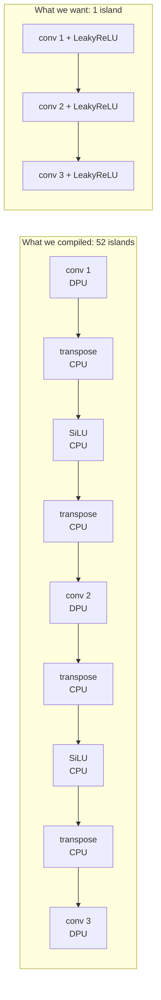

# DPU Subgraph Fragmentation

> [!danger] Headline finding
> The exp2 checkpoint compiles for the VCK190, but into **52 DPU subgraphs instead of 1**.
> The cause is the model's **SiLU** activation, which does not exist in Xilinx's XIR.
> Fixing it properly means changing the activation function — finetuning or retraining.

> [!bug] Correction 2026-09-11: `compiled/` does not run at all
> An earlier revision of this note claimed that `vitis_ai_library.GraphRunner` makes the
> fragmented SiLU build deployable — slow but correct. **That was tested and is false.**
>
> `GraphRunner` is present and does execute whole graphs, but every CPU subgraph needs a
> runtime *operator implementation* library, and there is no implementation for the op XIR
> invented:
>
> ```
> [UNILOG][FATAL][VAILIB_CPU_RUNNER_OPEN_LIB_ERROR][dlopen can not open lib!]
> lib=libvart_op_imp_aten__silu_.so ... No such file or directory
> op = xir::Op{... type = aten::silu_}
> ```
>
> The board ships 68 `libvart_op_imp_*.so` libraries. None of them is silu. So `compiled/`
> **compiles but can never execute** — the auto-generated XIR definition satisfies the
> compiler and not the runtime. See [[Board Bring-Up]].

> [!tip] The way out: decompose SiLU instead of replacing it
> `sigmoid` and `mul` **do** have runtime implementations on the board
> (`libvart_op_imp_sigmoid.so`, `libvart_op_imp_mul.so`), and
>
> ```
> SiLU(x) ≡ x * sigmoid(x)
> ```
>
> is an exact identity, not an approximation. Rewriting the activation as an explicit
> `x * torch.sigmoid(x)` **before quantization** makes the traced graph carry `sigmoid` and
> `mul` — both runnable — instead of the unimplemented `aten::silu_`.
>
> That yields a build with **best.pt's own weights and mathematically identical activations**,
> executable via `GraphRunner`, at the cost of a re-quantize and re-compile (container CPU work,
> **no GPU**). It stays fragmented and therefore slow, but it runs and it is accurate.
>
> ✅ **Done and verified** — `compiled_silu_decomp/` runs on the board: 50 DPU subgraphs, CPU ops
> reduced to `sigmoid`/`fix2float`/`float2fix` (all implemented), zero XIR warnings, 265
> detections on the 50-image smoke set. Full write-up in [[SiLU Decomposition]].

Related: [[Vitis AI DPU Concepts]], [[Quantization and Compile Results]],
[[Subsystem - Models]], [[Training Run exp2]], [[Implementation Plan]].

---

## The evidence

Compiling the quantized model with `vai_c_xir` against
`/opt/vitis_ai/compiler/arch/DPUCVDX8G/VCK190/arch.json`:

```
[UNILOG][INFO] Total device subgraph number 105, DPU subgraph number 52
[UNILOG][INFO] Compile done.
```

Three signals, gathered at three separate stages, all pointing at the same op:

| Stage | Message |
| --- | --- |
| Quantizer (`calib`) | `[VAIQ_WARN][QUANTIZER_TORCH_FLOAT_OP]: The quantizer recognize new op` `` `aten::silu_` `` `as a float operator by default` |
| xmodel export (`test`) | `[UNILOG][WARNING] The operator named ...SiLU_act..., type: aten::silu_, is not defined in XIR. XIR creates the definition of this operator automatically` |
| Compile (`vai_c_xir`) | 98 × `xir::Op{... type = transpose} has been assigned to CPU` |

## What is actually happening

The DPU is a fixed-function INT8 engine. It can only execute ops XIR knows how to lower onto it.

1. `aten::silu_` has **no XIR definition**. XIR invents a placeholder op rather than failing.
2. That op cannot be assigned to the DPU, so it lands on the CPU.
3. The DPU works in a different tensor layout than the CPU path, so the compiler inserts a
   **transpose pair** around every CPU-bound op — hence exactly **98 CPU transposes** for the
   49 SiLU ops (one in, one out, minus fusions).
4. Every SiLU therefore acts as a **wall** between DPU regions. With 52 convolutions separated by
   49 walls, the graph shatters into 52 DPU islands.



Each island boundary is a DMA transfer plus a CPU kernel plus a layout shuffle. 52 of them per
frame, on every inference. The DPU spends most of its time waiting.

> [!info] Why LeakyReLU is the answer
> The DPU implements LeakyReLU natively and **fuses it into the preceding convolution**, so it
> costs nothing and creates no boundary. YOLOv3's original Darknet design used LeakyReLU(0.1) —
> SiLU came from the YOLOv5 codebase this repo is derived from. Reverting the activation is
> returning YOLOv3 to its own design, not a compromise.
>
> One constraint: the DPU supports LeakyReLU only at **alpha = 0.1015625** (26/256). Any other
> slope — including a plain `0.1` — falls back to the CPU and reintroduces the fragmentation.

## Remediation options

| Option | Effort | Accuracy | Subgraphs | Verdict |
| --- | --- | --- | --- | --- |
| **A. Finetune with LeakyReLU(0.1015625)** | Hours of GPU time | Should recover close to baseline | ~1 | **Recommended** |
| **B. Retrain from scratch with LeakyReLU** | Days | Best achievable | ~1 | Only if A underperforms |
| **C. Swap activation, no finetune** | Minutes | Badly degraded | ~1 | Diagnostic only — proves the mapping, not shippable |
| **D. Run `compiled/` as-is with `GraphRunner`** | — | — | 52 | ❌ **Impossible.** No `libvart_op_imp_aten__silu_.so` on the board; it aborts at runtime |
| **E. Decompose SiLU to `x*sigmoid(x)`, requantize, run with `GraphRunner`** | ~10 min container CPU, no GPU | ✅ **Identical maths to best.pt** | 50 | ✅ **Done — it runs.** ~1 FPS. [[SiLU Decomposition]] |

Option **C is measured in [[SiLU to LeakyReLU Experiment]]** — it isolates the mapping question
from the accuracy question, confirming whether the activation really is the sole cause of the
fragmentation before anyone spends GPU hours on option A.

## What this means for the plan

[[Implementation Plan]] step 6 was "confirm the compiler log shows a single DPU subgraph." It does
not. That check has done its job: it caught a blocking architectural issue **before** any board
time was spent.

The honest read: **`compiled/` is not deployable at all** — not slowly, not at reduced
throughput. It aborts on the first CPU subgraph. Option **E** is the route, it needs no GPU,
and it now works: see [[SiLU Decomposition]].

So fragmentation has turned out to cost **throughput only**. Accuracy is available today at
~1 FPS; the finetune is what buys the other ~55 FPS.

> [!warning] Do not integration-test a fragmented xmodel with `vart.Runner`
> An earlier version of this note suggested using the 52-subgraph build as an integration test
> for the host app. That advice was wrong and would have wasted a day.
> `vart.Runner.create_runner(dpu_subgraphs[0], ...)` runs **only the first subgraph** — here,
> the very first convolution. Its output is `(1, 416, 416, 32)`, not the three `255`-channel
> detection maps, so the decode gets a feature blob it cannot interpret. The result is not
> "correct-ish plumbing"; it is garbage, or a crash.
>
> Use `compiled_lrelu/` (a genuine single-subgraph build) for integration testing, or
> `GraphRunner` for the fragmented one. `board_eval_vck190.py` already prints a warning when it
> sees more than one DPU subgraph — heed it.

The real *performant* deployment still needs a LeakyReLU model.

Since a finetune is required anyway, that is also the natural moment to reconsider the
`Bottleneck_merged` experiment (see [[Subsystem - Models]]) and to fix the preprocessing mismatch
noted in [[Subsystem - Utils Core]].


## The rule, confirmed: one DPU subgraph per activation

Two SiLU-decomposed builds, measured:

| Build | Conv modules → SiLU | DPU subgraphs | CPU `sigmoid` | Throughput |
| --- | --- | --- | --- | --- |
| `compiled_silu_decomp` (merged23) | 49 | 50 | 49 | 0.96 FPS |
| `compiled_orig` (stock YOLOv3) | 72 | **73** | 72 | 0.83 FPS |

Exactly one DPU subgraph per activation boundary, plus one. Fragmentation is therefore
**predictable before compiling**: count the `nn.SiLU` modules — [[yolov3_original on Hardware]].

## YOLOv8 avoids this entirely

`tools/inspect_xmodel.py` on the already-compiled models in `Versal_AI` reports **2 DPU
subgraphs** for yolov8n/s/m/l, with only the detection head on the CPU. The difference is the
activation: that project swaps `nn.SiLU` → `nn.Hardswish`, which the DPUCVDX8G implements
natively, so backbone and neck fuse into a single subgraph and the models run at 6–8 FPS at 640.

The trade is exactness — HardSwish *approximates* SiLU, where `x · sigmoid(x)` **is** SiLU. That
is the third remediation option this note never considered, and its accuracy cost is still
unmeasured — see [[YOLOv8 Prior Work in Versal_AI]] and [[Implementation Plan - YOLOv8]].

---

Back to [[Code Map]] | [[Home]]
