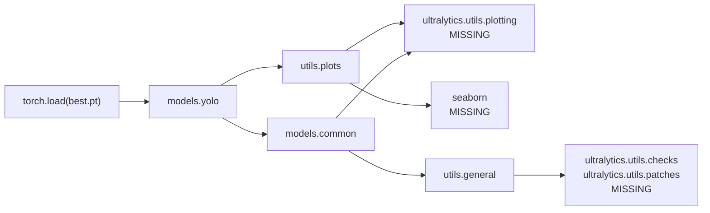

# Compat Shims

`yolov3_test/vitis_compat/` exists because the checkpoint and the container come from
**different eras of the Python ML stack**, and the checkpoint cannot be loaded without bridging them.

Related: [[Vitis AI Container]], [[The numpy _core Segfault]], [[Changes Log]].

---

## The version gap

| | Checkpoint trained with | Vitis AI image ships |
| --- | --- | --- |
| Python | 3.12 | 3.8.6 |
| torch | 2.13 (per `requirements.txt`) | 1.13.1 |
| NumPy | 2.x | 1.22.0 |
| `ultralytics` | installed | **absent** |
| `seaborn` | installed | **absent** |

## Why this blocks everything

`torch.load` on a YOLO checkpoint does not just read tensors — it **unpickles model objects**,
which means importing the modules that define their classes. That import chain is:



Every one of those imports runs at **module import time**, so a single missing package anywhere in
the chain makes the checkpoint unopenable. This is why a *plotting* library breaks *model loading*
— a genuinely counter-intuitive failure.

## What's in the directory

```
vitis_compat/
├── np2_pickle_compat.py              NumPy 2.x -> 1.x pickle path bridge
├── ultralytics/                      offline stand-in package
│   ├── __init__.py
│   └── utils/
│       ├── __init__.py
│       ├── plotting.py               Annotator, Colors/colors, save_one_box
│       ├── checks.py                 check_requirements -> no-op
│       ├── patches.py                torch_load with weights_only=False
│       └── torch_utils.py            TORCH_2_4 flag, autocast shim
└── site/                             pip --target install of seaborn 0.13.2
```

### `np2_pickle_compat.py`

Maps `numpy._core.*` onto `numpy.core.*`. **The subtle and important one** — the naive
parent-only version of this shim causes a segfault rather than an error. Full analysis in
[[The numpy _core Segfault]].

### `ultralytics/`

A minimal but *functional* stand-in for the handful of symbols this repo imports from the
`ultralytics` package. Not stubs that raise — real implementations, because some of them could
legitimately get called:

| Symbol | Implementation |
| --- | --- |
| `utils.plotting.Annotator` | Real cv2-backed box/label drawing (`box_label`, `rectangle`, `text`, `result`) |
| `utils.plotting.colors` | The actual Ultralytics 20-colour palette, `bgr=` aware |
| `utils.plotting.save_one_box` | Real crop-and-save with gain/pad/square semantics |
| `utils.checks.check_requirements` | No-op returning `True` — the image pins its own versions |
| `utils.patches.torch_load` | `torch.load` with `weights_only=False` defaulted, with a TypeError fallback for older torch |
| `utils.torch_utils.TORCH_2_4` | Computed from `torch.__version__` (False here) |
| `utils.torch_utils.autocast` | Dispatches to `torch.amp` or `torch.cuda.amp` per version |

### `site/`

seaborn 0.13.2, installed with:

```bash
pip install --no-cache-dir --no-deps --target vitis_compat/site seaborn
```

`--no-deps` was deliberate — numpy, pandas and matplotlib are already in the image, and pulling
duplicates would have wasted scarce disk. Total footprint **2.2 MB**.

## Activation

Only via `PYTHONPATH`, set by `vitis_run.sh`:

```
PYTHONPATH=/workspace/yolov3_test/vitis_compat:/workspace/yolov3_test/vitis_compat/site
```

> [!tip] Why PYTHONPATH and not a directory named `ultralytics/` at the repo root
> A real `ultralytics` install outside the container would be **shadowed** by a repo-root package
> of that name, silently breaking anything else on the machine that imports it. Keeping the shim
> behind an explicit `PYTHONPATH` entry means it is active *only* where it is needed and inert
> everywhere else.

## Preferred long-term fix

These shims paper over an environment mismatch. The cleaner resolutions, in order of preference:

1. **Re-save the checkpoint** from the training environment in a form the container can read
   (`torch.save` of a plain `state_dict` rather than pickled model objects, loaded into a model
   built from yaml). This removes the entire import chain problem at a stroke.
2. Use a Vitis AI image whose torch/NumPy generation matches the training environment, if one exists.
3. Keep the shims — fine for a one-off quantization, fragile as a permanent arrangement.

Option 1 is worth doing before the LeakyReLU finetune, since that produces a new checkpoint anyway.


## Two more, found 2026-09-12

Running `val.py` **inside** the container for the first time — for a float baseline — exposed two
things the quantization flow had never touched:

| Problem | Fix |
| --- | --- |
| `np.trapezoid` in `utils/metrics.py` is the NumPy 2.x name; the image has NumPy 1.x | `getattr(np, "trapezoid", None) or np.trapz` — [[Bugs Found and Fixed]] #10 |
| Docker's default 64 MB `/dev/shm` kills the DataLoader workers | `--shm-size=8g` on `docker run`. **`vitis_run.sh` does not set this**, so `val.py` needs a hand-rolled `docker run`, or the flag added to the script. |

> [!warning] The `ultralytics/` stub will not carry YOLOv8
> It provides only the handful of symbols this YOLOv3 repo imports — plotting, version checks. It
> has **no `ultralytics.nn.modules`**, so it cannot reconstruct a `C2f`, an `SPPF` or a v8
> `Detect`, and `torch.load` on a YOLOv8 checkpoint against it will fail. A real (or trimmed)
> `ultralytics` has to be vendored before [[Implementation Plan - YOLOv8]] can start. Note
> [[The numpy _core Segfault]]: a *partial* shim of a package is worse than none.

## The YOLOv8 vendor — resolved 2026-09-14

The blocker above is cleared. A **full ultralytics 8.4.5 source tree** already existed on this
machine, in the prior work at `Versal_AI/models/yolov8_test/ultralytics`, and is now vendored at:

```
Yolo_v8_Versal_Implementation/vendor/ultralytics/     4.2 MB, __pycache__ stripped
```

`Yolo_v8_Versal_Implementation/v8_run.sh` puts it on `PYTHONPATH` **ahead of** `vitis_compat`, so
the real package wins the import and the YOLOv3 stub stays inert for v8 work:

```
PYTHONPATH=<v8>/vendor:<v8>:<compat>:<compat>/site
```

> [!success] It works, and the version worry did not materialise
> The plan flagged a real risk: ultralytics 8.4.5 is a 2026 release and the container is
> **Python 3.8.6 / torch 1.13.1**, so modern syntax or a hard version floor could have made it
> unimportable. It imports cleanly, and `torch.load` succeeds on all four checkpoints, reporting
> `nc=80`, `reg_max=16`, `no=144`, strides 8/16/32 and stock COCO class ordering. Verified, not
> assumed — which is what the plan asked for.

Two notes for anyone revisiting this:

- **Order is load-bearing.** Put `vendor/` after `vitis_compat` on `PYTHONPATH` and the stub
  shadows the real package, reproducing exactly the partial-shim failure mode of
  [[The numpy _core Segfault]].
- **Nothing was trimmed.** The plan suggested vendoring only `ultralytics.nn` to avoid the
  dependency tree. It proved unnecessary — the full tree imports as-is, and 4.2 MB is not worth
  the risk of pruning something the unpickler reaches for.

`v8_run.sh` also sets `YOLO_CONFIG_DIR=/tmp/Ultralytics`; without it ultralytics warns on every
invocation that it cannot write its settings file into the read-only home.

---

Back to [[Code Map]] | [[Home]]
