# Model Architecture Graph

The exact layer-by-layer graph of the model **actually inside**
`runs/train/exp2/weights/best.pt` — the checkpoint that goes to the VCK190.
Not stock YOLOv3. Every channel count, route and op count below was read out of
build artefacts, not inferred from the upstream reference.

> [!info] Sources of truth (in descending authority)
> 1. `vitis_out/inspect_best.log:11-194` — the architecture YAML **embedded in
>    `best.pt`** (`DetectionModel.yaml`), plus the live `anchors` buffer and
>    `stride` buffer at `:197-213`.
> 2. `quantize_result/YOLOv3DPUWrapper.py` — the quantizer-generated,
>    BN-folded module. Every `Conv2d` there carries explicit
>    `in_channels`/`out_channels`/`kernel_size`/`stride`/`padding`, and its
>    `forward()` is the flattened, unambiguous dataflow. This is the *ground
>    truth for channels and routing*.
> 3. `vitis_out/quant_calib.log` — the 179-node torch trace (pre-BN-fold) with
>    per-op module paths; used to attribute the op census.
> 4. `models/yolov3_merged_23.yaml`, `models/common.py`, `models/yolo.py` — the
>    source that produced the above.
>
> The embedded YAML is **byte-for-byte the semantic equivalent of
> `models/yolov3_merged_23.yaml`** (same 29 entries, same args, `nc: 80`,
> `depth_multiple: 1.0`, `width_multiple: 1.0`, `ch: 3`). The deployed cfg is
> confirmed to be `yolov3_merged_23`, not `yolov3_merged` and not `yolov3_orig`.

---

## 1. Why "merged_23"

`models/yolov3_merged.yaml` and `models/yolov3_merged_23.yaml` differ by exactly
one line:

```
26c26
<     [-1, 4, Bottleneck, [1024]], # 10          <- yolov3_merged.yaml
---
>     [-1, 4, Bottleneck_merged, [1024]], # 10   <- yolov3_merged_23.yaml
```

In `_23` **all five** backbone residual stages are merged, giving
`1 + 2 + 8 + 8 + 4 = 23` `Bottleneck_merged` blocks. That count is the name, and
it is the same 23 that shows up as the quantizer's 23 `add` ops (§6).

`models/yolov3_orig.yaml` is the unmodified Darknet-53 variant (all 23 blocks are
standard `Bottleneck`); it is **not** what is in `exp2`. See
[[models.common_orig]] for the untouched module library — it contains no
`Bottleneck_merged` at all.

---

## 2. Dataflow graph (all 29 entries)

Solid arrow = implicit `-1` (previous layer). Dashed arrow = an explicit
`from` route that must be **buffered**, i.e. `-2` back-references and the two
long backbone skips.

```mermaid
flowchart TD
  IN["input<br/>1x3x416x416"]

  subgraph BB["Backbone - Darknet-53 skeleton, residuals collapsed to 1x1"]
    direction TB
    n0["0 Conv<br/>3-32 k3 s1<br/>32x416x416"]
    n1["1 Conv<br/>32-64 k3 s2<br/>64x208x208 P1/2"]
    n2["2 Bottleneck_merged x1<br/>64-64 k1<br/>64x208x208"]
    n3["3 Conv<br/>64-128 k3 s2<br/>128x104x104 P2/4"]
    n4["4 Bottleneck_merged x2<br/>128-128 k1<br/>128x104x104"]
    n5["5 Conv<br/>128-256 k3 s2<br/>256x52x52 P3/8"]
    n6["6 Bottleneck_merged x8<br/>256-256 k1<br/>256x52x52  SAVED"]
    n7["7 Conv<br/>256-512 k3 s2<br/>512x26x26 P4/16"]
    n8["8 Bottleneck_merged x8<br/>512-512 k1<br/>512x26x26  SAVED"]
    n9["9 Conv<br/>512-1024 k3 s2<br/>1024x13x13 P5/32"]
    n10["10 Bottleneck_merged x4<br/>1024-1024 k1<br/>1024x13x13"]
    n0 --> n1 --> n2 --> n3 --> n4 --> n5 --> n6 --> n7 --> n8 --> n9 --> n10
  end

  subgraph NK5["Neck - P5/32 stage"]
    direction TB
    n11["11 Bottleneck no-add<br/>1024-512 k1, 512-1024 k3<br/>1024x13x13"]
    n12["12 Conv<br/>1024-512 k1<br/>512x13x13"]
    n13["13 Conv<br/>512-1024 k3<br/>1024x13x13"]
    n14["14 Conv<br/>1024-512 k1<br/>512x13x13  SAVED"]
    n15["15 Conv<br/>512-1024 k3<br/>1024x13x13  SAVED"]
    n11 --> n12 --> n13 --> n14 --> n15
  end

  subgraph NK4["Neck - P4/16 stage"]
    direction TB
    n16["16 Conv from=-2<br/>512-256 k1<br/>256x13x13"]
    n17["17 nn.Upsample x2 nearest<br/>256x26x26"]
    n18["18 Concat dim=1<br/>256+512<br/>768x26x26"]
    n19["19 Bottleneck no-add<br/>768-256 k1, 256-512 k3<br/>512x26x26"]
    n20["20 Bottleneck no-add<br/>512-256 k1, 256-512 k3<br/>512x26x26"]
    n21["21 Conv<br/>512-256 k1<br/>256x26x26  SAVED"]
    n22["22 Conv<br/>256-512 k3<br/>512x26x26  SAVED"]
    n16 --> n17 --> n18 --> n19 --> n20 --> n21 --> n22
  end

  subgraph NK3["Neck - P3/8 stage"]
    direction TB
    n23["23 Conv from=-2<br/>256-128 k1<br/>128x26x26"]
    n24["24 nn.Upsample x2 nearest<br/>128x52x52"]
    n25["25 Concat dim=1<br/>128+256<br/>384x52x52"]
    n26["26 Bottleneck no-add<br/>384-128 k1, 128-256 k3<br/>256x52x52"]
    n27["27 Bottleneck x2 no-add<br/>256-128 k1, 128-256 k3<br/>256x52x52  SAVED"]
    n23 --> n24 --> n25 --> n26 --> n27
  end

  subgraph DET["28 Detect - stripped by the DPU wrapper to 3 bare 1x1 convs"]
    direction TB
    m0["m0 Conv2d 1x1 +bias<br/>256-255<br/>OUT 1x255x52x52  stride 8"]
    m1["m1 Conv2d 1x1 +bias<br/>512-255<br/>OUT 1x255x26x26  stride 16"]
    m2["m2 Conv2d 1x1 +bias<br/>1024-255<br/>OUT 1x255x13x13  stride 32"]
  end

  IN --> n0
  n10 --> n11
  n14 -. "from=-2 (skips 15)" .-> n16
  n8  -. "Concat[-1,8] backbone P4" .-> n18
  n21 -. "from=-2 (skips 22)" .-> n23
  n6  -. "Concat[-1,6] backbone P3" .-> n25
  n27 -. "Detect f[0]=27" .-> m0
  n22 -. "Detect f[1]=22" .-> m1
  n15 -. "Detect f[2]=15" .-> m2
```



> [!warning] The two `-2` routes are the easiest thing to get wrong
> `model.16` and `model.23` read `from = -2`. In `BaseModel._forward_once`
> (`models/yolo.py:146`) that is `y[-2]` on the running output list, i.e.
> **`model.14` feeds `model.16`** and **`model.21` feeds `model.23`** — the
> branch point is *before* the 3x3 that produces the detection feature map, not
> after it. Confirmed in the flattened trace: `quantize_result/YOLOv3DPUWrapper.py`
> applies `module_108` (= `model.22` conv) and `module_110` (= `model.23` conv)
> to the *same* tensor `output_module_94`, and likewise `module_92` (= `model.15`)
> and `module_94` (= `model.16`).

---

## 3. Layer table

`args` is shown **post-`parse_model`** (`models/yolo.py:386-392`), i.e. `c1`
prepended and `width_multiple = 1.0` already applied — that is what the module
constructors actually received. `n` is the repeat count. Shapes are for
`1x3x416x416` (batch 1, `imgsz: 416` per `inspect_best.log:216`).

| # | module | n | from | args (c1, c2, …) | output shape @416 | notes |
|---:|---|---:|---|---|---|---|
| 0 | `Conv` | 1 | `-1` | `[3, 32, 3, 1]` | `1x32x416x416` | stem, stride 1 |
| 1 | `Conv` | 1 | `-1` | `[32, 64, 3, 2]` | `1x64x208x208` | P1/2 |
| 2 | **`Bottleneck_merged`** | 1 | `-1` | `[64, 64]` | `1x64x208x208` | 1 add |
| 3 | `Conv` | 1 | `-1` | `[64, 128, 3, 2]` | `1x128x104x104` | P2/4 |
| 4 | **`Bottleneck_merged`** | 2 | `-1` | `[128, 128]` | `1x128x104x104` | 2 adds |
| 5 | `Conv` | 1 | `-1` | `[128, 256, 3, 2]` | `1x256x52x52` | P3/8 |
| 6 | **`Bottleneck_merged`** | 8 | `-1` | `[256, 256]` | `1x256x52x52` | 8 adds; **in `save`** |
| 7 | `Conv` | 1 | `-1` | `[256, 512, 3, 2]` | `1x512x26x26` | P4/16 |
| 8 | **`Bottleneck_merged`** | 8 | `-1` | `[512, 512]` | `1x512x26x26` | 8 adds; **in `save`** |
| 9 | `Conv` | 1 | `-1` | `[512, 1024, 3, 2]` | `1x1024x13x13` | P5/32 |
| 10 | **`Bottleneck_merged`** | 4 | `-1` | `[1024, 1024]` | `1x1024x13x13` | 4 adds |
| 11 | `Bottleneck` | 1 | `-1` | `[1024, 1024, False]` | `1x1024x13x13` | `add=False` |
| 12 | `Conv` | 1 | `-1` | `[1024, 512, 1, 1]` | `1x512x13x13` | |
| 13 | `Conv` | 1 | `-1` | `[512, 1024, 3, 1]` | `1x1024x13x13` | |
| 14 | `Conv` | 1 | `-1` | `[1024, 512, 1, 1]` | `1x512x13x13` | **in `save`** (feeds 16) |
| 15 | `Conv` | 1 | `-1` | `[512, 1024, 3, 1]` | `1x1024x13x13` | **in `save`** → Detect P5 |
| 16 | `Conv` | 1 | **`-2`** | `[512, 256, 1, 1]` | `1x256x13x13` | reads layer 14 |
| 17 | `nn.Upsample` | 1 | `-1` | `[None, 2, 'nearest']` | `1x256x26x26` | no params |
| 18 | `Concat` | 1 | `[-1, 8]` | `[1]` | `1x768x26x26` | 256 + 512 |
| 19 | `Bottleneck` | 1 | `-1` | `[768, 512, False]` | `1x512x26x26` | `add=False` (c1≠c2 anyway) |
| 20 | `Bottleneck` | 1 | `-1` | `[512, 512, False]` | `1x512x26x26` | `add=False` **despite c1==c2** |
| 21 | `Conv` | 1 | `-1` | `[512, 256, 1, 1]` | `1x256x26x26` | **in `save`** (feeds 23) |
| 22 | `Conv` | 1 | `-1` | `[256, 512, 3, 1]` | `1x512x26x26` | **in `save`** → Detect P4 |
| 23 | `Conv` | 1 | **`-2`** | `[256, 128, 1, 1]` | `1x128x26x26` | reads layer 21 |
| 24 | `nn.Upsample` | 1 | `-1` | `[None, 2, 'nearest']` | `1x128x52x52` | no params |
| 25 | `Concat` | 1 | `[-1, 6]` | `[1]` | `1x384x52x52` | 128 + 256 |
| 26 | `Bottleneck` | 1 | `-1` | `[384, 256, False]` | `1x256x52x52` | `add=False` |
| 27 | `Bottleneck` | 2 | `-1` | `[256, 256, False]` | `1x256x52x52` | `add=False`; **in `save`** → Detect P3 |
| 28 | `Detect` | 1 | `[27, 22, 15]` | `[80, anchors, [256, 512, 1024]]` | 3 tensors, see §5 | `no = 85`, `na = 3`, `nl = 3` |

Nothing in this table is a `?` — every channel pair was cross-checked against an
explicit `py_nndct.nn.Conv2d(in_channels=…, out_channels=…)` line in
`quantize_result/YOLOv3DPUWrapper.py`, and every spatial size follows from
`floor((H + 2*1 - 3)/2) + 1` on the six stride-2 3x3 convs:
`416 → 208 → 104 → 52 → 26 → 13`, with no odd-size truncation anywhere. 416 is a
"clean" size for this graph; a size that is not a multiple of 32 would not be.

**`save` list** (computed by `models/yolo.py:419`, `x % i`): `[6, 8, 14, 15, 21, 22, 27]`.
These seven activations must be held live across the graph. On the DPU that is
on-chip/DDR feature-map traffic that the compiler has to schedule; the largest
are `model.6` (`256x52x52` = 692 K elements) and `model.8` (`512x26x26` = 346 K).

---

## 4. `Bottleneck` vs `Bottleneck_merged` — the whole point of this fork

| | `Bottleneck` (`models/common.py:150`) | `Bottleneck_merged` (`models/common.py:192`) |
|---|---|---|
| signature | `(c1, c2, shortcut=True, g=1, e=0.5)` | `(c1, c2, shortcut=True)` — **no `g`, no `e`** |
| convs | `cv1 = Conv(c1, c2//2, 1, 1)`, `cv2 = Conv(c2//2, c2, 3, 1)` | `cv2 = Conv(c1, c2, 1, 1)` **only** |
| conv ops | 2 (one 1x1 + one 3x3) | 1 (a single 1x1) |
| forward | `models/common.py:181` — `x + cv2(cv1(x))` if `add` | `models/common.py:212` — `x + cv2(x)` if `add` |
| `add` | `shortcut and c1 == c2` | `shortcut and c1 == c2` |

Where each appears in the deployed graph:

- **`Bottleneck_merged` — 23 instances, backbone only**: layers **2, 4, 6, 8, 10**
  (counts 1, 2, 8, 8, 4). Every one has `c1 == c2` and `shortcut` defaults to
  `True`, so **all 23 carry a residual add**.
- **`Bottleneck` — 7 instances, head only**: layers **11, 19, 20, 26, 27**
  (counts 1, 1, 1, 1, 2). Every one is constructed with `shortcut=False` from the
  YAML, so **none of them adds** — including `model.20` and both `model.27`
  blocks, where `c1 == c2` and the shortcut *would* otherwise have fired.

> [!danger] `Bottleneck_merged` deletes the 3x3, not the 1x1
> The standard Darknet-53 residual unit is `1x1 reduce → 3x3 expand`. The merged
> unit is a **single 1x1**. So after `model.1`, the entire backbone contributes
> **zero spatial mixing** — all receptive-field growth in the backbone comes from
> the six stride-2 3x3 convs at layers 0, 1, 3, 5, 7, 9.
>
> Theoretical receptive field at `model.10` (P5/32) is **65 px** on a 416 input.
> The same graph with `yolov3_orig.yaml`'s standard bottlenecks would be
> **725 px**. Carried through the neck, the three detection features land at
> **P3/8 ≈ 305 px, P4/16 ≈ 289 px, P5/32 ≈ 257 px** — i.e. the large-object head
> sees the *smallest* context of the three, which is backwards from what an
> FPN is supposed to do. (Computed with the standard
> `r += (k-1)*j; j *= s` recurrence, treating nearest-upsample as `r` unchanged
> and `j` halved, and taking `max` over branches at each `Concat`.)
>
> Practical read: if `exp2` mAP is disappointing on large objects, this is the
> structural reason, and it is **not** something quantization or the DPU caused.

Parameter cost, derived from the 52 explicit conv specs
(`k*k*c_in*c_out` + BN `2*c_out`, + bias for the three Detect convs):

| | params | fp32 | fp16 |
|---|---:|---:|---:|
| deployed `yolov3_merged_23` | **34,528,157** | 138.1 MB | 69.1 MB |
| `yolov3_orig` (same head) | 61,949,149 | 247.8 MB | 123.9 MB |

Merging removes **44.3 %** of the weights. Two independent derivations agree on
34,528,157 (one parsing the generated quantizable module, one recomputing from
the YAML), and the `yolov3_orig` figure reproduces the canonical stock-YOLOv3
count — which is a good check that the head/Detect side of the table is right.

Note the split: the *backbone* is now cheap (6.87 M in the 23 merged blocks vs
34.29 M originally) while the **head is 20.91 M and untouched**. Roughly 61 % of
the deployed weights sit in `model.11..27`. Any further slimming has to attack
the head.

---

## 5. The three Detect branches

`Detect.__init__` (`models/yolo.py:61`) builds
`self.m = nn.ModuleList(nn.Conv2d(x, self.no * self.na, 1) for x in ch)` with
`ch = [256, 512, 1024]` (from `f = [27, 22, 15]`) and
`self.no * self.na = 85 * 3 = 255`. These are plain `nn.Conv2d`, **1x1, with
bias, no BN, no activation** — unlike every other conv in the graph.

| branch | `Detect.f` | source layer | conv | output | stride | anchors (grid units) | anchors (px) |
|---|---:|---|---|---|---:|---|---|
| P3 / small | `f[0] = 27` | `model.27` (256 ch, 52x52) | `m[0]`: 256→255 | `1x255x52x52` | 8 | `(1.25,1.625) (2.0,3.75) (4.125,2.875)` | `10,13 16,30 33,23` |
| P4 / medium | `f[1] = 22` | `model.22` (512 ch, 26x26) | `m[1]`: 512→255 | `1x255x26x26` | 16 | `(1.875,3.8125) (3.875,2.8125) (3.6875,7.4375)` | `30,61 62,45 59,119` |
| P5 / large | `f[2] = 15` | `model.15` (1024 ch, 13x13) | `m[2]`: 1024→255 | `1x255x13x13` | 32 | `(3.625,2.8125) (4.875,6.1875) (11.65625,10.1875)` | `116,90 156,198 373,326` |

Grid-unit anchors are quoted verbatim from `inspect_best.log:201-211`
(`torch.Size([3, 3, 2])`, `float16`); the pixel column is `anchor * stride` and
reproduces the standard YOLOv3 set exactly. Strides `[8., 16., 32.]` come from
`inspect_best.log:212`. `check_anchor_order` (`models/yolo.py:234`) did **not**
reorder anything — row 0 is still the small-object row.

**Output ordering matters.** `export_dpu_wrapper_AB3.py:166-171` does
`head_inputs = [y[j] for j in self.detect_f]` then returns `(out0, out1, out2)`,
so the tuple order is **P3/8, P4/16, P5/32** — the largest feature map first.
The generated graph confirms it: `quantize_result/YOLOv3DPUWrapper.py` ends with
`return (output_module_110, output_module_108, output_module_92)` where
`module_126/127/128` are `m0/m1/m2` respectively.

> [!warning] Everything after these three convs is host CPU work
> The wrapper takes `model.model[:-1]` (`export_dpu_wrapper_AB3.py:139`) and calls
> `detect_layer.m[i]` directly, bypassing `Detect.forward`. That means the
> reshape to `(bs, 3, ny, nx, 85)`, the `sigmoid`, the
> `xy = (xy*2 + grid) * stride`, the `wh = (wh*2)**2 * anchor_grid` decode
> (`models/yolo.py:86-89`), and NMS are **all absent from the DPU graph** and must
> be reimplemented on the ARM side. Two details that are easy to lose:
> the grid offset is `-0.5` (`models/yolo.py:103`, `stack(...) - 0.5`), and the
> decode is the **YOLOv5-style `*2` / `(*2)**2` form**, *not* classic YOLOv3
> `exp(t_w) * anchor`. Getting either wrong yields boxes that are plausible but
> systematically wrong. See [[Vitis AI DPU Concepts]] and
> [[export_dpu_wrapper_AB3]].

---

## 6. Op census, cross-checked against the quantizer

The Vitis AI torch trace in `vitis_out/quant_calib.log` reports 179 unique nodes.
Tallying every `type = …` field:

| trace op | count | what it structurally is |
|---|---:|---|
| `_convolution` | **52** | 49 `Conv` (conv+BN+SiLU) modules + 3 bare `Detect` 1x1 convs |
| `batch_norm` | **49** | one per `Conv` module; the Detect convs have none |
| `silu_` | **49** | one per `Conv` module; the Detect convs have none |
| `add` | **23** | the residual add in every backbone `Bottleneck_merged` |
| `upsample_nearest2d` | **2** | `model.17`, `model.24` |
| `cat` | **2** | `model.18`, `model.25` |
| `Param` / `Return` | 1 / 1 | graph input `input_0`, graph output `return_0` |

**Where the 52 convs live** (each verified by module path in the trace):

| group | convs | derivation |
|---|---:|---|
| stem / downsamplers 0, 1, 3, 5, 7, 9 | 6 | one 3x3 each |
| `Bottleneck_merged` 2, 4, 6, 8, 10 | 23 | 1 conv each x (1+2+8+8+4) |
| `Bottleneck` 11, 19, 20, 26, 27 | 14 | 2 convs each x (1+1+1+1+2) |
| plain neck `Conv` 12, 13, 14, 15, 16, 21, 22, 23 | 8 | one each |
| `Detect` `m0`, `m1`, `m2` | 3 | 1x1 output heads |
| **total** | **52** | ✓ matches the trace exactly |

`6 + 23 + 14 + 8 = 49` conv-BN-SiLU modules → the 49 `batch_norm` and 49 `silu_`
fall out for free, and `49 + 3 = 52`. The `Detect` convs are the whole reason the
three counts differ.

**Where the 23 adds come from** — enumerated directly from the trace, every one
is a `Bottleneck_merged` residual inside the backbone:

```
ModuleList[2]  /Bottleneck_merged        ->  1 add
ModuleList[4]  /Bottleneck_merged[0..1]  ->  2 adds
ModuleList[6]  /Bottleneck_merged[0..7]  ->  8 adds
ModuleList[8]  /Bottleneck_merged[0..7]  ->  8 adds
ModuleList[10] /Bottleneck_merged[0..3]  ->  4 adds
                                            -------
                                             23
```

**There are zero adds in the head.** All seven head `Bottleneck`s are built with
`shortcut=False`, so `self.add` is `False` and `forward` takes the
non-residual branch. If you ever see 24+ adds in a future trace, someone flipped
a `False` in the YAML.

> [!tip] 23 adds == 23 merged blocks == the "23" in `merged_23`
> This is the cheapest possible sanity check that the *right* checkpoint is being
> quantized. `yolov3_merged.yaml` would give 23 adds too but only 19 merged
> blocks and 4 standard ones — so also check that the trace shows
> `ModuleList[10]/Bottleneck_merged[i]/Conv[cv2]` (one conv per block) rather
> than `Bottleneck[i]/Conv[cv1]` + `cv2`.

### What survives into the quantized module

`quantize_result/YOLOv3DPUWrapper.py` — the post-calibration module — contains
**52 `py_nndct.nn.Conv2d`, 49 `py_nndct.nn.Module('aten::silu_')`, and zero
`BatchNorm`**. The 49 `batch_norm` ops are folded into their convs (every
generated `Conv2d` has `bias=True`, even where the PyTorch source used
`bias=False` at `models/common.py:67`). So the BN count is a non-issue for the
DPU. The 49 SiLUs are not:

> [!danger] SiLU is the deployment blocker, and it is 49-wide
> `vitis_out/quant_calib.log:42`:
> `[VAIQ_WARN][QUANTIZER_TORCH_FLOAT_OP]: The quantizer recognize new op 'aten::silu_' as a float operator by default.`
> It is emitted once, but it applies to all 49 instances — the generated module
> keeps them as opaque `py_nndct.nn.Module('aten::silu_')` wrappers rather than
> quantized ops. `Conv.default_act = nn.SiLU()` at `models/common.py:60`, and
> the deployed YAML has **no `activation:` key**, so the
> `Conv.default_act` override at `models/yolo.py:349-351` never fires.
>
> Structurally, a float op sits between *every* conv and its consumer, in a
> 49-deep chain. If `DPUCVDX8G` cannot absorb SiLU, the compiler has no
> contiguous conv run to fuse and the subgraph fragments at essentially every
> layer. Retraining or surgically swapping to a DPU-native activation
> (LeakyReLU / ReLU / hard-swish, whichever this DPU arch actually supports —
> **(unverified)** which of those `DPUCVDX8G` accepts) is the fix, and it is a
> *model* change, not a compiler flag. Tracked in
> [[Vitis AI DPU Concepts]] and [[Subsystem - Export]].

The remaining ops are all DPU-friendly in principle: 23 elementwise adds
(`py_nndct.nn.Add`), 2 nearest-neighbour resizes
(`py_nndct.nn.Interpolate`, `scale_factor=[2.0, 2.0]`), 2 concats
(`py_nndct.nn.Cat`, `dim=1`).

---

## 7. Concat operand order — do not swap these

Both concats put the **upsampled neck tensor first** and the backbone skip
second, which fixes the channel layout the following conv expects:

| layer | operands (in order) | channels | trace |
|---|---|---|---|
| `model.18` | `upsample(model.16)`, `model.8` | 256 + 512 = 768 | `module_97(dim=1, tensors=[output_module_94, output_module_67])` |
| `model.25` | `upsample(model.23)`, `model.6` | 128 + 256 = 384 | `module_113(dim=1, tensors=[output_module_110, output_module_41])` |

`module_67` is `ModuleList[8]/Bottleneck_merged[7]` (the last backbone P4 add) and
`module_41` is `ModuleList[6]/Bottleneck_merged[7]` (the last P3 add) — so the
skips tap the *final* output of stages 8 and 6, as `parse_model`'s `ch[x]`
indexing implies. `model.19`'s `cv1` is `in_channels=768` and `model.26`'s `cv1`
is `in_channels=384`, which only works with this ordering.

---

## 8. Deployment checklist implied by this graph

- [ ] **Input is fixed at `1x3x416x416`.** `quantize_vitis_AB4.py:327` traces with
      `torch.randn(1, 3, img_size, img_size)` at `img_size=416` (default at `:367`).
      The compiled `.xmodel` is shape-frozen; 640 would need a re-quantize.
- [ ] **Three outputs, in P3→P4→P5 order**, `1x255x52x52` / `1x255x26x26` /
      `1x255x13x13`. Confirm the runtime's output-tensor ordering matches rather
      than assuming it — the DPU runner may sort by name or by size.
- [ ] **255 = 3 x 85**, and the 85 is `[x, y, w, h, obj, 80 classes]` in that
      order (`models/yolo.py:86`, `split((2, 2, nc + 1), 4)`).
- [ ] **Host-side decode** must use grid offset `-0.5`, `xy*2`, `(wh*2)**2`,
      per-level anchors in **grid units** multiplied by `stride` — or equivalently
      the pixel anchors in §5 directly.
- [ ] **49 SiLUs** will fragment the subgraph. Get the compiler's partition report
      before assuming end-to-end DPU execution.
- [ ] The `-2` routes at `model.16` / `model.23` and the `save` set
      `[6, 8, 14, 15, 21, 22, 27]` are the only non-sequential structure; any
      hand-written C++/Python re-implementation of the graph must reproduce them.

---

See also: [[Subsystem - Models]] · [[models.yolo]] · [[models.common]] ·
[[quantize_result.YOLOv3DPUWrapper]] · [[export_dpu_wrapper_AB3]] ·
[[quantize_vitis_AB4]] · [[Vitis AI DPU Concepts]] · [[Training Run exp2]] ·
[[Subsystem - Export]] · [[Import Dependency Graph]]

Back to [[Code Map]] | [[Home]]
